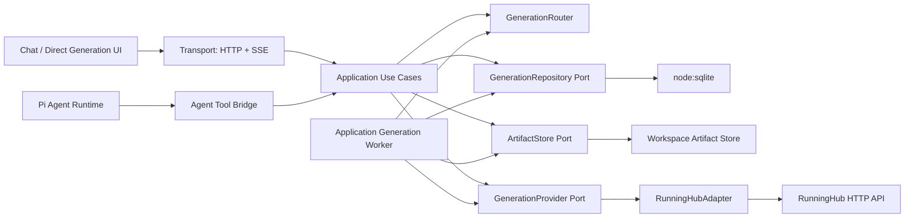
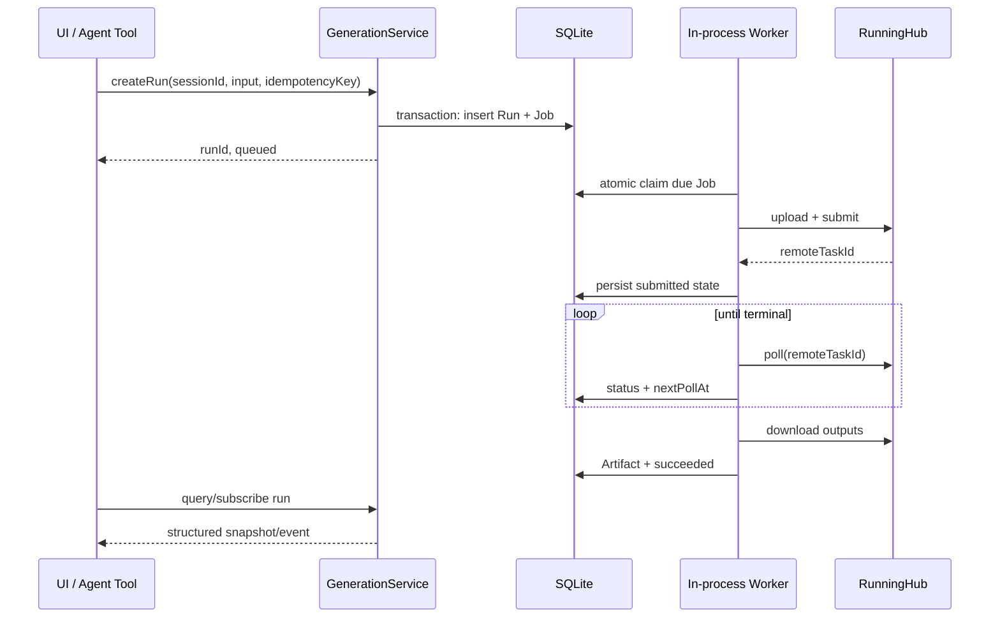

# AI 驱动内容生成设计方案

> 状态：Draft，等待 Review
>
> 适用范围：Po Agent 本地 Web、Electron 桌面端和当前单机服务器部署
>
> 当前供应商：RunningHub
>
> 本文描述目标架构，不以现有实现和开发期测试数据为约束；实现时可以直接替换旧内容生成数据结构和 API，但必须同步更新合同、调用方、测试和 API 文档。

## 1. 结论摘要

本方案采用以下核心设计：

1. **Session 不按“纯聊天”和“内容生成”拆成两个互斥类型。** Session 是用户工作的统一上下文，可以只有聊天、只有内容生成，也可以同时包含聊天消息和多个生成任务。`chat` 与 `content-generation` 是 UI 入口或视图，不是领域类型。
2. **内容生成采用持久化异步执行。** Agent 工具、表单和未来自动化都只负责创建 `GenerationRun`；后台执行器负责上传、提交、轮询、下载和恢复。客户端断开、页面刷新或 Agent Runtime 销毁不会终止任务。
3. **区分 Run 与 Job。** `GenerationRun` 是用户可见、可重试、稳定的逻辑请求；`ProviderJob` 是一次供应商提交尝试。当前 RunningHub 通常是一对一，模型仍保留一对多，以正确处理重试和供应商迁移。
4. **Route 只做选择，不做协议转换。** `GenerationRouter` 根据能力和显式路由配置选择供应商；`RunningHubAdapter` 独立负责 RunningHub 的鉴权、参数、上传、提交、查询和响应映射。
5. **暂不构建“万能 HTTP 供应商协议”。** 当前只有 RunningHub，先实现一个明确、可测试的适配器，同时保留稳定的 Provider Port。接入第二个供应商时新增 Adapter，不修改领域模型和调用方。
6. **使用 `node:sqlite` 持久化 Session 元数据、Run、Job、Artifact 和路由配置。** 不安装 `better-sqlite3`，不引入 ORM，也不引入 Redis、消息队列或独立 Worker 服务。
7. **运行时基线采用最新 LTS Node + 最新稳定 Electron。** 当前建议基线为 Node.js 24.18 LTS 和 Electron 43.2；Electron 43.2 内置 Node.js 24.18。桌面打包后由 Electron 自带 Node 执行 Next standalone server。
8. **Agent 暴露稳定的语义工具。** 工具不会随供应商/API 数量动态生成，而是固定提供 `generate_image`、`generate_video`、`get_generation` 等能力；路由和供应商差异在服务端解决。
9. **前端消费结构化生成事件和结果。** 不从工具返回的文本或 JSON 字符串中猜测媒体路径。图片、视频、状态和错误通过共享合同传递。

## 2. 背景与目标

当前项目有两条相互独立的流程：

- Agent 对话：用户发送消息，Pi Agent Runtime 执行 LLM 推理和工具调用，通过 SSE 返回事件。
- 内容生成：用户创建固定绑定某个 API 的内容生成 Session，通过表单提交 Job，再由客户端轮询。

目标是让以下入口共享同一套内容生成能力：

- 用户在对话中要求 Agent 生成图片或视频。
- 用户在内容生成界面直接填写参数并生成。
- 未来的批处理、工作流或自动化调用内容生成。

设计必须满足：

- 生成任务在刷新、断线和进程重启后可恢复。
- 不重复提交可能计费的供应商任务。
- RunningHub 的协议细节不泄漏到领域、前端和 Agent 工具。
- 接入第二个供应商时主要新增适配器，而不是改写整个流程。
- 保持当前本地单用户部署简单，不为尚不存在的分布式需求提前建设基础设施。

## 3. 非目标

当前阶段不实现：

- 多节点调度、Redis、Kafka、外部任务队列或独立 Worker 服务。
- 多租户、团队级权限、配额和计费系统。
- 自动在多个供应商之间按价格、质量或健康度负载均衡。
- 用户自由编写任意 HTTP 请求模板来模拟新供应商。
- 通用 DAG 工作流引擎。
- 把 Agent 消息正文从 Pi Session 文件整体迁移进 SQLite。
- 云对象存储；产物继续保存在本地工作区。

## 4. 对现有方案的主要修正

### 4.1 不再创建独立的内容生成 Session 类型

现有 `SessionInfo.mode = "chat" | "content-generation"` 会把两种 UI 和两种执行方式固化成领域类型，并导致内容生成 Session 固定绑定一个 `apiId`。这会产生以下问题：

- 同一个创作上下文不能自然地先聊天、再生成、再继续讨论。
- Agent 编排多个能力或未来多个供应商时，一个 Session 无法固定绑定单个 API。
- 会话列表、重命名、删除和恢复需要维护两套存储语义。
- 内容生成页面无法自然升级为带对话能力的工作台。

目标设计中只有一种 Session。Session 可以包含零个或多个 Agent 消息，也可以包含零个或多个 Generation Run。

### 4.2 不在 Agent 工具调用内部拥有长任务生命周期

旧方案在 `ToolDefinition.execute()` 内循环调用 `pollJob()`，直到任务完成或超时。这会把任务生命周期绑定到：

- 当前 LLM 推理轮次；
- 当前 Agent Runtime；
- 当前 SSE/HTTP 连接；
- 单个进程内的计时器。

这对于可能运行数分钟的视频任务不可靠。正确方式是先持久化 Run，再由后台执行器推进状态。工具可以等待结果，但只是观察者，不是任务所有者。

### 4.3 不用通用 HTTP 模板代替供应商适配器

当前 `HttpContentGenerationProvider` 只负责发送模板化 HTTP，请求字段、响应路径和供应商流程由 `ContentGenerationApi` 配置描述。这看起来通用，但复杂度会逐渐转移到：

- 大量字符串路径和模板变量；
- 难以静态检查的配置；
- 供应商特有的上传、鉴权、错误和状态语义；
- 无法可靠覆盖的运行时组合。

它适合低代码 HTTP 调试器，不适合作为核心供应商抽象。目标设计使用明确的 `RunningHubAdapter`。未来每个真正不同的供应商实现同一个 Port。

### 4.4 不让 Pi 基础设施直接依赖 ContentGenerationService

`PiAgentRuntimeFactory -> ContentGenerationService` 会让一个基础设施适配器依赖应用服务，破坏项目既定的依赖方向。

目标设计引入供应商无关的 `AgentToolDefinition` Port 类型：

- application 组装内容生成工具语义和执行回调；
- `AgentService` 把工具定义放入 `CreateRuntimeInput`；
- Pi infrastructure 只把项目自有工具定义映射成 Pi SDK `ToolDefinition`。

Pi 类型仍然被限制在 infrastructure 内。

### 4.5 不通过“第一个可用 API”隐式路由

数组顺序不是业务规则。即使当前只有 RunningHub，也需要显式、稳定的 `routeId`。默认路由可以由系统自动创建，但选择结果必须可解释、可保存和可复现。

### 4.6 不让 LLM 传递本地绝对路径

生成链路使用 `artifactId` 或受控的 `AssetRef` 传递素材。服务端再解析为已经注册的工作区文件。这样可以避免：

- LLM 拼错路径；
- 把工作区外文件交给上传流程；
- 路径变化导致历史任务不可理解；
- UI 和工具依赖供应商临时 URL。

## 5. 总体架构



稳定依赖方向保持：

```text
domain <- ports <- application <- transport
                ^
                |
          infrastructure

composition 负责组装 application 与 infrastructure
```

`Generation Worker` 是 application 层的进程内编排服务，不包含供应商协议，只依赖 ports。composition 负责构造并管理它的启动和停止。

## 6. 领域模型

### 6.1 Session

Session 是长期用户上下文，不代表某种执行协议。

```ts
interface Session {
  id: string;
  cwd: string;
  title?: string;
  origin: "chat" | "direct-generation" | "imported";
  agentSessionRef?: string;
  createdAt: string;
  updatedAt: string;
}
```

说明：

- `origin` 只记录创建入口，不限制能力。
- 直接生成创建的 Session 在用户首次聊天前可以没有 `agentSessionRef`；需要聊天时再懒创建 Pi Session。
- Pi Session 文件仍保存消息树和模型上下文；SQLite 保存统一 Session 元数据和关联关系。
- Session 删除时需要明确处理消息文件、Run 和产物，不能只删除某一套记录。

### 6.2 GenerationRun

Run 是一次逻辑内容生成请求，是 UI、Agent 和 API 共同使用的稳定对象。

```ts
type GenerationRunStatus =
  | "queued"
  | "running"
  | "succeeded"
  | "failed"
  | "cancel_requested"
  | "cancelled";

interface GenerationRun {
  id: string;
  sessionId: string;
  capability: "text-to-image" | "image-to-image" |
    "text-to-video" | "image-to-video" | "multimodal-to-video";
  routeId: string;
  status: GenerationRunStatus;
  prompt: string;
  input: GenerationInput;
  source: "agent-tool" | "direct-ui" | "api";
  sourceRef?: string; // 例如 toolCallId 或 messageId
  idempotencyKey: string;
  errorCode?: string;
  errorMessage?: string;
  createdAt: string;
  updatedAt: string;
  completedAt?: string;
}
```

一个自然语言请求可能产生多个 Run。例如“先生成首帧，再生成视频”会产生图片 Run 和视频 Run；二者通过输入 Artifact 和可选 `parentRunId` 关联，不需要立刻引入通用工作流引擎。

### 6.3 ProviderJob

Job 是一次具体供应商提交尝试，包含远端任务标识和供应商状态。

```ts
type ProviderJobStatus =
  | "created"
  | "uploading"
  | "submitting"
  | "submitted"
  | "polling"
  | "downloading"
  | "succeeded"
  | "failed"
  | "submission_unknown"
  | "cancelled";

interface ProviderJob {
  id: string;
  runId: string;
  attempt: number;
  providerId: string;
  providerOperation: string;
  routeRevision: number;
  resolvedConfigSnapshot: JsonValue;
  status: ProviderJobStatus;
  remoteTaskId?: string;
  remoteStatus?: string;
  nextPollAt?: string;
  leaseOwner?: string;
  leaseExpiresAt?: string;
  lastErrorCode?: string;
  lastErrorMessage?: string;
  createdAt: string;
  updatedAt: string;
}
```

Run 与 Job 分离的价值：

- 用户看到的 Run ID 在重试后不变；
- 每次可能计费的提交都有独立审计记录；
- 可以区分业务失败、查询失败和提交结果未知；
- 将来可以在保持 Run 不变的情况下切换供应商或执行补偿。

Job 必须保存创建时解析出的 Route revision 和脱敏配置快照。修改默认 Route 只影响新 Job，不能让执行中或恢复后的 Job 使用一套不同参数。

### 6.4 Artifact 与 AssetRef

```ts
interface GenerationArtifact {
  id: string;
  runId: string;
  jobId: string;
  kind: "image" | "video" | "audio" | "text";
  localPath?: string;
  remoteUrl?: string;
  contentType?: string;
  sizeBytes?: number;
  checksum?: string;
  createdAt: string;
}

type AssetRef =
  | { type: "artifact"; artifactId: string }
  | { type: "workspace-file"; relativePath: string };

interface GenerationInputAsset {
  slot: string;
  ref: AssetRef;
}
```

素材输入使用 `{ slot, ref }`，因为首帧、尾帧、参考图片、视频和音频在供应商协议中具有不同语义。所有 `workspace-file` 都必须经过已注册 workspace root 校验。对 Agent 优先返回 `artifactId`，`localPath` 只作为用户展示信息。

## 7. Session 与 UI 设计

### 7.1 Session 是否需要区分聊天和内容生成

结论：**领域上不区分，交互界面可以区分。**

```text
Session
├─ Conversation view：消息、思考、工具调用
├─ Generation view：Run 列表、状态、参数、产物
└─ Files view：工作区文件和生成产物
```

直接生成页面仍然有价值，因为它适合精确选择参数和素材；聊天页面适合意图理解与多步编排。二者是同一 Session 的不同入口，可以在布局层切换，不需要创建互斥的 Session 类型。

### 7.2 会话列表展示

会话列表不再依赖 `mode` 选择完全不同的中心组件。可以展示派生信息：

- 是否存在消息；
- 活跃 Run 数量；
- 最近 Run 状态；
- 最近产物缩略图；
- 创建入口。

这些都是投影视图，不是 Session 的能力限制。

## 8. 供应商、Route 与 Adapter

### 8.1 三个概念必须分开

| 概念 | 职责 | 不负责 |
| --- | --- | --- |
| `GenerationRouter` | 根据 capability、显式 routeId 和默认配置选择 Route | 不拼 RunningHub 请求，不解析响应 |
| `GenerationRoute` | 保存“能力 -> provider + operation + defaults”的稳定配置 | 不执行 HTTP |
| `GenerationProvider` Adapter | 把统一请求映射为供应商协议并归一化结果 | 不决定 UI 和 Session |

### 8.2 统一 Provider Port

不同供应商的接口、参数和返回值不需要长得一样。通用的是应用需要的生命周期语义，而不是 HTTP 形状。

```ts
interface GenerationProvider {
  readonly providerId: string;

  getCapabilities(): Promise<ProviderCapability[]>;

  submit(input: ProviderSubmitInput): Promise<{
    remoteTaskId?: string;
    state: "pending" | "succeeded";
    outputs?: ProviderOutput[];
    rawSnapshot?: SanitizedJson;
  }>;

  poll(input: {
    operation: string;
    remoteTaskId: string;
  }): Promise<ProviderPollResult>;

  cancel?(input: {
    operation: string;
    remoteTaskId: string;
  }): Promise<void>;
}
```

`ProviderSubmitInput` 使用项目自己的规范化字段：prompt、AssetRef、duration、aspectRatio 等。无法通用的配置由 Route 中的 `adapterConfig` 保存，并由对应 Adapter 自己验证和解释，不进入前端公共请求合同。

### 8.3 RunningHubAdapter

第一阶段只实现：

```text
src/server/infrastructure/content-generation/runninghub/
├─ runninghub-adapter.ts
├─ runninghub-client.ts
├─ runninghub-mappers.ts
├─ runninghub-errors.ts
├─ runninghub-types.ts
└─ *.test.ts
```

职责包括：

- API Key 和请求头；
- RunningHub 文件上传；
- 不同 operation/workflow 的参数映射；
- 提交和远端 taskId 提取；
- 状态查询和 RunningHub 状态归一化；
- 结果地址解析；
- 错误归一化和响应脱敏。

RunningHub 类型不得进入 domain、contracts、application 或 UI。

### 8.4 Route 设计

```ts
interface GenerationRoute {
  id: string;
  name: string;
  capability: GenerationCapability;
  providerId: "runninghub" | string;
  providerOperation: string;
  enabled: boolean;
  isDefault: boolean;
  revision: number;
  defaults: Record<string, JsonValue>;
  adapterConfig: JsonValue;
}
```

当前只需要 RunningHub 内置 Route。用户可以调整默认参数，但不直接编辑提交 URL、状态路径和任意模板。第二个供应商接入时新增 Adapter 和 Route catalog，再验证 Port 是否足够；不要为假想差异预先堆积抽象。

### 8.5 供应商边界安全

- RunningHub API Host 和允许下载的 CDN Host 由 Adapter 代码或受信 catalog 定义，不接受普通用户提交任意 URL。
- 下载需要校验协议、重定向后的最终 Host、内容长度、超时和允许的媒体类型，避免 SSRF 和无限下载。
- 请求/响应快照必须脱敏并限制大小；默认最多保存 64 KiB，超出部分截断并记录标记。
- Adapter 错误映射不得包含 API Key、完整鉴权头或供应商返回的敏感字段。
- 上传输入只能来自已经验证的 AssetRef。

## 9. 持久化与 `node:sqlite`

### 9.1 为什么使用 SQLite

与当前单个 JSON 文件相比，SQLite 提供：

- 事务和原子状态迁移；
- 按 Session、状态和轮询时间查询 Job；
- 唯一约束和幂等键；
- 进程重启后的恢复扫描；
- 多个并发请求下更可靠的读写；
- 不需要单独安装和运维数据库服务。

当前单机、本地优先场景正适合 SQLite。复杂度主要来自 schema、migration、事务和恢复规则，而不是数据库安装。

### 9.2 运行时与依赖

- 直接使用 `import { DatabaseSync } from "node:sqlite"`。
- `package.json` 不增加 SQLite npm 依赖。
- 开发和 Web 服务器使用最新 Node LTS；当前目标为 Node 24.18。
- Electron 使用最新稳定版；当前目标为 Electron 43.2，其内置 Node 为 24.18。
- `@types/node` 与实际 Node 主版本对齐。
- Electron renderer 不访问 SQLite；数据库只在 Next/Node 服务端进程中打开。

Node 24.18 中 `node:sqlite` 的稳定性标记为 Release Candidate。版本升级时应运行 Repository、migration 和恢复测试，而不是只依赖类型检查。

### 9.3 数据库位置

建议：

```text
<agent-data-dir>/po-agent.sqlite
```

- Electron：`PI_CODING_AGENT_DIR` 已指向 `app.getPath("userData")/pi-agent`，数据库放在该目录。
- 本地 Web 和服务器：继续使用服务端 Agent data dir，不放入仓库和 workspace。
- 生成产物仍放在 `<workspace>/.po-agent/generated/`，数据库只保存索引和元数据。

### 9.4 建议表结构

```text
sessions
generation_routes
generation_runs
provider_jobs
generation_artifacts
schema_migrations
```

关键约束：

- `generation_runs.idempotency_key` 唯一；
- `provider_jobs(run_id, attempt)` 唯一；
- 所有关联使用 foreign key；
- 状态更新包含期望前置状态，避免并发覆盖；
- JSON 字段只存可扩展输入和脱敏快照，核心查询字段必须是独立列。

### 9.5 初始化设置

```sql
PRAGMA foreign_keys = ON;
PRAGMA journal_mode = WAL;
PRAGMA synchronous = NORMAL;
PRAGMA busy_timeout = 5000;
```

使用小型显式 SQL migration，不引入 ORM。每次 migration 在事务中运行，并记录版本。Repository 对外可以保持 async 接口，但同步 SQL 事务必须短小，不在事务中执行 HTTP、文件上传或下载。

### 9.6 凭证

SQLite 不是加密数据库。数据库只保存 `credentialRef`，不在 Run、Job、日志或 provider snapshot 中复制 API Key。

第一阶段使用 Agent data dir 下独立的服务端凭证文件，并支持 `RUNNINGHUB_API_KEY` 环境变量作为非持久化回退；通过 `GenerationCredentialStore` Port 读取。后续如需要更强保护，再接入系统 Keychain。无论存储方式如何，公开 API 只返回 `hasCredential`。

### 9.7 开发期已有数据处理

当前项目仍处于开发阶段，不为现有 `content-generation.json` 中的测试数据提供迁移兼容：

- 不实现 JSON -> SQLite 导入脚本；
- 不做 JSON/SQLite 双写；
- 不保留旧 Repository 的兼容读取或回退路径；
- 新实现首次启动时直接创建全新的 SQLite schema；
- 旧 Provider、API、Session 和 Job 配置不导入，RunningHub 凭证和 Route 需要重新配置；
- 已经生成在 workspace 中的媒体文件不自动删除，但不会自动建立 Artifact 索引，仍可作为普通工作区文件使用。

这项决定只取消旧业务数据迁移，不取消 SQLite schema migration。`schema_migrations` 必须从第一版保留，用于新架构投入使用后的数据库升级。

## 10. 异步执行与恢复

### 10.1 执行流程



### 10.2 Worker

当前阶段 Worker 与 Next server 同进程，并作为 application service 由 composition 启动：

- 启动时扫描非终态 Job；
- 按 `nextPollAt` 获取到期任务；
- 通过短事务原子 claim，并设置 lease；
- HTTP 操作在事务外执行；
- 成功后再次用条件更新提交状态；
- lease 过期后允许恢复。

这比引入独立队列简单，同时为未来多进程执行保留升级路径。

该方案要求部署为长期运行的 Node 进程。Electron 和当前自有服务器部署符合条件；不能把 Worker 依赖在会随请求启动/冻结的 Serverless Function 中。未来如果改成 serverless 部署，必须先把执行器迁移到独立常驻 Worker 或托管队列。

### 10.3 提交幂等与未知状态

生成请求可能计费，禁止对 `submit` 做无条件自动重试。

- 创建 Run 使用调用方生成的 `idempotencyKey`，重复请求返回同一个 Run。
- 在发出供应商提交前持久化 `submitting`。
- 收到 `remoteTaskId` 后立即持久化 `submitted`。
- 如果请求已发出但因网络中断无法确认结果，Job 进入 `submission_unknown`。
- 当 RunningHub 没有可靠幂等键或查询手段时，不自动重新提交；UI 提示用户确认或手动重试。
- 查询和下载可以按退避策略安全重试，因为它们不会创建新的付费任务。

### 10.4 取消语义

- Agent Tool 的 `AbortSignal` 默认只停止等待，不自动取消远端生成。
- 用户显式点击取消时，Run 进入 `cancel_requested`。
- 如果 Adapter 支持远端取消则调用；不支持时停止本地轮询或继续跟踪，由产品策略决定并明确提示“供应商任务可能仍在运行”。
- 已成功的 Run 不能取消。

第一阶段 RunningHub adapter 尚无远端取消能力：显式取消会停止本地执行和轮询，并把活动 Job 与 Run 标记为 `cancelled`。确认界面必须提示已经提交的供应商任务可能继续运行和计费。

### 10.5 失败和重试

区分：

- validation failure：创建 Run 前返回，不写入执行记录；
- provider rejection：Job 失败，通常不自动重试；
- transient poll/download failure：退避重试并保存最近错误；
- submission unknown：必须人工决定；
- process restart：通过 SQLite 状态和 lease 自动恢复。

## 11. Agent 工具设计

### 11.1 稳定的语义工具

建议固定提供：

```text
generate_image
generate_video
get_generation
cancel_generation
```

工具不按 RunningHub API 或 Route 动态增删。Route 配置变化不会要求重建 Agent 的工具集合。若某能力没有可用 Route，工具返回稳定的 `GENERATION_ROUTE_UNAVAILABLE`。

### 11.2 工具输入

LLM 只看到跨供应商、可理解的语义参数：

```ts
interface GenerateVideoToolInput {
  prompt: string;
  assets?: AssetRef[];
  durationSeconds?: number;
  aspectRatio?: string;
  routeId?: string; // 高级用法，可省略
}
```

供应商 workflowId、HTTP 字段、上传 URL、状态路径和 API Key 都不暴露给 LLM。

### 11.3 工具等待策略

工具执行流程：

1. 创建持久化 Run。
2. 订阅/等待 Run，但不亲自轮询 RunningHub。
3. 通过 `onUpdate` 发送排队、上传、生成和下载状态。
4. 在合理等待上限内完成时返回 Artifact。
5. 超过等待上限时返回 `{ runId, status }`，而不是把仍在运行的任务标记为失败。
6. 后续可调用 `get_generation` 获取结果。

工具等待被中断后，Run 继续执行。LLM 不应因为超时自动重新调用 `generate_*`，避免重复计费。

### 11.4 工具结果

模型需要简洁文本，UI 需要结构化详情：

```ts
interface GenerationToolDetails {
  runId: string;
  status: GenerationRunStatus;
  artifacts: Array<{
    id: string;
    kind: "image" | "video" | "audio" | "text";
    localPath?: string;
    contentType?: string;
  }>;
  error?: { code: string; message: string };
}
```

Pi adapter 把它放入 Tool Result 的结构化 `details`；共享 SSE 合同将其映射给前端。前端不解析自然语言结果或供应商原始 JSON。

## 12. API 与事件合同

目标 API 形态：

```http
POST /api/sessions
GET  /api/sessions/:sessionId

POST /api/sessions/:sessionId/generation-runs
GET  /api/sessions/:sessionId/generation-runs
GET  /api/generation-runs/:runId
POST /api/generation-runs/:runId/cancel
POST /api/generation-runs/:runId/retry

GET  /api/sessions/:sessionId/events
```

`POST generation-runs` 接受 JSON 元数据和已注册 `AssetRef`。浏览器原始文件先通过受控上传/资产注册接口进入 workspace，再创建 Run。现有 multipart 接口可以直接替换，并同步修改前端调用方和公开合同。

Session SSE 可以同时承载 Agent 与 Generation 事件：

```ts
type SessionEvent =
  | AgentEvent
  | { type: "generation_run_updated"; run: GenerationRunDto }
  | { type: "generation_artifact_created"; artifact: GenerationArtifactDto };
```

SSE 只负责实时性，SQLite 快照负责正确性。断线重连后客户端先获取最新 Session/Run 快照，再继续订阅，不要求永久保存所有 SSE 事件。

任何公开合同变更必须同步更新 `src/contracts`、transport validator、前端 API client、测试和 `docs/agent-api-reference.md`。

## 13. 前端设计

### 13.1 共享展示模型

Chat 中的工具卡片和直接生成页面复用同一份 `GenerationRunDto`/`ArtifactDto`，但可以使用不同组件组合：

- `GenerationRunStatus`：阶段、耗时、错误和取消操作；
- `GenerationArtifactPreview`：图片、视频、音频或文本预览；
- `GenerationInputSummary`：prompt、参数和素材；
- `GenerationRunHistory`：当前 Session 的所有生成记录。

### 13.2 不依赖工具文本解析

禁止通过以下方式识别媒体结果：

- 判断工具名称后解析文本中的 JSON；
- 从模型回复中用正则提取 `localPath`；
- 直接使用供应商临时 URL 作为历史记录主键。

UI 根据结构化 `runId` 和 `artifactId` 查询/订阅结果。

### 13.3 直接生成与聊天共存

内容生成表单继续保留完整参数控制。建议在同一 Workspace 布局中提供 Chat 和 Generation 两个视图：

- Chat 适合自然语言、多步生成和结果讨论；
- Generation 适合明确 Route、参数和输入素材；
- 两边创建的 Run 都出现在同一 Session 历史中；
- 用户可以从任意 Artifact 继续发起新的生成或聊天。

## 14. 代码边界建议

```text
src/server/domain/content-generation/
  generation-run.ts
  provider-job.ts
  generation-route.ts
  generation-artifact.ts

src/server/ports/
  generation-repository.ts
  generation-provider.ts
  generation-artifact-store.ts
  agent-tool.ts

src/server/application/content-generation/
  create-generation-run.ts
  get-generation-run.ts
  cancel-generation-run.ts
  retry-generation-run.ts
  advance-provider-job.ts
  generation-router.ts
  generation-agent-tools.ts
  generation-worker.ts

src/server/infrastructure/sqlite/
  sqlite-database.ts
  sqlite-migrations.ts
  sqlite-generation-repository.ts

src/server/infrastructure/content-generation/runninghub/
  runninghub-adapter.ts
  runninghub-client.ts
  runninghub-mappers.ts

src/server/infrastructure/pi/
  pi-agent-tool-adapter.ts

src/server/composition/
  container.ts
```

关键依赖规则：

- application 不 import `node:sqlite`、RunningHub 类型或 Pi SDK。
- RunningHub adapter 和 SQLite repository 实现 ports。
- Pi adapter 只负责项目工具定义与 Pi `ToolDefinition` 的转换。
- Route Handler 只验证、调用 use case、映射响应。
- Worker 位于 application，只通过 ports 访问数据库、文件和供应商；composition 管理其生命周期。

## 15. 当前阶段的最小实现范围

为了避免“为未来供应商过度设计”，第一阶段只做：

- 一个 `GenerationProvider` Port；
- 一个 `RunningHubAdapter`；
- RunningHub 内置 Route catalog；
- `node:sqlite` Repository 和 migration；
- 一个进程内 Worker；
- 统一 Run/Job/Artifact 模型；
- 现有直接生成 UI 切换到 Run API；
- Agent 的图片/视频生成工具；
- 结构化状态与媒体预览。

明确不做：

- 通用 custom provider HTTP DSL；
- Provider 插件系统；
- 动态供应商发现；
- 自动故障转移；
- 分布式锁和外部队列。

只有在接入第二个真实供应商时，才根据实际差异调整 Provider Port。

## 16. 实施计划

### Phase 0：运行时基线

- 将开发/服务器 Node 基线升级到 Node 24 LTS。
- 将 Electron 更新到当前稳定 43.x，并确认内置 Node 与服务器主版本一致。
- 将 `@types/node` 对齐 Node 24。
- 增加 runtime 检查，确认 `node:sqlite` 可用。

### Phase 1：SQLite 基础设施

- 新增数据库初始化、PRAGMA 和 migration runner。
- 建立 Route、Run、Job、Artifact 表和 Repository。
- 为事务、唯一约束、状态条件更新和启动恢复增加测试。
- 不导入现有 `content-generation.json`；新架构使用全新数据库。
- Pi 消息正文继续保存在 Pi Session 文件中，不纳入 SQLite。

### Phase 2：RunningHub Adapter

- 把 RunningHub 协议从通用 HTTP 模板中收拢到 Adapter。
- 建立明确的请求/响应映射和错误分类。
- 使用 fixture 测试上传、提交、查询、成功、失败和异常响应。

### Phase 3：异步 Run 执行

- 实现 create/query/cancel/retry use cases。
- 实现进程内 Worker、lease、轮询退避和重启恢复。
- 用新 Run API 和 use cases 直接替换现有内容生成接口及其前端调用方。
- 删除旧 JSON Repository 的生产组装，不提供双写或兼容回退。

当前实现进度：Run/Job/Artifact、Worker、受控素材登记、Route 查询、取消与幂等重试已经完成；直接生成 UI 已改为读取 Run API。为了让开发期已有内容生成 Session 可继续用于验证，只保留 Session 元数据的懒投影，不迁移旧 Job，也不双写新 Run。旧 JSON 生产组装将在 Phase 4/6 完成统一 Session 后删除。

### Phase 4：统一 Session 投影

- SQLite 成为 Session 元数据和关联关系的来源。
- Pi Session 文件继续承载对话消息树。
- 移除“Session 固定绑定 API”的新建逻辑。
- UI 从 `mode` 分支迁移为同一 Session 的不同视图。
- Session 默认使用软删除；生成文件不随 Session 删除自动清除，产物删除需要单独、明确的用户操作。

当前实现进度：新建 Session 已移除固定模式选择；持久化 Pi Session 可以在 Chat 与 Generate surface 间切换，并在 Generate 中按 Run 选择能力。受 Pi SDK“首个 assistant 消息前不落盘”的约束，草稿 Session 暂不开放 Generate。开发期旧 JSON 生成 Session 继续进入兼容 Generate surface，待 SQLite 成为 Session 元数据唯一来源后删除。

### Phase 5：Agent 工具和结构化 UI

- 增加项目自有 `AgentToolDefinition` 抽象和 Pi adapter。
- 接入稳定的生成工具。
- 让 Chat 工具卡片直接消费 Run/Artifact DTO。
- 验证刷新、断线、Agent 中止和服务重启后任务仍可查看与恢复。

### Phase 6：清理旧实现

- 新链路验证完成后，移除 JSON Job 持久化和通用 HTTP 模板执行路径。
- 更新 `docs/architecture.md` 和 `docs/agent-api-reference.md`。
- 如统一 Session/SQLite 成为长期边界，补充 ADR。

## 17. 测试与验收

### 17.1 必测行为

- 相同 idempotency key 不会创建第二个 Run 或重复提交。
- 一个 Session 可以先聊天、再直接生成、再继续聊天。
- Agent 和直接 UI 创建的 Run 使用相同状态模型。
- 页面刷新或 SSE 断开不影响 Run。
- 服务在 queued、polling、downloading 阶段重启后可以恢复。
- `submitting` 阶段结果不确定时不会自动重复提交。
- RunningHub 响应变化只影响 Adapter 测试和实现。
- 工作区外路径无法注册为 AssetRef。
- API Key 不出现在 HTTP 响应、日志、SQLite 快照和工具结果中。
- 生成失败、取消和等待超时是不同状态。

### 17.2 完成标准

- application 只依赖 domain 和 ports。
- `node:sqlite` 是唯一生成状态数据库实现。
- 所有状态迁移有事务或条件更新保护。
- 公开合同和 API 文档同步。
- 相关单元、transport、infrastructure 和 UI 测试通过。
- `npm run check` 通过；涉及 Next.js/Electron 生产行为时 `npm run build` 通过。

## 18. 与业界常见设计的对应关系

本方案不是照搬某个云厂商产品，而是组合以下成熟模式：

| 本方案 | 对应模式 | 解决的问题 |
| --- | --- | --- |
| `GenerationProvider` + `RunningHubAdapter` | Ports and Adapters / Anti-Corruption Layer | 隔离供应商协议和类型 |
| `GenerationRun` + `ProviderJob` | Logical Job + Execution Attempt | 稳定用户对象与实际提交尝试分离 |
| SQLite 状态机 + 启动恢复 | Durable Execution | 长任务不依赖一次 HTTP/SSE 连接 |
| `idempotencyKey` + 唯一约束 | Idempotent Request | 防止重复创建和重复计费 |
| 条件状态更新 + lease | Optimistic Concurrency / Work Claiming | 防止同一 Job 被并发推进 |
| 明确的 `submission_unknown` | At-least-once 环境下的副作用控制 | 不确定时避免盲目重试付费提交 |
| 固定语义工具 + 服务端路由 | Tool Calling + Capability Routing | LLM 不感知供应商协议 |
| Session 快照 + SSE 提示 | Snapshot + Live Notification | 重连后以持久化状态恢复正确视图 |
| Artifact ID / AssetRef | Stable Resource Identity | 避免依赖路径和临时 URL |

当前没有引入 Transactional Outbox，因为状态更新和执行器位于同一 SQLite/单进程边界，且 SSE 丢失后客户端可以重新读取快照。如果未来需要把事件可靠投递到外部队列或其他服务，再增加 outbox 表和独立 dispatcher。

运行时版本策略参考官方维护周期：生产服务器选择 Node Active/Maintenance LTS，Electron 跟随最新稳定版本并检查其内置 Node 版本。相关资料：

- [Node.js Releases](https://nodejs.org/en/about/previous-releases)
- [Node.js SQLite API](https://nodejs.org/download/release/latest-v24.x/docs/api/sqlite.html)
- [Electron Releases and support policy](https://www.electronjs.org/docs/latest/tutorial/electron-timelines)
- [Electron release versions](https://releases.electronjs.org/)

## 19. 优点、代价与未来升级条件

### 优点

- Session 模型符合用户实际工作流，不人为割裂聊天和生成。
- 长任务独立于连接和 Agent Runtime，可恢复、可审计。
- RunningHub 特有复杂度被隔离，第二个供应商有明确接入点。
- SQLite 对当前单机应用足够可靠，又没有数据库服务运维成本。
- Agent、表单和未来自动化共享同一 use case，避免逻辑复制。
- Artifact ID 和结构化合同降低路径、安全和 UI 解析问题。

### 代价

- 需要维护 schema migration、状态机、Worker 和恢复逻辑。
- Session 元数据与 Pi 消息文件是混合持久化，需要处理一致性和删除顺序。
- `node:sqlite` 的同步 API 要求事务非常短，不能在 SQL 事务中执行网络操作。
- RunningHub Adapter 比纯配置模板需要写代码，但换来类型安全和可测试性。
- 统一 Session 会触及当前列表和布局分支，实现范围比只增加两个工具更大。

### 何时升级基础设施

只有出现以下条件时再考虑外部队列或 PostgreSQL：

- 多个服务进程需要同时 claim Job；
- 服务器需要水平扩容；
- 多用户并发和数据量显著增加；
- 需要跨机器 Worker、集中监控或严格任务吞吐；
- SQLite 文件锁和单机磁盘成为实际瓶颈。

## 20. Review 清单

请重点确认以下决策：

- [ ] 接受“Session 领域上统一，Chat/Generation 只是 UI 视图”。
- [ ] 接受“直接生成 Session 可以懒创建 Pi Agent Session”。
- [ ] 接受 Run 是逻辑请求、Job 是供应商提交尝试。
- [ ] 接受第一阶段只实现 RunningHubAdapter，不保留任意 HTTP 模板作为核心执行路径。
- [ ] 接受 Route 显式选择 provider/operation，而不是选择第一个可用 API。
- [ ] 接受 Agent 工具创建持久化 Run，工具中止不等于取消远端任务。
- [ ] 接受产物和输入主要通过 Artifact ID/AssetRef 关联，而不是 LLM 传绝对路径。
- [ ] 接受 `node:sqlite`、无 ORM、进程内 Worker 的当前技术组合。
- [ ] 接受 Node 最新 LTS + Electron 最新稳定版，而不是直接追 Node Current。
- [ ] 接受不迁移 `content-generation.json` 测试数据、不双写、不保留旧数据读取路径。

Review 通过后，应先把关键决定拆成 ADR，再开始实现 Phase 0 和 Phase 1。
