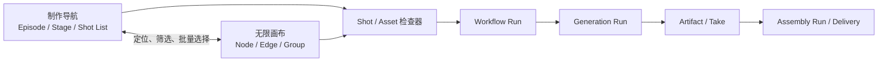
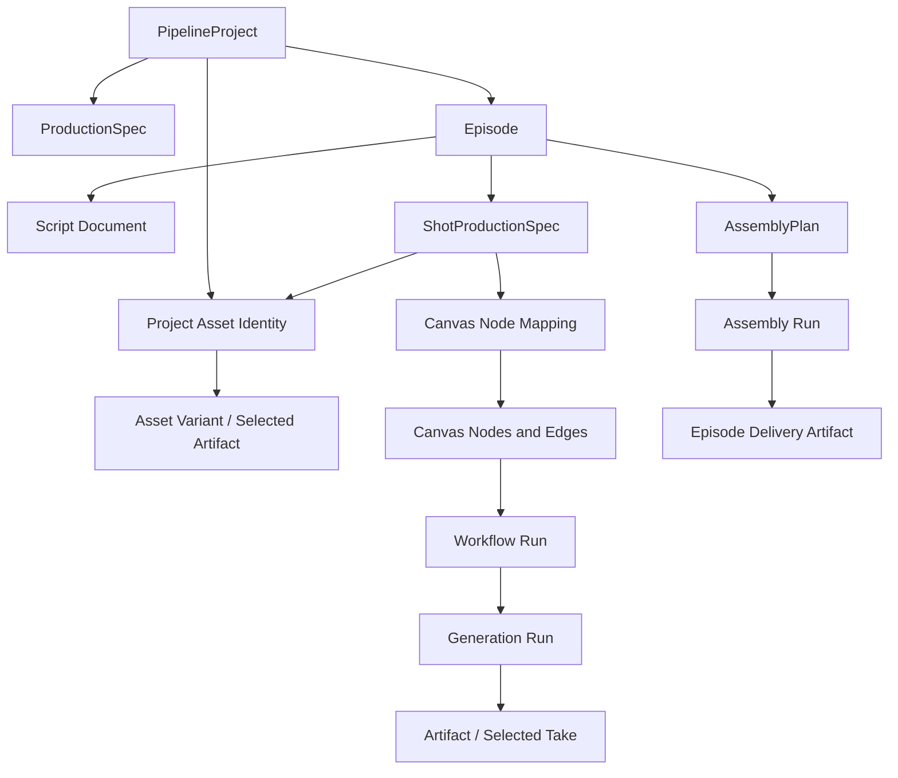

# Huobao Drama 对 Pipeline Studio 的参考分析

> 状态：评审稿  
> 日期：2026-09-17  
> 范围：产品工作流、信息架构、核心数据模型、Agent 分工、生成任务与交付闭环  
> 结论用途：用于确认 Pipeline Studio 后续产品与架构方向，本稿不包含实现变更

> **评审更新：** 本文保留为 Huobao 的详细研究和长期能力清单。当前推荐的第一版产品方案已经收敛为“Pipeline Agent 串联四个可独立使用的专业 Agent”，详见 [Huobao 四 Agent 工作流融合方案](./huobao-four-agent-workflow-proposal.md)。后者是当前应优先评审的产品方案。

## 1. 执行结论

Huobao Drama 最值得 Pipeline Studio 学习的部分，是它把短剧生产所需的对象和步骤表达得非常清楚：

1. 项目先确定画幅和视觉风格；
2. 项目包含多集，每集都有独立制作状态；
3. 剧本被提取为可复用的角色、场景和道具；
4. 分镜是结构化的生产单元，明确绑定参考资产；
5. 图片、视频、合成任务都有可见状态、历史结果和失败恢复入口；
6. 用户沿着“剧本 → 资产 → 视频 → 导出”即可完成一次交付。

Pipeline Studio 当前已经具备更强的通用执行底座：无限画布、结构化引用、Route Schema、Generation Run、Workflow Run、持久恢复、生成血缘、结果历史、Canvas Agent、原子修改和撤销。当前缺口主要在**短剧生产语义和进度可理解性**。用户看到的是节点和连线，需要自己理解这些节点分别属于哪一集、哪一个镜头、当前完成到了哪里、下一步应该做什么。

推荐方向是：

> 在现有无限画布之上增加一个由结构化生产数据驱动的“制作导航 / Production Lens”，让剧集、资产、镜头、生成和交付成为可扫描、可定位、可批量操作的生产对象。画布继续保存可检查的执行事实，Workflow Run 和 Generation Run 继续保存真实运行状态。

这项借鉴的重点是 Huobao 的产品语法和任务闭环。界面继续使用 Po Agent 已有的 Ant Design 深色工作台、信息密度和交互规则。

## 2. 分析依据与边界

### 2.1 Huobao Drama

本次分析基于本地源码 `D:\huobao-drama-master`，重点阅读：

- `README.zh-CN.md` 与 `CLAUDE.md`；
- `backend/src/db/schema.ts` 与 SQLite DDL；
- `backend/src/routes`、`services`、`agents/tools`；
- `backend/workspace/prompts` 与 `backend/workspace/skills`；
- `frontend/app/views/drama/detail.vue`；
- `frontend/app/views/drama/episode.vue`；
- `MentionTextarea.vue`、API composables、中文词典；
- `docs/screenshots/01` 至 `09` 的实际产品截图；
- 后端与前端现有结构测试。

本地目录是下载包，不含 Git 元数据，因此本稿只代表 2026-09-17 所检查的本地快照。

### 2.2 当前 Pipeline Studio

本次对照基于当前仓库提交 `8a32ba4129c36cb102799148814abd64d7764653`，重点阅读：

- `PRODUCT.md`、`DESIGN.md`、`docs/architecture.md`；
- `src/server/domain/pipeline.ts` 与 `src/contracts/pipeline.ts`；
- Pipeline application services、ports、SQLite repositories 和 HTTP transport；
- `src/features/pipeline-studio` 的画布、节点、Agent 面板与客户端状态；
- `workflow-run-v1-design.md`；
- Canvas Agent 的产品研究、画布准备和生成编排设计。

本稿区分已经存在于 `src` 中的能力和只存在于设计文档中的目标，避免把规划当成现状。

## 3. 两个产品解决问题的方式

| 维度 | Huobao Drama | Pipeline Studio 当前状态 | 对 Pipeline Studio 的含义 |
| --- | --- | --- | --- |
| 核心入口 | 固定短剧制作流程 | 通用无限画布 | 增加短剧制作导航，继续复用画布 |
| 项目层级 | 项目 → 剧集 → 制作阶段 | 项目 → 节点 / 边 | 需要剧集或章节容器 |
| 创作对象 | 角色、场景、道具、分镜 | `PipelineAsset`、`StoryboardFrame`、媒体节点 | 现有类型可以演进，无需另建平行系统 |
| 生产状态 | 每阶段的数量和完成状态 | 项目阶段状态、节点状态、Workflow Run | 需要在工作台中聚合并展示 |
| Agent | 四个固定职责 Agent | 一个理解用户意图的 Canvas Agent + Skills | 保留统一 Agent，用 Skill 和结构化工具表达职责 |
| 生成方式 | 单项、批量、失败重试 | 单节点、所选节点 Workflow Run、取消与重试 | 补齐面向镜头的批量选择和恢复入口 |
| 模型配置 | 顶栏按文本/图片/视频全局选择 | 每个节点按 Route Schema 配置 | 继续使用节点级 Route，项目级设置只作为默认策略 |
| 参考素材 | 分镜绑定资产，提示词中 `@名称` | 富文本引用、边、资源角色 | 扩展语义角色并由服务端编译到 Route 槽位 |
| 历史结果 | 分镜视频历史与当前版本 | Generation Run、视频历史、选择结果、血缘和过期状态 | 当前底座更完整，应成为结构化制作视图的数据源 |
| 最终交付 | 选镜头、FFmpeg 拼接、下载 | `assembly` 仍显示 `coming soon` | 合成与交付是明显的产品缺口 |

## 4. Huobao 的产品与实现拆解

### 4.1 固定流程提供了低认知成本的入口

剧集工作台左侧持续展示四个阶段：剧本、资产制作、视频制作、拼接导出。当前阶段、完成阶段、子步骤和总体进度始终可见。用户无需先理解节点类型、依赖图或模型输入模式。

值得学习的点：

- 导航本身就是制作状态说明；
- 每个阶段有明确空态和下一步动作；
- 已完成数量直接使用业务对象表达，例如资产 `3/12`、视频 `4/16`；
- 用户可以回到前序阶段修改内容；
- 顶栏持续展示项目、集数、角色数、分镜数、模型和分辨率等上下文。

需要修正的点：Huobao 同时在后端提供 `pipeline-status`，又在 `episode.vue` 中通过素材、分镜和合成数据计算 `mainStageDone`。Pipeline Studio 应只由服务端基于领域对象和真实运行状态计算阶段状态，前端负责展示。

### 4.2 项目级生产规格先于具体生成

Huobao 创建项目时要求选择：

- 横屏 `16:9` 或竖屏 `9:16`；
- 全局画面风格；
- 剧名和基础项目信息。

这些配置会影响后续资产提示词、视频画幅和项目呈现。它体现了一条重要原则：稳定的创作约束应在项目早期确定，并被后续步骤继承。

Pipeline Studio 已有 `artDirection` 和模型设置，但缺少一个清晰的“生产规格”对象。建议引入项目级 `ProductionSpec`，至少包含：

- 内容类型：短剧、广告、角色短片等；
- 默认画幅与交付分辨率；
- 视觉方向和风格参考；
- AI 生成内容语言；
- 默认镜头时长范围；
- 剧集规划和命名规则。

这些字段是默认值和约束来源。具体镜头仍可在明确需要时覆盖。

### 4.3 剧集是可恢复的制作容器

Huobao 的项目包含多集，每集记录原始内容、改写剧本、分辨率、状态、最终视频和缩略图。项目详情页展示每集是否已录入剧本、是否已有成片、最近更新时间和当前状态。

当前 Pipeline Studio 没有 Episode 领域对象。长内容只能依靠节点分组和命名维持结构，难以形成稳定的：

- 每集制作进度；
- 项目资产与本集资产的边界；
- 分集批量运行；
- 单集成片；
- 跨集角色一致性；
- 项目整体交付状态。

建议增加轻量的 `Episode` 容器，并允许单集短片项目自动创建一个默认 Episode。Episode 不负责执行生成，它负责组织剧本、镜头规格、画布节点映射和交付物。

### 4.4 资产采用“项目身份 + 剧集引用”

Huobao 将角色、场景、道具保存在项目层，通过多对多关系关联到剧集。提取 Agent 会读取现有项目资产，对名称或场景地点进行归一化和去重，再创建或合并并关联到当前剧集。

这套模型对连续短剧很实用：

- 同一角色无需每集重复创建；
- 角色形象和参考图在多集之间复用；
- 本集只显示实际使用的对象；
- 分镜继续绑定其中的角色、场景和道具；
- 资产修改可以识别受影响的剧集和镜头。

Pipeline Studio 已有 `PipelineAsset`、资产变体、选定产物和 Continuity Bible。建议将它们组织为“项目资产身份”，再新增 Episode 和 Shot 的引用关系。角色、场景和道具的连续性字段继续由现有 Continuity 能力管理。

### 4.5 分镜是创作语义和执行配置之间的桥梁

Huobao 的 storyboard 包含：

- 场景、人物和道具关系；
- 景别、角度、运镜、氛围；
- 画面描述、图片提示词、视频提示词；
- 时长、首帧、尾帧、参考图；
- 视频、字幕、合成视频和状态。

用户在视频制作页按分镜顺序浏览任务，左侧是镜头列表，中部编辑镜头描述、氛围、引用和提示词，右侧查看当前视频、历史视频和生成参数。这种“列表 + 检查器 + 结果”的结构非常适合大量同构镜头的连续审阅。

当前 `StoryboardFrame` 已包含角色、场景、道具、对白、运镜、走位、灯光、声音、景别、转场和提示词，基础比 Huobao 更细。现有生成编排设计还提出了 `ShotProductionSpec`，但该类型目前只存在于设计文档，尚未进入 `src`。

建议正式引入 `ShotProductionSpec`，并将其定义为镜头的创作事实：

- 保存“要拍什么”；
- 不保存供应商字段；
- 关联 Episode、项目资产和源剧本范围；
- 保存镜头目标、表演、摄影、声音、连续性和交付约束；
- 通过编译产生节点的 Route、参数、提示词和资源绑定。

### 4.6 资产引用同时具备人类语义和机器绑定

Huobao 允许在视频提示词中输入 `@角色名`、`@场景名` 和 `@道具名`。生成前会根据分镜绑定的参考素材顺序，将名称改写为供应商理解的图片序号。用户看到的是业务对象，供应商收到的是实际输入槽位。

这一理念非常值得保留。具体实现需要放在服务端编译层：

```text
人类引用：角色“凌皓”
  → 项目资产 ID
  → 当前选定的资产产物
  → 语义角色 subject / wardrobe / scene / prop
  → Route 支持的输入槽位与顺序
  → 供应商请求参数和模型提示词引用
```

当前 Pipeline Studio 已有 Tiptap 资源引用、Canvas Edge、`reference / first-frame / last-frame` 角色和 Route 参数验证。建议扩展语义角色，复用现有富文本引用和边。供应商序号、槽位名和 URL 均由服务端编译，不写回用户提示词。

### 4.7 批量操作围绕同构生产单元设计

Huobao 对高频批量场景提供了直接入口：

- 批量生成角色、场景、道具图片；
- 批量补齐视频提示词；
- 批量生成选中分镜或全部分镜；
- 一键重试失败视频；
- 勾选已完成镜头进行拼接。

批量生成视频前会展示镜头数量、预计总时长、模型和分辨率，再由用户确认。这个交互明确表达了成本相关操作的影响范围。

Pipeline Studio 的 Workflow Run 已能按 DAG 运行所选节点、跳过已完成节点、持久保存步骤、取消和重试。需要补的是面向制作对象的选择方式：

- 当前集全部未完成镜头；
- 选中的镜头；
- 失败镜头；
- 输出已过期的镜头；
- 缺少角色参考图的镜头；
- 某个场景或角色影响到的镜头。

这些筛选最终转换为 Workflow Run 的节点集合，执行机制继续复用现有服务。

### 4.8 任务中心聚合异步工作

Huobao 顶栏的任务入口打开右侧抽屉，将图片、视频和合成任务按时间聚合。每条任务显示目标、类型、状态、时间、错误和预览。

Pipeline Studio 的状态分散在节点、Agent 消息和 Workflow Run 展示中。建议增加项目级运行中心，统一展示：

- Production Plan；
- Workflow Run；
- Generation Run；
- 本地下载或媒体处理；
- Assembly Run。

运行中心应围绕用户可行动的信息组织：内容是否已经生成、是否可能再次计费、失败发生在哪个阶段、可以执行哪种恢复动作。原始供应商状态和技术 ID 放入详情。

### 4.9 合成与导出形成完整交付闭环

Huobao 可以选择已有视频的分镜，按顺序使用 FFmpeg 合并，保存历史合成结果，在线播放并下载，最后标记剧集完成。

当前 Pipeline Studio 的阶段模型已经包含 `assembly`，但 SQLite repository 返回 `coming soon`，现有 Pipeline Studio 源码中没有完整的短剧合成工作流。

建议加入 `AssemblyPlan` 和对应运行：

- 输入为有序 Shot 列表及各 Shot 选定 take；
- 允许排除镜头和调整顺序；
- V1 提供直接拼接、分辨率归一化和基础音频处理；
- 输出保存为正常 Artifact，并关联 Episode；
- 合成失败可恢复，已生成镜头无需重新生成；
- 交付历史保留参数、输入版本和文件位置。

已有音频节点、FFmpeg 媒体预处理端口和生成 Artifact 体系可作为实现基础。合成应作为独立 application capability 和 port，不应直接写进 Route Handler 或 React 组件。

### 4.10 专职 Agent 的价值应通过统一 Agent 的 Skills 表达

Huobao 使用四个专职 Agent：剧本改写、资产提取、分镜拆解和提示词生成。每个 Agent 的工具范围清楚，prompt 和 Skill 可在设置页管理。

这些职责边界值得学习：

- 剧本改写只读写当前剧集剧本；
- 资产提取读取项目已有资产并去重；
- 分镜拆解读取剧本和已确认资产；
- 提示词生成读取结构化对象并写回对应字段。

Pipeline Studio 已经采用项目独立 Canvas Agent、项目 Skills、工具权限和本轮范围控制。推荐继续使用一个用户可见 Agent，由短剧 Skill 和结构化工具提供上述能力。工具层按 Episode、Shot、Asset 和 Canvas Plan 强制作用域，避免不同 Agent 各自维护隐藏状态。

## 5. 值得借鉴的视觉与交互设计点

### 5.1 制作导航

Huobao 的左栏同时承担阶段导航、完成状态和下一步提示。Pipeline Studio 可以在左侧资产面板或新的可折叠制作导航中呈现：

- 剧集列表；
- 当前集的剧本、资产、镜头、生成、合成；
- 每个阶段的完成数量和阻塞原因；
- 点击阶段后筛选并聚焦相关节点。

阶段状态应支持 `not-started / ready / in-progress / blocked / completed / attention`，并带有可读原因。

### 5.2 分镜清单与画布双向定位

分镜数量较多时，自由画布不适合逐项检查。建议提供可折叠 Shot List：

- 顺序、缩略图、时长、状态、主要角色和场景；
- 生成中、失败、结果过期、缺引用等筛选；
- 点击镜头后画布聚焦对应节点组；
- 画布选中节点时清单同步定位；
- 多选后直接创建 Workflow Run。

### 5.3 镜头检查器

Huobao 的“任务列表 + 镜头信息 + 结果预览”结构适合作为镜头密集审阅模式。Pipeline Studio 可以复用现有节点数据和生成历史，在右侧检查器中展示：

- Shot Production Spec；
- 绑定资产及其就绪状态；
- 编译后的 Route 和参数；
- 当前结果和历史 takes；
- 过期原因和下游影响；
- 单镜运行、取消、重试和选择结果。

### 5.4 业务数量优先于抽象状态

显示“12 个镜头中 8 个已有选定视频，2 个失败，2 个待生成”比显示一个模糊的百分比更可操作。进度只统计真实业务对象，避免把 Agent 步骤、轮询次数或模型调用次数混入制作完成度。

### 5.5 失败恢复入口靠近失败对象

批量顶部提供“重试失败”，单镜检查器提供具体恢复动作，运行中心提供完整诊断。按钮禁用时显示具体原因，例如“该镜头尚未绑定可用角色图”或“当前工作流仍在取消”。

## 6. 当前 Pipeline Studio 已有的优势

以下能力已存在于当前代码中，应直接成为新制作视图的底座：

1. **通用媒体节点**：文本、图片、视频、音频节点及上传资源；
2. **结构化引用**：富文本资源引用、Canvas Edge 和引用顺序；
3. **Route 驱动配置**：根据能力和 Schema 展示模型参数；
4. **画布一致性**：Revision、批量 mutation、冲突处理、自动保存和 SSE；
5. **Agent 可审计修改**：Canvas Plan、原子应用、Action 和撤销；
6. **素材理解与连续性**：Asset Analysis 和 Continuity Bible；
7. **持久工作流运行**：DAG 步骤、运行恢复、取消和失败处理；
8. **生成运行模型**：Provider Job、Artifact、下载失败区分和持久状态；
9. **结果历史与血缘**：视频 take、选定结果、输入指纹和 stale 标记；
10. **费用边界**：节点或工作流显式触发，Canvas Agent 有独立生成权限；
11. **项目级 Skills**：短剧能力可以作为可安装、可维护的创作策略；
12. **清晰服务端分层**：domain、ports、application、infrastructure、transport。

因此新增能力应表现为这些底层能力的结构化投影和生产入口。

## 7. 不建议直接采用的 Huobao 做法

### 7.1 单一固定流程作为唯一工作台

固定流程适合标准短剧，但 Pipeline Studio 还要覆盖广告、角色短片、单张概念图、混合媒体和局部修复。制作导航应由项目类型、Skill 或模板决定，可隐藏和裁剪阶段。

### 7.2 全局模型选择直接控制整集

同一集中的镜头可能需要不同 Route。项目级模型设置适合作为默认偏好，最终 Route 仍应按镜头素材、能力和约束选择，并保存在节点生成配置中。

### 7.3 在前端编译参考图编号

Huobao 在 `episode.vue` 中将 `@名称` 改写为 `@图片N名称` 并组装参考图列表。这类逻辑依赖模型能力、素材顺序和供应商协议，应由 application 层的版本化编译器完成。

### 7.4 通过是否存在产物判断完整完成状态

“有视频 URL”无法表达当前结果是否被用户选定、是否已经过期、输入是否变化、远端是否成功但本地下载失败。阶段状态应读取 Shot Spec、节点 provenance、Workflow Run、Generation Run 和 Assembly Run。

### 7.5 巨型页面组件承载完整业务流程

Huobao 的 `episode.vue` 同时负责阶段导航、资产 CRUD、生成、轮询、引用映射、合成、任务中心和大量样式。Pipeline Studio 应继续按 feature、application service、port 和 transport 分层，UI 组件只组合状态和动作。

### 7.6 非流式 Agent 请求

Huobao 的 Agent 路由使用一次性 `generate` 并在完成后返回所有工具调用。当前 Po Agent 已有持久会话、流式执行、工具过程和停止控制，继续沿用现有 Agent 运行时。

### 7.7 直接复制源码或视觉资产

本地 Huobao 源码使用 `CC BY-NC-SA 4.0`，当前项目使用 MIT。建议只吸收产品模式和独立实现思路。任何源码、文案、样式或视觉资产复用都需要单独进行许可证评估。

## 8. 推荐目标产品形态

### 8.1 一个生产模型，两种工作视图



两个视图读取同一组领域对象：

- 制作导航帮助用户理解进度和批量处理；
- 无限画布帮助用户检查依赖、调整节点和执行局部创作；
- Agent 通过 Canvas Plan 和生产对象工具修改同一份事实；
- 所有付费生成继续进入 Workflow Run / Generation Run。

### 8.2 推荐领域关系



### 8.3 建议的事实边界

| 数据 | 唯一职责 | 来源 |
| --- | --- | --- |
| `ProductionSpec` | 项目级创作和交付约束 | 用户 / Agent，经用户可见编辑 |
| `Episode` | 分集组织和交付容器 | 用户 / Agent |
| `PipelineAsset` | 项目内稳定资产身份 | 提取、手动创建或上传 |
| `ShotProductionSpec` | 镜头创作目标 | 剧本拆解、用户编辑或 Agent |
| `CanvasNodeData.params` | 实际可运行 Route 配置 | 编译器 / 用户节点编辑 |
| `CanvasPlan` | 一次 Agent 画布变更 | Canvas Agent |
| `WorkflowRun` | 一组节点的执行状态 | application service |
| `GenerationRun` | 一次供应商生成任务 | content generation service |
| `Artifact / selected take` | 生成结果和当前选择 | Generation Run / 用户选择 |
| `AssemblyPlan / Run` | 有序镜头到成片的交付执行 | 用户 / application service |

## 9. 推荐功能清单与优先级

### P0：先建立短剧生产语义

#### P0.1 项目 Production Spec

- 新建或设置中编辑画幅、视觉方向、内容语言和项目类型；
- 清楚标注哪些字段是默认值，哪些变化会使已有输出过期；
- 继续使用项目级 `artDirection`，避免复制风格配置。

#### P0.2 Episode 容器

- 项目支持一集或多集；
- 单集项目自动创建默认集；
- Episode 关联剧本、Shot、节点映射和最终交付物；
- 项目资产可被多个 Episode 使用。

#### P0.3 `ShotProductionSpec` 落地

- 将现有设计中的类型进入 domain、port、repository 和 contract；
- 与现有 `StoryboardFrame` 迁移或合并，避免长期双模型；
- 保存来源剧本范围和画布节点映射；
- 支持锁定、顺序调整和局部更新。

#### P0.4 制作导航和 Shot List

- 显示每集的剧本、资产、镜头、生成和交付状态；
- 点击后筛选或定位画布节点；
- 支持失败、过期、未生成和已完成筛选；
- 状态和禁用原因由后端提供。

#### P0.5 面向镜头的批量 Workflow Run

- 对选中、失败、过期或未完成镜头运行；
- 确认框展示镜头数、预计调用数和关键交付参数；
- 复用现有 Workflow Run 的 DAG、恢复、取消和重试；
- 已完成且输入未变化的节点继续跳过。

### P1：补齐连续性和交付闭环

#### P1.1 项目资产库与剧集引用

- 项目级角色、场景、道具身份；
- Episode 和 Shot 只保存引用；
- 提取时去重并给出合并预览；
- 资产变更展示受影响镜头。

#### P1.2 语义引用编译器

- 扩展 subject、scene、prop、wardrobe、style、first-frame、last-frame 等角色；
- 从富文本引用和边生成 Route Slot Binding；
- 编译结果带版本和原因；
- preflight 校验缺失素材、顺序、数量和 capability。

#### P1.3 项目运行中心

- 聚合 Production Plan、Workflow、Generation、下载和 Assembly；
- 失败状态给出明确恢复动作；
- 展示重复付费风险；
- 支持从运行记录定位到 Episode、Shot 和节点。

#### P1.4 Assembly V1

- 选择 Shot 的最终 take；
- 按镜头顺序拼接；
- 统一基础容器、分辨率和音频；
- 保存运行历史和成片 Artifact；
- 提供预览、文件定位和下载。

### P2：提高效率和首次使用体验

#### P2.1 短剧 Skill 拆分

- 剧本整理；
- 资产提取与去重；
- 分镜设计；
- 提示词与 Route 编译策略；
- 成片检查。

Skill 提供策略，结构化工具负责数据边界和写入。

#### P2.2 制作模板

- 单集短剧；
- 多集连续短剧；
- 角色短片；
- 产品广告。

模板创建 Production Spec、建议阶段和初始节点拓扑，用户可随时修改。

#### P2.3 结果质量检查

- 按 Shot Spec 检查主体、动作、镜头、连续性和交付规格；
- 自动建议最小影响修改；
- 每镜限制重试和 Route 回退次数；
- 达到预算后交给用户决定。

#### P2.4 引导与示例项目

- 首次进入时使用可关闭的制作导航提示；
- 以真实示例项目说明项目资产、Shot、Workflow Run 和 Assembly；
- 避免逐控件教程，围绕一次完整交付组织引导。

## 10. 建议实施顺序

### 阶段 A：只读制作投影

目标：先验证信息架构，不改变现有执行模型。

- 从现有 `PipelineProject`、`PipelineAsset`、`StoryboardFrame`、Canvas Node 和 Run 派生制作状态；
- 增加可折叠制作导航和 Shot List；
- 支持从列表定位节点；
- 所有状态计算在 application / repository 层完成；
- 使用一个真实短剧项目验证状态是否准确。

验收重点：用户能在 30 秒内说明项目有多少镜头、多少已完成、哪些失败以及下一步操作。

### 阶段 B：稳定生产对象

目标：让 Episode 和 Shot Spec 成为长期数据模型。

- 引入 `ProductionSpec` 和 `Episode`；
- 合并或迁移 `StoryboardFrame` 到 `ShotProductionSpec`；
- 增加项目资产与 Episode / Shot 关系；
- 让 Canvas Agent 工具按这些对象写入；
- 建立从生产对象到 Canvas Plan 的确定性映射。

验收重点：刷新和重启后，分集、镜头顺序、资产关系和节点映射保持一致。

### 阶段 C：批量执行与恢复

目标：让结构化制作视图真正提高生产效率。

- 从 Shot 筛选生成 Workflow Run；
- 增加失败、过期和未完成的批量操作；
- 引入语义引用编译与 preflight；
- 加入项目运行中心；
- 验证取消、恢复和避免重复付费。

验收重点：单镜失败后只重跑必要节点，已完成镜头和无关分支不重复提交。

### 阶段 D：合成与交付

目标：完成从创作到成片的闭环。

- 实现 Assembly port、service、repository 和 worker；
- 支持按选定 take 拼接；
- 将输出保存为 Artifact 和 Episode delivery；
- 增加历史、预览和失败恢复；
- 完成真实竖屏和横屏项目回归。

验收重点：应用重启后可恢复合成，生成成功的镜头无需重新付费，最终成片可定位并再次导出。

## 11. 建议验证项目

至少建立以下三个回归项目：

1. **单集竖屏短剧**：8 个镜头、2 个角色、2 个场景，验证基础闭环；
2. **三集连续短剧**：跨集复用角色和场景，验证项目资产身份和连续性；
3. **局部修改项目**：修改第 2 集一个角色造型，只标记受影响镜头过期并局部重跑。

每个项目记录：

- 从导入文本到可运行画布所需手动操作数；
- 第一次运行前通过 preflight 的比例；
- 失败后用户找到原因和恢复入口所需时间；
- 实际重复提交的付费任务数；
- 从完成镜头到导出成片所需步骤数；
- Agent 修改超出用户指定范围的次数。

## 12. 本轮建议评审的产品决策

建议本次 Review 优先确认以下六项：

1. 是否接受“制作导航 + 无限画布”作为 Pipeline Studio 的双视图形态；
2. 是否将 Episode 作为一等领域对象，同时让单集项目自动拥有默认 Episode；
3. 是否正式落地 `ShotProductionSpec`，并规划与 `StoryboardFrame` 的合并或迁移；
4. 是否将短剧阶段进度全部改为服务端计算并返回具体阻塞原因；
5. 是否把 Assembly V1 纳入近期闭环，而不是继续停留在 `coming soon`；
6. 是否以“只读制作投影”作为第一个实现阶段，先用真实项目验证信息架构。

## 13. 最终建议

Huobao 证明了短剧工具的核心体验并不只取决于模型和节点能力。用户需要稳定的制作对象、明确的阶段、可复用资产、按镜头审阅、批量执行、失败恢复和最终交付。

Pipeline Studio 已经具备可靠的通用画布与运行基础。最有价值的下一步，是把这些底层能力组织成用户能够直接理解的短剧制作系统：

- 以 Production Spec 固化项目约束；
- 以 Episode 组织长内容；
- 以 Project Asset 保持身份和连续性；
- 以 Shot Production Spec 保存创作事实；
- 以画布呈现可检查的执行配置；
- 以 Workflow Run 和 Generation Run 承担真实执行；
- 以 Assembly Run 完成交付。

这样形成的 Pipeline Studio 会同时具备专业短剧生产的清晰度和通用 AI 画布的灵活性。
