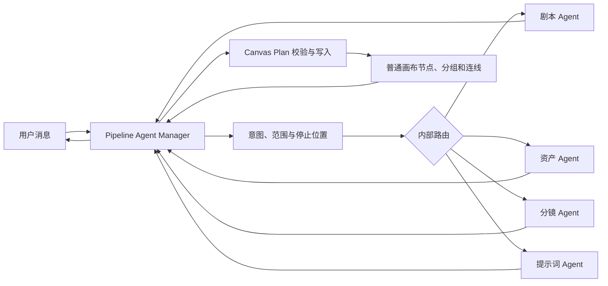
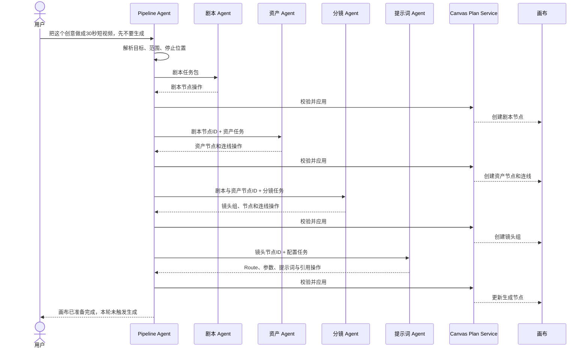
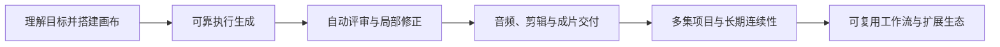

# Pipeline Studio × Huobao 内部多 Agent 工作流融合方案

> 状态：产品方向已确认，待实现设计  
> 日期：2026-09-17  
> 目标：说明一个 Chat 如何在内部编排四个专业 Agent，并将全过程呈现在画布中

## 1. 一句话方案

用户始终只面对一个 Chat 和一个 Pipeline Agent。

Pipeline Agent 作为 Manager / Supervisor 理解用户语义，在内部决定调用剧本、资产、分镜或提示词 Agent，也可以按依赖顺序调用多个。专业 Agent 不拥有用户入口和独立 Chat。它们返回结构化结果，由 Pipeline Agent 统一写成画布节点、分组和连线。

用户想只处理某一步时，直接在同一个 Chat 中表达目标。例如“只修改剧本”“提取当前剧本中的角色”“重新拆分第 2 场”“补全选中视频节点的提示词”。Pipeline Agent 会自动路由到对应的内部 Agent。

## 1.1 已确认的实现方向

四个专业能力需要实现，但第一版不必先创建四个独立用户会话或四套长期 Agent Session。采用以下组合：

```text
一个 Pipeline Agent（Manager）
  ├── tool: pipeline_run_script_specialist
  │     └── 剧本系统提示词 + Script Skill + 输出 Schema
  ├── tool: pipeline_run_asset_specialist
  │     └── 资产系统提示词 + Asset Skill + 输出 Schema
  ├── tool: pipeline_run_storyboard_specialist
  │     └── 分镜系统提示词 + Storyboard Skill + 输出 Schema
  └── tool: pipeline_run_prompt_specialist
        └── 提示词系统提示词 + Prompt Skill + Route Schema
```

这里的 tool 是 Manager 调用专业能力的边界，Skill 是专业能力内部使用的方法和规则。两者不能互相替代：

- 只有 Skill：主 Agent 仍需同时理解全部规则、工具和上下文，隔离不足；
- 只有普通 tool：只能执行固定函数，无法完成剧本、分镜和提示词等创作判断；
- LLM 驱动的专业 tool + 专属 Skill：既保留专业推理，也能限制上下文、输出和可执行范围。

每个专业 tool 内部运行一次受控的 Specialist 调用。它可以和主 Agent 使用同一个模型，也可以配置不同模型，但拥有独立系统提示词、最小上下文、结构化输出 Schema、超时、步骤上限和评估集。

第一版 Specialist 不直接写数据库，也不直接生成图片或视频。它返回结构化操作，服务端据此创建现有 Canvas Plan 草稿；Manager 再通过现有 `canvas_apply_plan` 应用。这样继续复用 revision、scope、Route Schema、原子 mutation 和 undo 机制。

## 1.2 从 Huobao 借鉴什么

Huobao 的源码实际注册了四个 Mastra Agent：`script_rewriter`、`extractor`、`storyboard_breaker`、`prompt_generator`。每个 Agent 由以下部分组成：

- 独立 instructions；
- 独立 Skill 目录；
- 独立工具集合；
- 动态模型配置；
- 包含项目和集数的 Request Context；
- 最大工具步骤数。

它证明了“专业提示词 + 专业 Skill + 工具白名单”能形成明显强于通用提示词的处理能力。Pipeline Studio 参考这套专业能力边界，但不复制 Huobao 的多个用户入口、前端流程或进程内任务状态。Pipeline Agent 继续负责语义路由、步骤顺序、用户沟通和画布范围控制。

## 2. 做完后的 Pipeline Studio

页面继续保持无限画布和右侧 Agent 面板：

```text
┌───────────────────────────────────────────────────────────┬────────────────────────┐
│ Pipeline Studio 画布                                      │ Pipeline Agent Chat    │
│                                                           │                        │
│ [创意/原文]                                               │ 用户：把这个创意做成   │
│      │                                                    │ 30秒短视频，先不要生成 │
│      ▼                                                    │                        │
│ [剧本] ───────┬──────────────┐                            │ 本轮内部工作           │
│               │              │                            │ ✓ 剧本 Agent           │
│               ▼              ▼                            │ ✓ 资产 Agent           │
│         [角色设定]     [场景设定]                          │ ● 分镜 Agent           │
│               │              │                            │ ○ 提示词 Agent         │
│               └──────┬───────┘                            │                        │
│                      ▼                                    │ Agent 当前说明……       │
│             ┌─ 镜头 01 ──────────────┐                   │                        │
│             │ [镜头描述] → [图] → [视频] │                │ [继续输入……]           │
│             └────────────────────────┘                   │                        │
│             ┌─ 镜头 02 ──────────────┐                   │                        │
│             │ [镜头描述] → [图] → [视频] │                │                        │
│             └────────────────────────┘                   │                        │
└───────────────────────────────────────────────────────────┴────────────────────────┘
```

用户不会看到 Agent 选择器，也不需要理解内部调用方式。

用户能感知到的变化只有：

- Pipeline Agent 能完成从创意到可运行画布的完整任务；
- Chat 中会显示本轮内部工作进度；
- 每一步完成后，对应结果立即出现在画布；
- 用户可以修改任何节点，再通过同一个 Chat 继续；
- Pipeline Agent 会根据新请求只调用真正需要的内部 Agent。

## 3. 多 Agent 架构模式

### 3.1 Manager / Supervisor

Pipeline Agent 是唯一持有用户会话的 Manager，负责：

- 理解当前消息和对话历史；
- 结合画布选择、项目状态和用户消息判断意图；
- 确定目标对象、允许范围和停止位置；
- 选择一个或多个专业 Agent；
- 为每个专业 Agent 准备最小任务包；
- 管理步骤依赖和中间结果；
- 校验并应用专业 Agent 返回的画布操作；
- 处理停止、失败、重试和恢复；
- 在同一个 Chat 中向用户统一回复。

四个专业 Agent 是内部 worker：

1. 剧本 Agent；
2. 资产 Agent；
3. 分镜 Agent；
4. 提示词 Agent。

### 3.2 内部调用关系



专业 Agent 之间不直接共享 Chat。完整链路由 Pipeline Agent 逐步调度，并把上一步写入画布后得到的稳定节点 ID 传给下一步。

### 3.3 一次完整调用



## 4. Pipeline Agent 如何理解用户请求

Pipeline Agent 每轮先生成内部执行意图：

```ts
interface PipelineTurnIntent {
  objective: string;
  targetNodeIds: string[];
  requiredSpecialists: Array<"script" | "asset" | "storyboard" | "prompt">;
  constraints: string[];
  allowedOperations: string[];
  allowGeneration: boolean;
  stopCondition: string;
}
```

示例：

| 用户请求 | 内部决定 | 停止位置 |
| --- | --- | --- |
| “写一个 30 秒产品短视频脚本” | 调用剧本 Agent | 剧本节点 |
| “提取这个剧本中的角色和场景” | 调用资产 Agent | 资产设定和待配置图片节点 |
| “把第二场拆成 6 个镜头” | 调用分镜 Agent | 6 个镜头组 |
| “补全这三个视频节点的生成配置” | 调用提示词 Agent | 可运行视频节点 |
| “根据这个创意把整条短视频画布搭好” | 依次调用四个 Agent | 可运行画布 |
| “完成这部短剧并生成所有镜头” | 四个 Agent + Workflow Run | 已生成结果 |
| “只重做第 3 镜，动作更快” | 调用提示词或分镜 Agent，只处理第 3 镜 | 第 3 镜新配置或结果 |

用户可以先选择画布节点再发送消息。当前选择作为可信上下文进入 Pipeline Agent，由它决定交给哪个内部 Agent。节点工具栏无需出现专业 Agent 名称。

## 5. 四个内部专业 Agent

### 5.1 剧本 Agent

输入可以是创意、原文、广告需求、现有剧本或用户选中的文本节点。

职责：

- 创作故事梗概；
- 生成短视频脚本；
- 将长内容整理为短剧剧本；
- 生成旁白、对白和场景说明；
- 修改指定剧本片段。

输出是普通文本节点。它不提取资产、不拆分镜，也不创建生成任务。

### 5.2 资产 Agent

输入通常是剧本节点，也可以包含用户上传的图片和现有资产节点。

职责：

- 提取角色、场景、关键道具或产品；
- 搜索画布和项目中已有的同一对象；
- 合并重复对象；
- 创建或更新资产设定文本节点；
- 为需要形象参考的资产准备图片节点；
- 建立资产与来源剧本的连线。

示例输出：

```text
[剧本]
  ├──提取──> [凌皓·角色设定] ──形象参考──> [凌皓·定妆图]
  ├──提取──> [女孩·角色设定] ──形象参考──> [女孩·定妆图]
  └──提取──> [废弃工厂·场景设定] ───────> [工厂·场景图]
```

### 5.3 分镜 Agent

输入是剧本节点和可用资产节点。

职责：

- 将指定剧本范围拆成镜头；
- 设计画面、景别、运镜、表演和时长；
- 创建镜头描述文本节点；
- 创建镜头所需的图片或视频节点；
- 把角色、场景和道具连接到对应镜头；
- 按顺序布局并分组镜头。

每个镜头成为一个可编辑节点组：

```text
┌─ 镜头 03 · 车内对话 · 4 秒 ───────────────────┐
│                                               │
│ [镜头描述] ───────────────> [视频节点]         │
│      ▲                           ▲            │
│      │                           │            │
│ [凌皓定妆图] [女孩定妆图] [车内场景图] ───────┘
└───────────────────────────────────────────────┘
```

### 5.4 提示词 Agent

输入是镜头组、图片节点或视频节点。

职责：

- 读取镜头创作要求；
- 读取连入节点的角色、场景、道具和参考素材；
- 选择满足条件的生成 Route；
- 编写适合该 Route 的提示词；
- 设置画幅、时长、分辨率和其他参数；
- 将素材绑定到正确输入槽位；
- 通过 preflight 检查节点是否可以运行。

提示词 Agent 默认只把节点准备到“可运行”状态。用户明确要求生成且已授权时，Pipeline Agent 才创建 Workflow Run。

## 6. 专业 Agent 的输入输出合同

每个专业 Agent 都有自己的 system instruction、Skill、工具白名单、输入输出 Schema、最大步骤数、超时和评估用例。

Pipeline Agent 不把完整用户会话交给专业 Agent，只提供本次任务必需的上下文：

```ts
interface SpecialistTask {
  taskId: string;
  projectId: string;
  objective: string;
  inputNodeIds: string[];
  constraints: string[];
  allowedOperations: string[];
  stopCondition: string;
}

interface SpecialistResult {
  taskId: string;
  summary: string;
  operations: CanvasAgentPlanOperation[];
  outputRefs: Array<{
    role: string;
    tempId?: string;
    nodeId?: string;
  }>;
  warnings: string[];
}
```

专业 Agent 不直接操作数据库。它返回结构化 Canvas 操作，由现有 Canvas Plan Service 校验：

- 项目范围；
- 画布 revision；
- 可修改节点范围；
- 允许的 mutation 类型；
- Route 和参数合法性；
- 内容生成授权。

校验通过后，当前步骤的操作原子写入画布。

## 7. 内部工作流状态

Pipeline Agent 为本轮维护一份可恢复的编排状态：

```text
本轮目标：完成30秒悬疑短视频画布

Step 1  script       completed   输出 script-node-1
Step 2  assets       completed   输出 asset-node-1..4
Step 3  storyboard   running     输入 script-node-1 + asset-node-1..4
Step 4  prompt       pending
```

每一步包含：

- 使用的专业 Agent；
- 输入节点 ID；
- 约束和停止条件；
- 输出节点 ID；
- 对应 Canvas Plan ID；
- 状态、错误和重试次数。

应用刷新、用户停止或某一步失败后，Pipeline Agent 可以从最后一个已完成步骤继续。已经成功写入画布的节点不会因后续步骤失败而丢失。

## 8. 用户如何局部使用某项能力

用户始终在同一个 Chat 中表达目标：

> 只把选中的剧本拆成 3 个镜头，保持当前角色设定，不要生成视频。

Pipeline Agent 解析为：

```text
目标动作：拆分分镜
输入范围：当前选中的剧本节点
约束：3 个镜头，沿用现有角色设定
允许副作用：创建文本、图片、视频节点和连线
停止位置：节点配置完成，不触发生成
内部执行者：分镜 Agent
```

Pipeline Agent 只调用分镜 Agent。完成后仍由 Pipeline Agent 回复用户。

其他例子：

- “只润色这段对白” → 剧本 Agent；
- “从剧本中补充遗漏的道具” → 资产 Agent；
- “重新设计第 4 镜的运镜” → 分镜 Agent；
- “让选中的三个视频节点使用这些角色图” → 提示词 Agent；
- “从剧本一直做到可以生成的视频节点” → 资产、分镜、提示词 Agent；
- “从这个创意完成整条视频” → 四个 Agent 串联。

## 9. 短视频和短剧使用同一套内部流程

### 9.1 15 秒短视频

```text
创意节点
  → 15 秒脚本节点
  → 产品 / 场景资产节点
  → 3 个镜头组
  → 3 个已配置视频节点
```

### 9.2 多集短剧

```text
故事原文
  → 第 1 集 / 第 2 集 / 第 3 集剧本节点
  → 共用角色与场景资产
  → 每集各自的镜头组
  → 每个镜头的图片和视频节点
```

第一版通过画布分组表达集数。多集项目经过真实验证后，再决定是否增加 Episode 领域实体。

### 9.3 已有剧本和素材

```text
上传剧本 + 角色图 + 场景图
  → Pipeline Agent 调用分镜 Agent
  → Pipeline Agent 调用提示词 Agent
  → 用户检查并生成
```

Pipeline Agent 自动跳过已经具备可靠结果的前序步骤。

## 10. 画布如何表达工作流

第一版继续使用现有四类节点：文本、图片、视频、音频。

| 业务内容 | 画布表达 |
| --- | --- |
| 创意、剧本、角色设定、场景设定、镜头描述 | 文本节点 |
| 上传图片、角色图、场景图、分镜首帧 | 图片节点 |
| 待生成视频、生成结果 | 视频节点 |
| 配音、环境声、音乐 | 音频节点 |
| 资产集合、单个镜头、单集内容 | 节点分组 |
| 来源、参考、生成依赖 | 有语义的连线 |

推荐连线含义：

- 剧本 → 资产设定：从剧本提取；
- 剧本 → 镜头描述：从剧本拆分；
- 资产图片 → 图片或视频节点：生成参考；
- 镜头描述 → 图片或视频节点：创作要求；
- 图片 → 视频：图生视频输入；
- 音频 → 视频：口型、配音或节奏参考。

用户修改上游节点后，下游生成结果继续使用现有 provenance 机制标记为旧版本。

## 11. Chat 中如何展示内部执行

Pipeline Agent 调用多个专业 Agent 时，Chat 中显示一个紧凑的内部执行卡片：

```text
正在准备 30 秒悬疑短视频

✓ 剧本        已创建 1 个脚本节点
✓ 资产        已创建 2 个角色、1 个场景
● 分镜        正在创建 6 个镜头
○ 提示词      等待分镜完成
```

这里展示的是 Pipeline Agent 的内部步骤，不是四个独立 Chat，也没有 Agent 切换操作。

完成后由 Pipeline Agent 统一回复：

```text
画布已准备完成：
- 1 个剧本节点
- 3 个资产设定节点和 3 个参考图节点
- 6 个镜头组
- 6 个已配置的视频节点

所有视频节点已经可以手动生成。本轮没有调用付费生成接口。
```

## 12. 第一版需要实现的能力

1. Pipeline Agent 的语义路由和范围判断；
2. 四套独立的 Specialist Profile：系统提示词、Skill、输入输出 Schema、允许操作和评估集；
3. 四个受控的 specialist tool 调用入口；
4. Pipeline Agent 的持久化步骤计划；
5. 专业 Agent 结果到 Canvas Plan 的校验与应用；
6. 上一步输出节点到下一步任务的稳定传递；
7. Agent Chat 中的内部步骤进度；
8. 停止、单步失败、重试和继续；
9. 画布选中节点进入本轮可信上下文；
10. 自动创建和布局阶段分组、镜头分组、节点与连线；
11. 默认停在“画布可运行”；
12. 用户明确要求并授权后才创建 Workflow Run。

第一版还需要收敛现有重复路径：

- `pipeline_analyze_script` 的能力并入资产 Specialist，不再与新的专业 tool 同时作为主 Agent 的可选路径；
- `pipeline_extract_storyboard` 的能力并入分镜 Specialist；
- 剧本和提示词处理不再依赖通用的简短 system prompt；
- 专业 tool 统一返回结构化结果，不直接创建资产、分镜或 Generation Run；
- 现有 Canvas Plan、preflight、Workflow Run 和 Generation Run 保持事实来源。

## 13. 推荐开发顺序

### 阶段 1：四个 Specialist Tool 独立可调用

- 增加统一的 `PipelineSpecialistRunner` application 边界；
- 实现四套专业系统提示词、Skill、上下文组装器和输入输出 Schema；
- 注册四个命名清晰的 Manager tool；
- Pipeline Agent 能在测试中分别调用每个专业 tool；
- 每个 Specialist 只接收任务包中允许的节点、项目事实和 Route 摘要；
- Specialist 结果先创建 Canvas Plan 草稿，再由 Manager 调用现有应用入口；
- 建立四组独立评估用例。

验收：用户在 Chat 中说“提取选中剧本的资产”，Pipeline Agent 只调用资产 Agent，画布出现资产节点和连线。

### 阶段 2：Pipeline Agent 串联多步

- 实现本轮步骤计划；
- 前一步的稳定输出节点进入下一步任务；
- Chat 显示内部步骤状态；
- 支持在任一步停止；
- 支持从已有中间结果继续。

验收：一句创意最终形成剧本、资产、镜头组和可运行视频节点，全程没有隐藏生产数据。

### 阶段 3：手动修改后的局部继续

- 用户修改剧本后重新请求资产或分镜处理；
- 用户修改一个镜头后只重新配置该镜头；
- 下游结果根据 provenance 标记过期；
- Pipeline Agent 解释影响范围并选择所需专业 Agent。

验收：修改第 3 镜对白后，只更新第 3 镜相关节点和配置。

### 阶段 4：按用户授权执行生成

- 用户明确要求并开启自动生成后，Pipeline Agent 创建 Workflow Run；
- 只运行当前任务范围内的节点；
- 失败后从对应镜头继续；
- 已完成且未过期的结果不重复生成。

## 14. 已确认的产品与实现决策

1. 采用“一个用户 Chat + Pipeline Agent Manager + 四个内部专业能力”的 Supervisor 模式；
2. 四个专业能力第一版实现为四个 LLM 驱动的 Specialist Tool，并分别加载专属系统提示词和 Skill；
3. Specialist 只接收最小任务包并返回结构化 Canvas 操作；
4. Specialist 没有独立用户会话，不直接写数据库，也不创建 Generation Run 或 Workflow Run；
5. Manager 决定调用一个还是多个 Specialist，并统一向用户回复；
6. 完整工作流默认停在“节点已配置、等待用户生成”；
7. 是否增加 Episode 领域实体继续由真实多集项目验证，不作为四 Specialist 实现的前置条件。

## 15. 最终产品描述

> 用户始终只和 Pipeline Agent 对话。Pipeline Agent 理解语义后，在内部选择并编排剧本、资产、分镜和提示词 Agent，把全过程铺在画布上。用户修改任何节点后，只需继续描述目标，Pipeline Agent 会自动调用需要的专业 Agent。生成操作仍由节点和 Workflow Run 执行，过程可见、可停、可恢复。

## 16. 核心方案完成后的功能方向

四 Agent 方案完成后，Pipeline Studio 已经能够把用户目标转换成可编辑、可运行的生产画布。后续产品主线应从“画布准备”向“可靠交付”推进。



### 16.1 方向一：让画布能够可靠执行

这是四 Agent 方案后的第一优先级。

Pipeline Agent 已经能准备节点，下一步需要确保一组节点可以安全、可恢复地运行：

- 执行前统一 preflight，检查 Route、参数、引用、素材可用性和依赖关系；
- 在用户确认前展示预计生成节点数、调用次数和主要交付规格；
- 根据节点依赖创建持久化 Workflow Run；
- 无依赖节点受控并行，有依赖节点按顺序执行；
- 应用刷新或重启后继续已有运行；
- 区分供应商生成失败、供应商下载输入失败、本地产物下载失败和本地编排失败；
- 支持取消、失败节点重试、重新下载和 Route 回退；
- 已完成且输入未变化的节点不重复提交；
- 幂等控制保证同一操作不会产生重复付费任务。

用户仍然只需在 Chat 中说：

> 生成这些镜头，失败的自动重试一次。

Pipeline Agent 负责选择目标节点、创建 Workflow Run，并在同一个 Chat 中报告进度和需要用户处理的问题。

### 16.2 方向二：从“生成结果”走向“质量收敛”

生成完成不等于作品可用。下一步应增加内部 Review Agent。

Review Agent 不作为新的用户入口。Pipeline Agent 在用户要求检查结果或开启自动评审时调用它。

它负责：

- 将图片或视频结果与镜头描述进行对照；
- 检查角色、服装、产品、场景和画风连续性；
- 检查动作、情绪、镜头、对白和时长是否符合目标；
- 识别明显的生成缺陷、文字错误和音画问题；
- 比较同一节点的多个 take；
- 输出结构化偏差和建议动作；
- 确定最小受影响范围。

Pipeline Agent 根据评审结果选择：

- 保留当前结果；
- 只修改提示词；
- 调整参数；
- 更换参考素材；
- 更换 Route；
- 重新生成必要的上游节点。

自动修正必须有预算限制，例如每个镜头最多自动重试一次、最多回退一个 Route。达到上限后由 Pipeline Agent 向用户说明创作取舍。

### 16.3 方向三：补齐音频、剪辑和成片交付

当图片和视频镜头能够可靠生成后，产品需要完成从镜头到成片的闭环。

可以继续增加内部专业能力：

#### Audio Agent

- 根据角色和对白创建配音节点；
- 管理角色与声音的稳定映射；
- 创建环境声、音效和音乐节点；
- 根据镜头时长调整音频；
- 为需要的镜头配置口型同步。

#### Assembly Agent

- 读取各镜头选定的最终 take；
- 根据镜头顺序创建 Assembly Plan；
- 处理基础转场、字幕、音轨和响度；
- 调用本地 FFmpeg 能力生成成片；
- 保存预览、成片 Artifact 和交付历史；
- 合成失败时从合成阶段恢复，不重新生成镜头。

画布中可以先用节点和有序分组表达装配关系。真实项目证明需要精细时间控制后，再增加时间线视图。

### 16.4 方向四：支持多集项目和长期连续性

四 Agent 第一版可以使用画布分组表达集数。多集项目增多后，再将稳定需求提升为领域能力：

- Episode 成为项目内的内容容器；
- 角色、场景、道具作为项目级资产被多集引用；
- 项目保存角色设定、服装、声音、场景和视觉风格的连续性事实；
- 每个镜头记录使用了哪些资产版本；
- 资产变化时准确标记受影响的镜头；
- Pipeline Agent 可以按集、按场景或按角色执行局部更新；
- 每集拥有独立成片，项目可以继续生成合集或不同交付版本。

这一步的数据模型应从真实画布项目中提炼，避免先建立一套与画布脱节的剧集管理系统。

### 16.5 方向五：形成可复用的生产工作流

当多种真实项目跑通后，可以把成功经验沉淀为可复用能力：

- 短视频、短剧、产品广告、角色短片等项目模板；
- 可复用的画布节点拓扑和默认布局；
- 可复用的 Pipeline Agent 编排策略；
- 行业或风格 Skill Packs；
- 团队自定义的专业 Agent 指令、工具权限和评估集；
- 根据项目特征自动推荐合适模板；
- 从现有成功项目提取模板，同时移除具体素材和敏感内容。

模板提供初始约束和编排建议，Pipeline Agent 仍根据用户本轮目标决定实际步骤。

### 16.6 方向六：扩展更多内部专业 Agent

长期可以增加新的内部 worker，例如：

- Research Agent：收集创作背景和事实资料；
- Director Agent：统一镜头语言、节奏和表演方向；
- Continuity Agent：维护跨镜头和跨集连续性；
- Review Agent：评审生成结果；
- Audio Agent：配音、音乐和音效；
- Assembly Agent：剪辑、字幕和成片输出；
- Localization Agent：翻译、配音和多语言交付。

这些 Agent 继续由 Pipeline Agent 自动选择。用户界面始终保持一个 Chat，不随着内部 Agent 数量增加而增加入口复杂度。

## 17. 推荐路线与优先级

| 阶段 | 产品结果 | 主要内部能力 | 优先级 |
| --- | --- | --- | --- |
| A | 从目标得到可编辑、可运行画布 | 剧本、资产、分镜、提示词 Agent | 当前核心方案 |
| B | 画布可以可靠批量生成 | Preflight、Workflow Run、恢复、成本边界 | 下一阶段 |
| C | 系统能判断结果是否符合目标并局部修正 | Review Agent、最小影响重试 | 高 |
| D | 从镜头得到带声音的完整成片 | Audio Agent、Assembly Agent | 高 |
| E | 稳定支持多集和跨集连续性 | Episode、项目资产、Continuity Agent | 中 |
| F | 不同内容类型可以快速复用成功流程 | 模板、Skill Packs、Agent Registry | 中 |
| G | 支持多语言和更多交付渠道 | Localization Agent、交付预设 | 后续 |

## 18. 长期产品形态

长期的 Pipeline Studio 仍然保持三个核心界面概念：

1. **一个 Chat**：用户描述目标、修改意见和交付要求；
2. **一张画布**：展示所有可检查、可修改的创作事实和执行依赖；
3. **一套 Run 体系**：记录 Agent 编排、内容生成、质量修正和最终装配。

内部 Agent 数量可以增加，供应商模型可以变化，工作流也可以因项目而不同。用户始终通过 Pipeline Agent 表达意图，并在画布上控制结果。

最终产品可以概括为：

> Pipeline Studio 是一个由单一对话驱动、内部多 Agent 协作、以画布为生产事实、能够从创意持续推进到最终交付的 AI 内容生产工作台。

## 19. 后续阶段的判断标准

每个新方向都应回答以下问题，再进入开发：

1. 它是否减少用户为了完成作品而进行的重复手工操作；
2. 它是否能落回普通画布节点、连线、Artifact 或 Run；
3. Pipeline Agent 是否可以通过语义自动决定何时使用它；
4. 用户是否能检查、修改、停止和恢复；
5. 失败是否有明确且不会重复计费的恢复方式；
6. 它是否经过至少一个真实项目验证。

无法满足这些条件的能力不应只为了增加 Agent 数量或展示自动化程度而加入。
