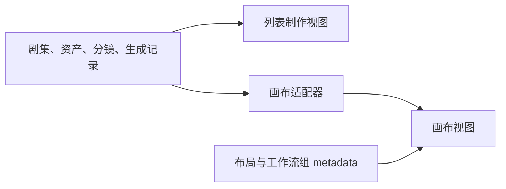

# Pipeline Studio × LocalMiniDrama 研究与参考价值评估

> 状态：产品与架构评审稿  
> 日期：2026-09-17  
> 研究对象：`D:\LocalMiniDrama-main`  
> 目标：判断 LocalMiniDrama 对 Pipeline Studio 的研究价值，并提炼可进入现有单 Chat、多 Agent、画布工作流方案的能力

## 1. 结论

LocalMiniDrama **有较高研究价值**，但它的核心价值与 Huobao 不同。

- Huobao 值得研究的是：如何把剧本、资产、分镜和提示词拆成专业能力，并形成创作流程。
- LocalMiniDrama 值得研究的是：短剧生产需要哪些结构化数据、怎样在列表和画布之间保持同一份事实、如何补全缺失步骤、如何维持镜头连续性，以及如何向用户展示资产变化影响了哪些镜头。

它不应作为 Pipeline Studio 的多 Agent 架构样板。仓库中的 OpenClaw Skill 本质上是一个 Agent 按说明顺序调用 HTTP API；一键全流程和画布工作流主要由前端 JavaScript 编排，没有独立的 Manager Agent、专业 Agent、持久化 Workflow Run 和 Step 状态机。

综合判断：

| 维度 | 评价 | 说明 |
| --- | --- | --- |
| 产品流程研究 | 很高 | 已覆盖剧本、资产、分镜、图片、视频、配音、合成和工程迁移 |
| 画布交互研究 | 高 | 列表与画布同源、关联高亮、节点内编辑、工作流组重跑都已落地 |
| 短剧领域模型 | 很高 | Episode、Storyboard、角色、场景、道具、首尾帧和连续性字段较完整 |
| 多 Agent 架构研究 | 低 | 没有真正的 Supervisor 与 agent-as-tool 体系 |
| 可靠任务编排 | 中低 | 单任务有持久化记录，完整流水线由前端内存状态推进 |
| 直接复用代码 | 中低 | MIT 允许复用，但 Vue/Express/JavaScript 结构与当前项目差异较大 |
| 对现有方案的启发 | 很高 | 可以补强四 Agent 方案的生产规则、数据合同和用户控制方式 |

一句话概括：

> Huobao 帮助 Pipeline Studio 定义“内部由谁处理”，LocalMiniDrama 帮助定义“生产过程具体处理什么、怎样让用户检查和继续”。

## 2. 本次研究范围

本结论不仅基于 README，还核查了以下实现：

- 一键全流程：`frontweb/src/views/FilmCreate.vue`
- 画布视图：`frontweb/src/views/DramaCanvas.vue`
- 画布数据适配：`frontweb/src/utils/dramaCanvasAdapter.js`
- 画布工作流执行：`frontweb/src/composables/useCanvasWorkflowRunner.js`
- 画布与工作流设计记录：`docs/plans/2026-06-15-drama-canvas-workflow-plan.md`
- 异步任务：`backend-node/src/services/taskService.js`
- 分镜生成和连续性：`backend-node/src/services/episodeStoryboardService.js`、`framePromptService.js`、`tailFrameLinkService.js`
- 资产库与去重：`backend-node/src/services/libraryDedup.js` 及三类 Library Service
- 项目导入导出：`backend-node/src/services/dramaExportService.js`、`dramaImportService.js`
- 自然语言控制：`openclaw-skill/SKILL.md`、`tools.json`
- 关键行为测试：`backend-node/test/taskService.test.js`、`videoResumePoll.test.js`、`libraryDedup.test.js`

仓库使用 MIT License。若后续直接移植实质性代码，需要保留其版权和许可声明。

## 3. 它实际做成了什么

### 3.1 一条完整的短剧生产链

LocalMiniDrama 已经把以下过程连接起来：

```text
故事 / 原文
  → 分集剧本
  → 提取角色、场景、道具
  → 生成资产参考图
  → 生成结构化分镜
  → 生成分镜图或首尾帧
  → 生成分镜视频
  → 配音、旁白和字幕
  → 合成整集视频
```

这条链路对 Pipeline Studio 的价值在于，它提供了真实生产对象和前置条件，而不只是一个抽象的“文本到视频”流程。

### 3.2 列表模式与画布模式使用同一份业务数据

它的设计文档明确规定：角色、场景、分镜、图片和视频仍然保存在现有 SQLite 表中，画布只保存节点位置、视口和工作流分组。`dramaCanvasAdapter.js` 再把业务实体转换成 Vue Flow 节点和边。



这个原则非常值得采用：同一个角色或分镜不应该因为出现在列表和画布中就拥有两份可分别修改的数据。

### 3.3 画布表达了生产关系，而不只是自由摆放

画布会从业务关系推导出：

- 剧本与集数的关系；
- 分镜的先后顺序；
- 角色、场景、道具与所用分镜的关系；
- 分镜描述、图片、首帧、尾帧、视频和音频的生成链；
- 工作流组包含的分镜及其执行步骤。

用户可以在节点内编辑和触发生成，也可以框选多个分镜建立工作流组并整组重跑。

### 3.4 “补全并生成”会跳过已有结果

一键流程不是每次从头生成。它会依次检查：

- 是否已有角色、场景和道具；
- 是否已有分镜；
- 哪些资产缺少图片；
- 哪些分镜缺少图片；
- 哪些分镜缺少可播放视频；
- 是否已有最终合成结果。

缺失项才进入执行队列。这个“从当前项目状态规划剩余步骤”的思路，比固定重放整条工作流更适合 Pipeline Studio。

### 3.5 分镜不是一段模糊提示词

LocalMiniDrama 的分镜包含较完整的摄影和叙事字段：

- 景别、水平角度、俯仰角度；
- 运镜、动作、表演结果；
- 场景、时间、氛围、灯光和景深；
- 对白、旁白、情绪和强度；
- 时长、段落和顺序；
- 图片提示词、视频提示词、首尾帧提示词；
- 角色、场景和道具引用；
- 经典模式或多图参考的全能模式。

这证明分镜 Agent 的输出合同应该是结构化 Shot Spec，而不应只返回自然语言镜头描述。

### 3.6 它处理了连续镜头的一些真实问题

项目实现了多种连续性机制：

- 角色身份锚点、风格词和色板；
- 首帧与尾帧分别保存和生成；
- `layout_description` 作为人物站位和画面布局约束；
- 生成尾帧时引用首帧布局；
- 从当前镜头视频提取最后一帧，作为下一镜头首帧；
- 在生成分镜提示词时读取相邻镜头信息。

这些机制并不都需要原样进入第一版，但它们明确说明“连续性”需要成为正式数据，而不能长期只依靠 Agent 临时记忆。

### 3.7 资产变化会展示受影响镜头

角色、场景或道具卡片会列出关联的分镜。用户重新生成资产后，可以看到哪些镜头受影响，并批量重做相应分镜图。

这是非常实用的用户控制方式：系统不仅知道依赖关系，还把影响范围解释给用户。

### 3.8 项目可以完整导入导出

项目 ZIP 不只包含最终视频，还包含：

- 项目信息、剧本和分镜字段；
- 角色、场景和道具；
- 分镜图片历史；
- 首尾帧绑定；
- 帧提示词；
- 音频和视频文件；
- 画布布局和工作流组 metadata。

导入过程使用事务，并把旧 ID 映射到新 ID。这对本地优先的创作工具很有参考意义。

## 4. 最值得 Pipeline Studio 采用的设计

### 4.1 同一份生产事实，多种工作视图

Pipeline Studio 目前以画布作为生产事实。LocalMiniDrama 进一步说明：复杂短剧只靠无限画布并不总是最高效，用户还需要密集的镜头列表来逐项检查参数和结果。

建议后续提供一个与画布同源的 **Shot List / Sequence View**：

- 画布适合查看依赖、整体结构和局部创作关系；
- 镜头列表适合连续浏览、批量选择、比较状态和逐镜修订；
- 两者读取相同节点、边、Artifact、Run 和连续性设定；
- 任一视图的修改立即反映到另一视图；
- 不建立第二套短剧数据库。

### 4.2 将“补全并生成”改造成确定性 Planner

Pipeline Agent 可以理解用户目标，但哪些步骤已满足、哪些节点缺输入、哪些结果已过期，应由 application 层根据权威数据计算。

推荐流程：

```text
用户目标
  → Pipeline Agent 确定范围和交付目标
  → Readiness Planner 检查已有节点、引用、Artifact 和版本
  → 得到缺失步骤与受影响范围
  → 专业 Agent 只补齐需要创作判断的内容
  → Canvas Plan 校验并写入
  → 用户显式启动 Workflow Run
```

这比让 Manager Agent 自己用提示词猜测“应该跳过什么”更可靠。

### 4.3 为分镜 Agent 建立结构化 Shot Spec

建议至少包含：

```ts
interface ShotSpec {
  title: string;
  order: number;
  durationSeconds: number;
  narrativePurpose: string;
  action: string;
  dialogue?: string;
  narration?: string;
  shotSize?: string;
  cameraAngle?: string;
  cameraMovement?: string;
  lighting?: string;
  depthOfField?: string;
  emotion?: string;
  characterRefs: string[];
  sceneRef?: string;
  propRefs: string[];
  continuityFromShotRef?: string;
}
```

这些字段可以先保存在镜头描述文本节点的结构化 metadata 中，再由提示词 Agent 编译成不同 Route 所需的输入。不要让模型供应商字段进入 Shot Spec。

### 4.4 把资产身份和连续性提升为项目级事实

LocalMiniDrama 的全局库、项目库、四视图和身份锚点说明，角色与场景不能只是一次生成的图片。

Pipeline Studio 可以在现有连续性设定和 provenance 之上逐步增加：

- 角色、产品、场景和道具的稳定资产 ID；
- 用户确认的身份特征、服装、色板和声音；
- 当前采用的参考图版本；
- 哪些镜头使用了哪个资产版本；
- 资产更新后的受影响节点集合；
- 项目内复用与跨项目导入。

跨项目素材库可以晚于项目内资产注册表。先把版本和引用关系做正确，避免一个“全局图库”变成无来源的文件集合。

### 4.5 在 UI 中直接展示下游影响

当用户修改或替换角色图时，界面应给出具体结果：

```text
该角色被 8 个镜头引用：#2、#3、#5、#7、#8、#10、#11、#12
其中 5 个已有生成结果，将被标记为过期。
```

用户随后可以选择：

- 只保存资产，不重跑；
- 重新配置受影响节点；
- 重跑选中的镜头；
- 等待后续统一处理。

现有画布边和 provenance 已经能够提供比 LocalMiniDrama 前端数组扫描更准确的实现基础。

### 4.6 把镜头连续性表达成明确关系

第一版可以增加语义关系或节点 metadata：

- `sequence-next`：镜头顺序；
- `continuity-reference`：连续性参考；
- `first-frame-source`：首帧来源；
- `last-frame-source`：尾帧来源；
- `asset-reference`：角色、场景或道具引用。

提示词 Agent 和未来 Continuity Agent 读取这些关系，而不是根据画布坐标推断顺序。

### 4.7 在高成本阶段设置停点

LocalMiniDrama 在分镜、资产图和分镜图完成后设置倒计时，让用户有机会暂停。这个意图值得保留，但 Pipeline Studio 已有更合适的产品形式：

- 四个内部 Agent 默认把画布准备到可运行；
- preflight 展示要生成的节点、Route、数量和主要规格；
- 用户明确启动后才进入 Workflow Run；
- 自动评审和自动重试有预算上限。

不需要照搬固定 20 秒或 30 秒倒计时。

### 4.8 为自然语言入口建立完整工具覆盖表

OpenClaw Skill 的真正价值是列出了从创建项目到最终合成需要的全部 API 动作。它可以作为 Pipeline Agent 工具覆盖测试的参考清单。

但 Pipeline Studio 不应让 Agent 直接用通用 HTTP 工具拼 URL。应继续采用受控的 application 工具和稳定合同，并为每种自然语言目标验证：

- 所需读能力是否存在；
- 所需写操作是否能生成 Canvas Plan；
- 前置条件能否由服务端判断；
- 失败后能否恢复；
- 工具是否限制在当前项目和本轮节点范围内。

### 4.9 工程导出应保存创作过程，不只保存媒体

Pipeline Studio 已采用可迁移的本地项目目录，这比单个 ZIP 更适合作为事实来源。后续导出功能可以借鉴 LocalMiniDrama 的完整性：

- 导出项目 manifest 和 schema version；
- 保存节点、边、分组、连续性设定和工作流定义；
- 保存采用的 Artifact 及必要历史版本；
- 保存生成配置快照和来源关系；
- 导入时事务校验、版本迁移和 ID 重映射；
- ZIP 只是交付和迁移格式，不成为运行时数据库。

## 5. 它对四 Agent 方案的具体补充

LocalMiniDrama 不改变“一个 Chat + Pipeline Agent + 内部专业 Agent”的整体结构，但应补充以下职责。

| 现有内部能力 | 从 LocalMiniDrama 吸收的要求 |
| --- | --- |
| Pipeline Agent | 根据目标调用 Readiness Planner，跳过已满足且未过期的阶段，解释剩余工作和影响范围 |
| 剧本 Agent | 输出可分集或可分段的结构，并保留对白、旁白和场景信息 |
| 资产 Agent | 复用现有项目资产，维护稳定引用和版本，识别重复资产 |
| 分镜 Agent | 输出结构化 Shot Spec、镜头顺序、资产引用和连续性关系 |
| 提示词 Agent | 根据 Route 能力选择经典单图、首尾帧或多图参考策略，绑定正确输入槽位 |
| Workflow Run | 只执行 Planner 判定为缺失或过期的节点，继续使用持久化拓扑、Step 和幂等控制 |
| Review Agent（后续） | 检查资产一致性、相邻镜头连续性和 Shot Spec 符合度，给出最小重跑范围 |

这里不建议立即新增“连续性 Agent”作为第五个基础 Agent。第一阶段先把连续性字段、关系和校验做成确定性数据能力；真实项目证明需要创作判断后，再加入内部 Continuity Agent。

## 6. 不建议照搬的实现

### 6.1 不复制前端内存流水线

`FilmCreate.vue` 内维护暂停、终止、当前步骤、错误日志、并发数和重试状态，并直接顺序调用各生成 API。刷新页面或应用重启时，完整流水线没有持久化 Run 可以恢复。

Pipeline Studio 已有持久化 Workflow Run、Step、Generation Run、Provider Job、preflight 和幂等设计，不应退回到前端编排。

### 6.2 不把 workflow_groups 当成真正的运行状态

LocalMiniDrama 的 `workflow_groups` 只是 metadata 中的以下信息：

```json
{
  "storyboard_ids": [12, 13, 14],
  "pipeline": ["image", "video", "audio"]
}
```

它适合作为批处理选择集，不足以表达拓扑快照、输入版本、步骤状态、失败原因、幂等键和恢复点。Pipeline Studio 应继续使用 CanvasWorkflow 与 Workflow Run 的分层模型。

### 6.3 不对所有失败统一自动重试三次

LocalMiniDrama 的流水线对多个步骤统一最多重试三次。对于付费生成，提交结果不确定时自动重试可能产生重复计费。

Pipeline Studio 应继续区分：

- 提交前失败；
- 已确认提交后的轮询失败；
- 上游任务失败；
- 下载失败；
- 本地处理失败。

只有确定安全的阶段才自动重试。

### 6.4 不让通用 HTTP Skill 成为核心 Agent 接口

OpenClaw Skill 依赖说明文档告诉 Agent 正确 API 顺序，并用 memory 保存 `drama_id`、`episode_id` 和当前步骤。这种方式容易受到字段变化、遗漏前置步骤和上下文丢失影响。

Pipeline Studio 的专业 Agent 应继续接收最小任务包，通过受控工具返回结构化操作，由 application 校验和落库。

### 6.5 不复制巨型页面组件和业务耦合

`FilmCreate.vue` 超过一万行，同时承担大量 UI、轮询、流水线、生成和业务判断；`videoClient.js` 也集中了大量供应商协议分支。这些文件说明功能丰富，但不适合作为模块边界参考。

当前项目应继续保持：

```text
domain <- ports <- application <- transport
```

供应商差异留在 infrastructure，前端只消费共享合同和应用用例。

### 6.6 不默认把所有关系全部展开在画布上

LocalMiniDrama 的画布截图已经表现出明显的长连线和交叉线问题。角色、场景和道具全部连接到多个镜头后，大项目会迅速降低可读性。

Pipeline Studio 更适合提供：

- 默认折叠镜头内部节点；
- 按选择高亮关联边；
- 按语义类型筛选连线；
- 分集或分场景聚焦；
- 将密集参数检查放到 Shot List；
- 只在需要时显示资产到镜头的全部依赖。

## 7. 对当前产品路线的影响

LocalMiniDrama 使现有路线更具体，但不需要改变主线。


### 当前核心方案中立即吸收

1. 分镜 Agent 输出结构化 Shot Spec；
2. Pipeline Agent 调用确定性的 Readiness Planner；
3. 专业 Agent 必须复用已有节点并跳过可靠结果；
4. 资产、镜头和生成结果保留稳定引用与版本；
5. 画布边承担真实依赖和影响分析；
6. 经典单图、首尾帧和多图参考作为生成策略，不作为新的用户 Agent；
7. 用户修改上游资产后显示受影响镜头。

### 四 Agent 方案完成后优先推进

1. 与画布同源的 Shot List / Sequence View；
2. 连续性设定、首尾帧关系和相邻镜头检查；
3. 项目资产注册表与资产版本；
4. 完整项目导出、导入和版本迁移；
5. Review Agent 对 Shot Spec 和连续性进行评审；
6. Audio Agent 与 Assembly Agent 完成成片闭环。

### 真实项目验证后再决定

1. 是否将 Episode 提升为独立领域实体；
2. 是否需要跨项目全局素材库；
3. 是否增加专门的 Continuity Agent；
4. 是否增加细粒度时间线编辑；
5. 四宫格、九宫格等模型特定生产模式是否值得做成通用能力。

## 8. 推荐优先级

| 优先级 | 建议 | 原因 |
| --- | --- | --- |
| P0 | 结构化 Shot Spec | 直接决定分镜 Agent 和提示词 Agent 的合同质量 |
| P0 | Readiness Planner | 保证 Agent 不重复创建、工作流只补缺失项 |
| P0 | 资产引用与下游影响 | 支撑局部修改、局部继续和过期判断 |
| P0 | 同源数据原则 | 防止未来增加列表视图时形成两套事实 |
| P1 | Shot List / Sequence View | 多镜头项目的检查效率明显高于只用无限画布 |
| P1 | 连续性关系与首尾帧策略 | 提高连续视频的可用性 |
| P1 | 项目资产注册表 | 支持多镜头和多集复用 |
| P1 | 完整工程导入导出 | 符合本地项目和长期可迁移方向 |
| P2 | 全局素材库 | 需要先解决版本、来源和权限问题 |
| P2 | Continuity Agent | 先验证确定性数据能力是否已经足够 |
| P2 | 四宫格、特定模型工作流 | 与供应商能力强相关，不能反向污染通用模型 |

## 9. 最终判断

LocalMiniDrama 值得继续作为 **短剧生产机制参考项目**，不适合作为 **多 Agent 或可靠工作流架构模板**。

它对 Pipeline Studio 最有价值的启示有五个：

1. 画布、列表和 Chat 必须围绕同一份生产事实工作；
2. 完整流程应该从当前项目状态补齐缺失项，而不是每次从头执行；
3. 分镜、资产身份和连续性必须成为结构化数据；
4. 上游修改后，系统要明确展示受影响的镜头和结果；
5. 自然语言 Agent 负责理解目标，可靠性、前置条件、恢复和重试应由 application 与 Run 体系负责。

因此，建议把它定位为 Huobao 研究之后的第二块拼图：

> 保留 Huobao 提炼出的单 Chat、Supervisor 和四个内部 Agent；吸收 LocalMiniDrama 的同源视图、结构化分镜、补全式执行、资产复用、连续性和影响分析；继续使用 Pipeline Studio 已有的持久化 Workflow Run，而不复制其前端脚本式流水线。
