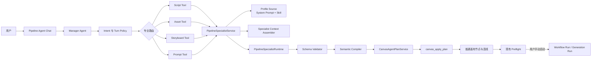
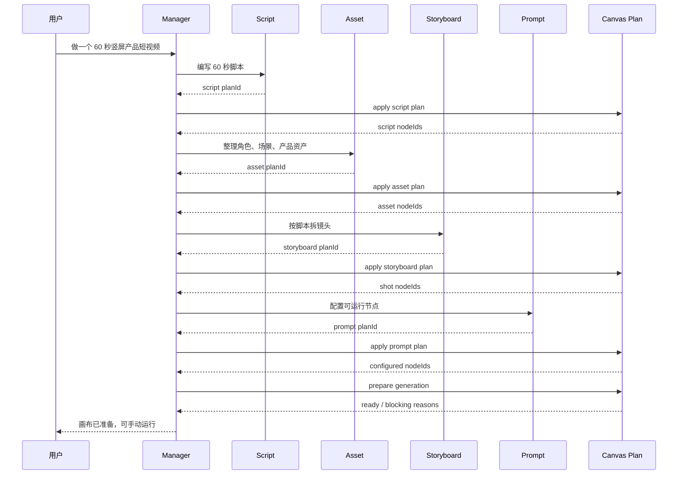

# Pipeline Studio 内部四 Specialist Agent 完整设计与执行方案

> 文档状态：V1 已正式收口；20 个固定端到端样例全部通过，自动指标达到发布门槛  
> 方案版本：V1.0  
> 更新日期：2026-09-24  
> 适用范围：Pipeline Studio 的剧本、资产、分镜和生成提示词准备能力  
> 研究输入：Huobao Drama、LocalMiniDrama、Pipeline Studio 当前实现与既有设计文档

## 1. 评审摘要

### 0.1 2026-09-21 实施快照

已完成：

- 四套内置 Profile、通用 Runtime/Profile Source port、隔离补全和一次格式修复。
- Script、Asset、Storyboard、Prompt 四个 Specialist Tool，并接入单一 Pipeline Agent Chat。
- `CanvasScriptSpec`、`CanvasAssetSpec`、`CanvasShotSpec`、`group` 与非引用 `edgeType` 的 Plan 编译和 HTTP 校验。
- `references` 与语义血缘连线分离；Route 绑定、引用同步和 Workflow 拓扑只消费 `references`。
- 用户直接修改正文后旧 `creativeSpec` 自动失效；Agent Plan 可以原子更新正文和规格。
- 文本节点显示剧本、资产或镜头规格标记；中英文文案、架构文档、API 合同和桌面打包资源路径已同步。
- 环境变量 `PO_AGENT_PIPELINE_SPECIALISTS_ENABLED=0` 可关闭四个 Specialist Tool，用于本地回退或灰度。

已补齐的收口项：

- `resources/pipeline-specialists/evaluation` 包含 20 个固定样例、评分表与指标门槛。
- 画布 Inspector 可按字段编辑 `creativeSpec`，保存时同步更新可见正文，并显示全部语义连线和引用连线的下游影响。
- `canvas_prepare_generation` 区分明确执行、缺失补齐、过期重做、可靠复用和非生成来源跳过。
- Asset 编译器复用稳定 identityKey、标准名、别名与可确认的旧文本资产；多候选时返回身份歧义错误。
- Prompt 编译器复用规格节点唯一派生的同类型媒体节点，避免重复配置。
- 运行指标写入本地匿名 JSONL，记录失败、修复、Plan 操作数和 preflight 通过情况。
- Manager 明确按 `episodeKey` 分批处理多集短剧，批次过大时缩小未处理范围，不重试同一范围。

最终浏览器回归结果记录在本次交付说明中；旧阶段 HTTP API 仍有明确兼容调用方，因此保留底层服务，但旧分析、分镜和付费生成 Tool 继续不向 Manager 注册。

### 0.2 2026-09-22 最终验收补充

- 同一 Chat 回合内，Plan 新建的节点会进入本轮有效 scope，后续 Storyboard 或 Prompt Specialist 可以安全引用，完整工作流不再要求用户重复发送指令。
- 显式提出 Specialist 或预检步骤时，Intent Resolver 会提升到对应阶段，避免被通用 review 分类阻断。
- Specialist 上下文改为紧凑索引并限制 Route 摘要数量，选中规格不再重复携带全文，长画布仍受输入预算保护。
- Asset 编译器只在同类资产间做 identityKey、标准名和别名去重。即使模型显式把剧本或镜头节点填为资产 target，也会新建独立资产，禁止跨规格类型覆盖。
- 浏览器端已完成单集 20 秒短视频和两集各 12 秒短剧回归。多集用例生成 6 个 9:16 视频节点，预检结果为 ready 6、reuse 0、missing 0、stale 0、skipped 0，且未触发媒体生成。
- 最终门禁：`npm run check` 通过（1055 passed，1 skipped），`npm run build` 通过。

本方案建议把 Pipeline Studio 的 Canvas Agent 升级为一个面向用户的 **Manager Agent**，并在它的内部增加四个专业能力：

1. **Script Specialist**：理解创作目标，编写或改写故事、脚本、旁白和对白。
2. **Asset Specialist**：识别并维护角色、场景和关键道具的稳定身份与视觉设定。
3. **Storyboard Specialist**：把脚本转成可制作的镜头规格，控制节奏、表演、构图、运镜和声音。
4. **Prompt Specialist**：根据已启用的 Generation Route，把镜头规格转成可执行的图片、视频和音频节点配置。

用户始终只面对一个 Pipeline Agent Chat。用户不选择 Agent，也不进入四个独立会话。Manager 根据本轮语义和当前画布状态，决定只调用一个 Specialist，或者按照依赖关系连续调用多个 Specialist。

四个 Specialist 在 Manager 看来是四个工具；每个工具内部由独立的系统提示词、专业 Skill、输入上下文、结构化输出协议、确定性校验和画布 Plan 编译器组成。它们不是四个常驻聊天会话，也不直接修改数据库，不创建 Generation Run 或 Workflow Run。

所有结果继续落到现有画布节点、连线和 Canvas Agent Plan。用户可以修改任意节点，再从画布显式启动单节点生成或工作流生成。现有的 Route Catalog、全量预检、Workflow Run、Generation Run、Provider Job、Artifact、失败恢复和 provenance 机制继续作为生产执行的事实来源。

### 1.1 本次建设解决的核心问题

当前 Pipeline Studio 已有可靠的画布、Plan、生成和恢复基础，但创作推理层较弱：

- 剧本实体提取和分镜提取依赖短提示词与宽松 JSON 解析，无法稳定处理创作约束、连续性和局部修改。
- 旧服务在模型返回后直接创建资产、分镜和节点，缺少去重、预览、原子应用和统一撤销。
- Manager 需要同时承担意图理解、专业创作、Route 选择、节点配置和画布操作，单一上下文容易膨胀，专业质量不稳定。
- 用户说“做一个短视频”或“把这一段改成分镜”时，当前能力缺少一条一致、可观察、可中途接管的处理链。

本方案把复杂度放在内部能力边界中，不增加用户操作负担。

### 1.2 建设后的产品形态

完成后，Pipeline Studio 仍然是当前的画布加单一 Chat：

- 用户输入目标或选中节点后发出指令。
- Chat 中显示简洁的专业步骤进度，例如“整理剧本”“统一角色设定”“拆分镜头”“配置生成节点”。
- 每一步产生普通画布节点和连线，并通过现有 Action 支持整组撤销。
- 用户可以在任一步停下，手动修改节点，再让 Agent 继续。
- Agent 准备完成后告诉用户哪些节点或工作流可以手动运行。
- 图片、视频和音频生成仍由用户在画布中显式触发。

产品不会出现四个 Agent 标签页、Agent 切换器、四套会话历史或另一套工作流编辑器。

## 2. 已确认的产品决策

以下内容来自前几轮讨论，作为本方案的固定前提：

| 决策 | 结论 |
| --- | --- |
| 用户入口 | 只有一个 Pipeline Agent Chat |
| 多 Agent 关系 | Pipeline Agent 是 Manager，四个专业 Agent 是内部 Specialist |
| 调用方式 | Manager 根据用户语义和画布状态自动路由 |
| 单独使用 | 用户通过自然语言只提出某一类任务，Manager 只调用对应 Specialist |
| 完整使用 | Manager 按依赖顺序调用多个 Specialist |
| 实现形态 | 四个 Manager Tool，每个 Tool 绑定独立 System Prompt 与 Skill |
| 画布写入 | Specialist 生成语义结果，服务端编译为 Canvas Agent Plan |
| 生成控制 | Specialist 和 Manager 都不创建付费生成 Run |
| 用户控制 | 用户可修改节点，并从节点或工作流手动启动生成 |
| 事实来源 | 继续使用现有 Canvas、Workflow Run、Generation Run 和 Artifact |
| 长短内容 | 短视频与短剧共用同一套内部流程，按规模分批处理 |

## 3. 方案价值与修改范围判断

### 3.1 这项工作为什么能让当前项目变得更好

这次升级补的是 Pipeline Studio 当前最薄弱的创作决策层，并且复用已经完成的生产基础。

| 当前能力 | 当前状态 | 本方案带来的变化 |
| --- | --- | --- |
| 用户意图识别 | 已有结构化 Intent Resolver | 增加专业任务路由与依赖判断 |
| 画布上下文 | 已有受信任 Context Assembler | 为不同 Specialist 提供最小、相关上下文 |
| 画布变更 | 已有 Plan、原子应用、rebase 和 undo | 所有专业结果统一走 Plan，不再直接写库 |
| 剧本能力 | 短提示词，输出深度有限 | 使用独立剧作方法、约束和质量检查 |
| 资产能力 | 提取后直接新增，容易重复 | 建立稳定身份、去重、复用和连续性 |
| 分镜能力 | 一次性提取，引用匹配较弱 | 形成可制作 Shot Spec，按集或场景分批 |
| Prompt 能力 | 三条简单润色提示词 | 按 Route Schema 生成完整 prompt、参数和素材绑定 |
| 生成执行 | 已有完整 Run 体系 | 保持不变，继续由用户显式触发 |
| 结果评审 | 已有素材分析、历史 take 和影响范围 | Specialist 可以利用评审结果做局部修订 |

真正的收益不是“项目里多了四个 Agent 名称”，而是以下能力变得稳定：

- 用户的自然语言目标能转换成明确、可检查的制作步骤。
- 每一步有独立的专业规则，避免一个大提示词同时承担所有任务。
- 角色、场景和镜头信息能在后续步骤中持续复用。
- Agent 的结果先经过结构校验和 Plan 校验，再进入画布。
- 用户修改某个节点后，可以只重做受影响的下游部分。
- 短视频与多集短剧共享相同架构，不需要维护两套产品流程。

### 3.2 修改量如何被控制

本方案不是重写 Pipeline Studio。第一版只新增创作能力层，并对现有 Plan 合同做少量扩展：

- 不新建第二套画布。
- 不新建第二套 Generation Run 或 Workflow Run。
- 不引入四个常驻 Agent Runtime。
- 不要求先建立 Episode 数据表。
- 不复制 LocalMiniDrama 的前端内存 Pipeline。
- 不改变用户手动触发生成的产品原则。
- 不把现有 Pipeline Skill 市场改造成 Specialist 配置中心。

第一版需要新增的核心内容是四套 Profile、一个通用 Specialist Runtime Port、一个应用服务、四个语义编译器，以及三个可选的画布 Plan 字段。节点仍保存到现有 `pipeline_canvas_nodes.data_json`，因此创作规格不要求 SQLite 表迁移。

## 4. 研究结论如何进入本方案

### 4.1 Huobao Drama 值得吸收的部分

Huobao 的四个专业 Agent 不是名称包装。每个 Agent 都有独立提示词、Skill、工具白名单、模型配置和请求上下文。它证明了按专业阶段拆分提示词和能力边界，可以减少单个 Agent 的职责冲突。

Pipeline Studio 吸收以下方法：

- 剧本、资产、分镜、Prompt 使用独立系统提示词。
- 每个专业能力只接收完成任务所需的上下文。
- 每个专业能力有自己的结构化输出和质量规则。
- Manager 只负责理解意图、选择能力、控制顺序和汇总结果。

Pipeline Studio 不照搬 Huobao 的调用入口。Huobao 当前由应用或服务选择 Agent，没有一个完整的语义 Manager。Pipeline Studio 的优势应该是用户只面对一个 Chat，由 Manager 自动决定内部调用。

### 4.2 LocalMiniDrama 值得吸收的部分

LocalMiniDrama 的价值主要在工作流细节：

- 剧本、镜头表和画布可以是同一份数据的不同视图。
- 只补齐缺失结果，复用已有可靠资产。
- 镜头需要结构化字段，不能只有一段描述。
- 角色和场景需要跨镜头连续性。
- 上游修改后应显示下游影响，而不是静默覆盖。

Pipeline Studio 已有画布、连续性设定、preflight、provenance 和下游影响分析，因此只需要把这些能力接入 Specialist，不需要复制 LocalMiniDrama 的状态管理方式、通用 HTTP Skill 或前端内存任务队列。

## 5. 产品交互设计

### 5.1 用户只看到一个 Agent

用户可以直接提出以下要求：

- “把这个创意扩成 60 秒竖屏短视频脚本。”
- “从选中的剧本里整理角色和场景，别重复已有角色。”
- “只把第三场改成节奏更快的分镜。”
- “为这些镜头配置可运行的视频节点，我自己点生成。”
- “从头帮我搭好一个三集短剧的制作画布。”

Manager 的内部决策分别是：

| 用户意图 | Specialist 调用 |
| --- | --- |
| 只写脚本 | Script |
| 从现有文本提取资产 | Asset |
| 从现有脚本拆分镜头 | Storyboard |
| 给现有镜头配置模型和提示词 | Prompt |
| 完整短视频 | Script → Asset → Storyboard → Prompt |
| 完整短剧 | Script → Asset → 按集调用 Storyboard → 按集调用 Prompt |
| 修改角色外观 | Asset，必要时再调用 Prompt 更新受影响节点 |
| 修改一个镜头节奏 | Storyboard → Prompt，只处理受影响镜头 |

“四个 Agent 可以单独使用”的产品含义是用户可以只要求一个专业任务，Manager 会只调用对应 Specialist。它不代表用户需要进入四个不同的 Agent 页面。

### 5.2 Chat 中的进度呈现

沿用现有通用 Tool Call 展示，在 Pipeline Agent Panel 中增加四个工具的稳定标签和摘要：

| 工具状态 | 用户看到的文案示例 |
| --- | --- |
| running | 正在整理剧本结构 |
| running | 正在统一角色与场景设定 |
| running | 正在拆分第 2 集镜头 |
| running | 正在配置 8 个生成节点 |
| completed | 已创建 6 个镜头规格节点，可在画布修改 |
| failed | 3 个镜头缺少可用视频 Route，请先配置模型 |

展示层只呈现任务、范围、状态、结果数量和可操作错误。内部 System Prompt、完整上下文和模型原始 JSON 不出现在常规 UI。

### 5.3 画布中的结果

第一版继续使用四种新 Studio 媒体节点：`text`、`image`、`video`、`audio`。

- 剧本、梗概和场次使用 `text` 节点。
- 角色、场景、道具身份和镜头规格也使用 `text` 节点，作为用户可直接编辑的创作事实。
- Prompt Specialist 根据资产规格创建带完整 Route 的 `image` 参考图节点。
- Prompt Specialist 根据镜头规格创建带完整 Route 的 `image` 或 `video` 生产节点。
- 旁白、对白或音乐需求在确有 Route 时使用 `audio` 节点。
- `derives_from`、`source_of` 和 `generates` 表达创作来源关系。
- `references` 加 `reference`、`first-frame` 或 `last-frame` 只表达真正进入生成 Route 的素材绑定。

这样既能让用户看到工作流关系，又不会把仅用于说明来源的连线错误地当成模型素材输入。

### 5.4 长内容的分批规则

Canvas Agent Plan 当前最多包含 60 个操作和 30 个新增节点。专业调用采用更保守的上限：

- 单次最多新增 20 个节点。
- 单次最多修改 30 个已有节点。
- 单次最多输出 40 个 Plan 操作。
- 多集项目按集调用 Storyboard 和 Prompt。
- 单集镜头过多时按场次或连续镜头段调用。

工具不得静默截断。范围超过上限时，工具返回明确的分批建议；Manager 根据已生成的集或场次节点继续调用，用户仍只发出一次完整目标。

## 6. 总体架构



### 6.1 依赖方向

实现继续遵守项目现有依赖方向：

```text
domain <- ports <- application <- transport
                    ^
                    |
              infrastructure implements ports
                    |
               composition wires all parts
```

关键边界如下：

- domain 定义 Specialist 种类、结构化创作规格和结果类型。
- ports 定义模型运行和内置 Profile 读取能力。
- application 负责上下文、调用顺序、校验、编译和 Canvas Plan 创建。
- infrastructure 负责 Pi 模型适配与内置 Markdown Profile 的读取。
- composition 构造实现并注入 `PipelineAgentToolProvider`。
- transport 不承载创作逻辑。

## 7. Manager、Tool、Skill 与 Specialist 的关系

### 7.1 Manager Agent

Manager 使用现有 Pipeline Agent Runtime 和会话。它负责：

- 理解当前用户要求。
- 使用 Turn Policy 确定允许阶段和节点范围。
- 检查画布中已存在的可靠结果。
- 选择一个或多个 Specialist Tool。
- 在依赖步骤之间应用 Plan，并把真实节点 ID 交给下一步。
- 最后执行现有 `canvas_prepare_generation` 做配置检查。
- 向用户汇总已完成内容、阻塞项和手动生成入口。

Manager 不负责撰写完整专业结果，也不自行模拟四套专业规则。

### 7.2 Specialist Tool

Tool 是 Manager 可以调用的稳定应用边界。第一版注册四个工具：

```text
pipeline_run_script_specialist
pipeline_run_asset_specialist
pipeline_run_storyboard_specialist
pipeline_run_prompt_specialist
```

每个 Tool：

1. 校验当前回合权限和项目范围。
2. 组装该专业需要的上下文。
3. 加载对应 Profile。
4. 调用 Specialist Runtime。
5. 校验结构化结果。
6. 确定性地编译为 Canvas Agent Plan。
7. 返回 Plan ID、摘要、警告和范围。

Tool 自身不应用 Plan。Manager 收到 Plan ID 后调用现有 `canvas_apply_plan`。这保留了统一的原子写入、revision 检查、Route 校验和 undo。

### 7.3 Specialist Skill

Skill 是某个专业能力的知识与方法，不是用户可直接调用的服务。每个 Specialist Profile 至少包含：

- 角色与职责边界。
- 工作步骤。
- 输入证据的优先级。
- 创作规则。
- 结构化输出定义。
- 常见失败与自检清单。
- 禁止行为。

内部 Specialist Skill 与当前项目可安装的 Pipeline Skill 是两类资源：

| 类型 | 当前 Pipeline Skill | 内部 Specialist Skill |
| --- | --- | --- |
| 作用 | 扩展用户项目中的 Agent 使用方法 | 定义产品内置专业能力 |
| 是否由用户安装 | 是 | 否 |
| 是否可以禁用 | 按项目控制 | 第一版不可禁用 |
| 是否注入 Manager | 由 ResourceLoader 决定 | 不注入，只给对应 Specialist |
| 版本来源 | 外部包或本地目录 | 随应用版本发布 |

这样可以防止用户安装的 Skill 意外改写系统级 Specialist 边界，也避免把四套长指令同时塞进 Manager 上下文。

### 7.4 Specialist Runtime

第一版的 Specialist Runtime 是受约束的单次专业执行器：

- 独立 system prompt。
- 独立 Skill 内容。
- 有界上下文。
- JSON Schema 输出。
- 温度、token、超时和修复次数限制。
- 不注册文件、Shell、网络或生成工具。
- 原始输出只在服务端解析，不直接写画布。

它不需要四个长期存活的 Pi Agent Session。这样能避免四套历史、并发状态和会话恢复成本。以后某个专业任务确实需要多步工具循环时，可以在 `PipelineSpecialistRuntime` port 后替换实现，不改变 Manager 的四个 Tool 合同。

## 8. 核心领域合同

下面的类型表达目标边界。字段名称可在实现阶段按现有命名规范调整，但职责不能合并回一个无类型 JSON。

```ts
export type PipelineSpecialistKind =
  | "script"
  | "asset"
  | "storyboard"
  | "prompt";

export interface PipelineSpecialistRequest {
  projectId: string;
  sessionId: string;
  objective: string;
  sourceNodeIds: string[];
  targetNodeIds: string[];
  episodeKey?: string;
  constraints: PipelineCreativeConstraints;
}

export interface PipelineCreativeConstraints {
  language?: string;
  targetDurationSeconds?: number;
  aspectRatio?: string;
  audience?: string;
  platform?: string;
  tone?: string;
  preserveUserText: boolean;
}

export interface PipelineSpecialistProfile {
  kind: PipelineSpecialistKind;
  version: string;
  systemPrompt: string;
  skillInstructions: string;
  maxInputCharacters: number;
  maxOutputTokens: number;
  temperature: number;
}

export interface PipelineSpecialistResult<TDraft> {
  kind: PipelineSpecialistKind;
  profileVersion: string;
  summary: string;
  draft: TDraft;
  warnings: PipelineSpecialistWarning[];
  quality: PipelineSpecialistQuality;
}

export interface PipelineSpecialistWarning {
  code: string;
  message: string;
  nodeIds: string[];
  blocking: boolean;
}

export interface PipelineSpecialistQuality {
  passed: boolean;
  checks: Array<{
    code: string;
    passed: boolean;
    message: string;
  }>;
}

export interface PipelineSpecialistPlanResult {
  planId: string;
  status: "draft";
  summary: string;
  operationCount: number;
  affectedNodeIds: string[];
  warnings: PipelineSpecialistWarning[];
  profileVersion: string;
}
```

### 8.1 Runtime Port

不要把 Specialist 的 JSON Schema、重试和专业 Profile 塞进通用 `LlmPort`。新增专用 port：

```ts
export interface PipelineSpecialistRuntime {
  run<TDraft>(input: {
    profile: PipelineSpecialistProfile;
    context: string;
    outputSchema: Record<string, unknown>;
    signal?: AbortSignal;
  }): Promise<PipelineSpecialistResult<TDraft>>;
}
```

application 只依赖这个稳定接口。Pi SDK 类型、结构化输出能力和模型调用细节留在 infrastructure adapter 中。

### 8.2 Profile Source Port

```ts
export interface PipelineSpecialistProfileSource {
  get(kind: PipelineSpecialistKind): Promise<PipelineSpecialistProfile>;
}
```

内置实现读取随应用发布的四组 Profile。每组 Profile 使用明确版本号；测试固定版本和内容摘要，防止无意修改提示词后没有评测。

### 8.3 画布创作规格

为了让结果既能由用户编辑，又能被后续 Specialist 稳定读取，给 `CanvasNodeData` 增加可选 `creativeSpec`。该字段保存在现有 `data_json` 中，不增加数据库列。

```ts
export type CanvasCreativeSpec =
  | CanvasScriptSpec
  | CanvasAssetSpec
  | CanvasShotSpec;

export interface CanvasScriptSpec {
  schemaVersion: 1;
  kind: "script";
  level: "concept" | "episode" | "scene" | "segment";
  key: string;
  title: string;
  objective: string;
  estimatedDurationSeconds?: number;
  characters: string[];
  sourceNodeIds: string[];
}

export interface CanvasAssetSpec {
  schemaVersion: 1;
  kind: "asset";
  assetType: "character" | "scene" | "prop";
  identityKey: string;
  canonicalName: string;
  aliases: string[];
  visualDescription: string;
  continuityFacts: string[];
  sourceNodeIds: string[];
}

export interface CanvasShotSpec {
  schemaVersion: 1;
  kind: "shot";
  shotKey: string;
  episodeKey?: string;
  sceneKey?: string;
  order: number;
  durationSeconds: number;
  purpose: string;
  visual: string;
  subjects: Array<{
    identityKey: string;
    action: string;
    expression?: string;
  }>;
  dialogue?: {
    speaker: string;
    line: string;
    emotion?: string;
    delivery?: string;
  };
  shotSize: string;
  cameraMovement: string;
  blocking: string;
  lighting: string;
  audio: {
    ambience?: string;
    sfx?: string;
    music?: string;
  };
  transition?: string;
  sourceNodeIds: string[];
}
```

`creativeSpec` 保存可验证的创作事实；`textDocument` 和 `params.promptDocument` 保存用户可见、可编辑的表达。两者由 application 编译器同时生成。用户编辑结构化字段时，Inspector 更新两者；用户只改自由文本时，后续 Specialist 将自由文本视为最新要求，并重新生成相关 `creativeSpec`。

### 8.4 Plan 合同的最小扩展

在现有 `CanvasAgentPlanOperation` 中增加：

```ts
type CanvasAgentPlanOperation =
  | {
      type: "node.create";
      tempId: string;
      mediaType: CanvasMediaType;
      name: string;
      text?: string;
      prompt?: string;
      routeId?: string;
      settings?: Record<string, CanvasGenerationSettingValue>;
      creativeSpec?: CanvasCreativeSpec;
      group?: { id: string; name: string };
      column?: number;
      row?: number;
    }
  | {
      type: "node.update";
      nodeId: string;
      name?: string;
      text?: string;
      prompt?: string;
      routeId?: string;
      settings?: Record<string, CanvasGenerationSettingValue>;
      creativeSpec?: CanvasCreativeSpec;
      group?: { id: string; name: string };
    }
  | {
      type: "edge.create";
      source: string;
      target: string;
      edgeType?: "references" | "source_of" | "generates" | "derives_from";
      role?: CanvasResourceRole;
    };
```

约束规则：

- `references` 才参与 Route 素材槽位校验。
- `first-frame` 和 `last-frame` 只能用于图片到视频的 `references` 边。
- `source_of`、`generates`、`derives_from` 只表达创作依赖，不进入供应商请求。
- `creativeSpec` 第一版只保存在对应的 `text` 规格节点；媒体生成节点通过非引用依赖边指向它的来源规格。
- 所有已有 Plan 范围、revision、节点版本和操作数量限制继续生效。

当前领域类型和 SQLite 约束已经支持四种 `CanvasEdgeType`，但 Canvas Agent Plan 编译器仍固定创建 `references`，`CanvasStudioService.syncTargetReferences` 也会读取目标节点的全部入边。因此实现不能只给 Plan 增加 `edgeType` 字段，还必须同时固定连线语义：

| edgeType | 进入节点素材列表 | 进入 Route 校验 | 进入 Workflow Run 拓扑 | 参与来源展示与影响分析 |
| --- | --- | --- | --- | --- |
| `references` | 是 | 是 | 是 | 是 |
| `source_of` | 否 | 否 | 否 | 是 |
| `generates` | 否 | 否 | 否 | 是 |
| `derives_from` | 否 | 否 | 否 | 是 |

对应改造必须覆盖：

- `CanvasAgentPlanService.validatePlanEdgeBindings` 只对 `references` 校验素材角色。
- `CanvasAgentPlanService.validateGenerationConfigurations` 只把 `references` 计入生成输入。
- `CanvasAgentPlanService.compilePlan` 保留 Plan 中的真实 `edgeType`。
- `CanvasStudioService.syncTargetReferences` 只同步 `references`。
- Workflow Run 拓扑只使用选中生成节点之间的 `references`。
- 下游影响分析继续遍历四种边，使上游规格修改能标出受影响媒体节点。
- 环路检查仍检查全部边，避免画布依赖关系形成循环。

这些改动使用已有 `CanvasEdgeType` 和现有边表，不需要新增数据库列。

## 9. 四个 Specialist 的完整设计

## 9.1 Script Specialist

### 职责

Script Specialist 把用户创意、现有文本或局部修改要求整理成可继续生产的脚本内容。它负责叙事结构，不负责生成视觉资产、拆镜头或选择模型。

### 输入

- 用户本轮 objective。
- 用户选中或 `@` 引用的文本节点。
- 项目原始文本的相关片段。
- 用户确认的角色、风格和世界观连续性。
- 目标时长、集数、平台、画幅、受众和语气。
- 需要保留的原句或节点。

### 专业 Skill 内容

- 从主题、冲突、角色目标和结尾回报构建故事。
- 按目标时长控制信息密度。
- 区分旁白、对白、动作和画面说明。
- 短视频优先前几秒建立钩子和观看理由。
- 短剧按集形成局部目标、冲突升级和集尾驱动力。
- 修改任务优先保留用户未要求改动的内容。
- 不把摄影术语提前塞入文学脚本。

### 结构化输出

```ts
export interface ScriptSpecialistDraft {
  format: "short-video" | "short-drama";
  title: string;
  logline: string;
  targetDurationSeconds?: number;
  episodes: Array<{
    key: string;
    title: string;
    objective: string;
    estimatedDurationSeconds: number;
    scenes: Array<{
      key: string;
      heading: string;
      location: string;
      time: string;
      purpose: string;
      content: string;
      characterNames: string[];
    }>;
  }>;
}
```

### 编译结果

- 短视频默认创建一个主脚本 `text` 节点；内容过长时按场次创建子节点。
- 短剧为每集创建一个 `text` 节点，并使用 `group` 标识集。
- 概念节点到集节点使用 `source_of`。
- 改写已有节点时优先 `node.update`，不重复创建。
- 每个节点包含 `CanvasScriptSpec` 和可编辑的富文本内容。

### 质量门槛

- 总时长与目标误差不超过预设容差。
- 每个场次有明确叙事目的。
- 角色名称在同一输出中一致。
- 用户要求保留的文本没有被删除。
- 没有生成 Route、媒体节点或付费任务。

### 明确不做

- 不提取完整资产清单。
- 不拆镜头。
- 不写模型特定 Prompt。
- 不调用图像、视频或音频生成。

## 9.2 Asset Specialist

### 职责

Asset Specialist 从脚本和现有画布中识别稳定的角色、场景与关键道具身份，合并重复实体，并形成可复用的视觉设定节点。

### 输入

- 目标脚本或场次节点。
- 当前项目全部 `CanvasAssetSpec` 紧凑索引。
- 与目标相关的现有图片节点和素材分析摘要。
- 用户确认的 Continuity Bible 条目。
- 已锁定、已选择或已生成可靠产物的资产节点。
- 风格、时代、地域、品牌和禁用元素约束。

### 专业 Skill 内容

- 区分稳定身份与一次性状态。
- 角色身份保存年龄段、面部特征、体型、发型、基础服装和视觉锚点。
- 场景身份保存空间结构、材质、时间基础、光线方向和可复用地标。
- 道具只保留影响剧情、动作或视觉连续性的对象。
- 同名、别名和描述相近实体先匹配已有 identityKey。
- 已锁定节点只引用，不覆盖。
- 已有可靠参考图时复用，不为每个镜头复制资产。
- 临时表情、动作、天气和镜头构图属于 Shot Spec，不写入稳定资产身份。

### 结构化输出

```ts
export interface AssetSpecialistDraft {
  assets: Array<{
    action: "create" | "update" | "reuse";
    targetNodeId?: string;
    assetType: "character" | "scene" | "prop";
    identityKey: string;
    canonicalName: string;
    aliases: string[];
    visualDescription: string;
    continuityFacts: string[];
    sourceNodeIds: string[];
    confidence: "high" | "medium" | "low";
  }>;
  unresolvedMentions: Array<{
    name: string;
    reason: string;
    sourceNodeIds: string[];
  }>;
}
```

### 去重规则

按以下顺序匹配：

1. 用户明确引用的节点 ID。
2. 已存在的 `identityKey`。
3. 标准名称或别名的精确匹配。
4. 类型一致且核心视觉事实一致的语义匹配。
5. 无可靠匹配时创建新身份。

低置信度合并不得自动执行。工具返回非阻塞或阻塞警告，由 Manager 用一个简短问题让用户确认。

### 编译结果

- `create` 创建带 `CanvasAssetSpec` 的 `text` 规格节点，并写入用户可直接编辑的资产说明。
- `update` 更新未锁定的现有资产规格节点。
- `reuse` 不产生节点写操作，只在结果中返回已有节点 ID。
- 脚本到资产使用 `derives_from` 或 `source_of`。
- 不为同一角色在每个镜头创建新资产规格节点。
- 资产参考图节点由 Prompt Specialist 根据该规格创建并绑定有效 Route，避免产生无法通过现有 Plan 校验的无 Route 图片占位节点。

### 质量门槛

- identityKey 在项目内唯一。
- 所有新增资产都有明确脚本来源。
- 锁定节点没有被修改。
- 角色的稳定外观与镜头临时状态分离。
- 重复资产创建率低于评测阈值。
- 没有生成实际图片。

## 9.3 Storyboard Specialist

### 职责

Storyboard Specialist 把脚本片段转换成 Shot Spec。它负责镜头叙事和可制作性，不负责选择具体模型，也不把通用描述直接当成最终供应商 Prompt。

### 输入

- 一个明确的脚本范围，通常是一集或一个场次。
- 相关资产 identityKey 和节点 ID。
- 现有 Shot Spec，用于局部改写和避免重复。
- 目标时长、节奏、画幅和平台。
- 已确认的镜头语言、风格和连续性。
- 用户要求保留或修改的镜头节点。

### 专业 Skill 内容

- 每个镜头只有一个主要叙事目的。
- 镜头时长与动作复杂度匹配。
- 对白时长、人物动作和镜头运动能够在时长内完成。
- 景别、机位、走位、视线和运动方向保持连续。
- 角色、场景和道具使用已有 identityKey。
- 建立镜头之间的建立、推进、反应和转场关系。
- 竖屏构图优先主体可读性和上下空间使用。
- 不为视觉变化很小的连续动作无意义地增加镜头。

### 结构化输出

```ts
export interface StoryboardSpecialistDraft {
  episodeKey?: string;
  sourceNodeIds: string[];
  totalDurationSeconds: number;
  shots: Array<{
    shotKey: string;
    sceneKey?: string;
    order: number;
    durationSeconds: number;
    purpose: string;
    visual: string;
    subjects: Array<{
      identityKey: string;
      action: string;
      expression?: string;
    }>;
    dialogue?: {
      speaker: string;
      line: string;
      emotion?: string;
      delivery?: string;
    };
    shotSize: string;
    cameraMovement: string;
    blocking: string;
    lighting: string;
    ambience?: string;
    sfx?: string;
    music?: string;
    transition?: string;
  }>;
}
```

### 编译结果

Storyboard Specialist 始终创建或更新带 `CanvasShotSpec` 的 `text` 镜头规格节点，便于用户先评审和修改镜头表：

- 脚本到镜头规格使用 `derives_from`。
- 同一集使用稳定 group ID 和名称。
- 规格文本包含时长、主体、动作、对白、景别、运镜、走位、灯光、声音和转场。
- 不创建缺少 Route 的 `image` 或 `video` 占位节点。

Manager 随后调用 Prompt Specialist。Prompt Specialist 根据镜头目标创建带完整 Route 的 `image` 或 `video` 节点，并使用 `derives_from` 连接镜头规格。

### 质量门槛

- shotKey 在当前集内唯一，顺序连续。
- 镜头总时长与脚本目标一致。
- 每个主体 identityKey 都能映射到已有资产或明确警告。
- 对白长度能在镜头时长内表达。
- 相邻镜头不存在未解释的场景、服装、人物位置或运动方向跳变。
- 没有选择具体 Route 或创建生成 Run。

## 9.4 Prompt Specialist

### 职责

Prompt Specialist 把 Asset Spec 和 Shot Spec 转换为当前 Route Catalog 可以执行的节点配置。它负责 Route 适配、Prompt 组织、参数和素材绑定，不改变剧本事实或镜头叙事目的。

### 输入

- 目标资产规格或镜头规格节点。
- 相关 `creativeSpec`。
- 已确认的连续性条目。
- 可用 Generation Route 的紧凑摘要和候选 Route Schema。
- 现有可靠资产节点与 Artifact 引用。
- 当前节点已有 prompt、settings 和绑定。
- 用户指定的模型、画幅、时长、数量或质量偏好。

### 专业 Skill 内容

- 先根据输出媒体类型和输入素材选择 Route，再写 Route 适配 Prompt。
- 只使用 Route Schema 中存在的参数和素材槽位。
- 把稳定身份、当前动作、场景、构图、灯光和运动分层组织。
- 图像 Prompt 描述单帧可见事实。
- 视频 Prompt 描述时间变化、动作阶段、镜头运动和结束状态。
- 有可靠角色或场景参考时优先复用普通 reference。
- 只有用户需要锁定开场或结束构图时使用 first-frame 或 last-frame。
- last-frame 必须与 first-frame 成对，并选择支持该输入的 Route。
- 不为了满足图生视频形式而自动生成一次性首帧。
- 保留用户手工修改过且与 Route 兼容的参数。

### 结构化输出

```ts
export interface PromptSpecialistDraft {
  configurations: Array<{
    nodeId: string;
    mediaType: "image" | "video" | "audio";
    routeId: string;
    prompt: string;
    negativePrompt?: string;
    settings: Record<string, string | number | boolean | Array<string | number | boolean>>;
    references: Array<{
      sourceNodeId: string;
      role: "reference" | "first-frame" | "last-frame";
      order: number;
    }>;
  }>;
}
```

### 编译结果

- 对已有媒体生成节点使用 `node.update` 写入 prompt、routeId 和 settings。
- 缺少目标媒体节点时，在当前回合允许的范围内创建带完整 Route 的节点。
- 资产规格生成 `image` 参考图节点；镜头规格根据目标生成 `image`、`video` 或确有需要的 `audio` 节点。
- 规格节点到媒体节点使用 `derives_from`，该边不进入供应商素材输入。
- 真实素材输入使用 `references` 边。
- 创作来源使用 `derives_from`，不进入 Route 输入。
- 编译后必须通过 `CanvasAgentPlanService` 的 Route Schema 校验。
- Plan 应用后由 Manager 调用 `canvas_prepare_generation`，只做配置预检。

### 质量门槛

- 每个目标节点都有可用 Route。
- 参数全部属于对应 Route Schema。
- 必填素材槽位已经满足。
- 引用角色和场景与 Shot Spec 一致。
- 视频 Prompt 包含时间变化，不是静态画面描述。
- 预检通过率达到上线阈值。
- 没有创建 Generation Run 或 Workflow Run。

## 10. Manager 编排规则

### 10.1 路由算法

Manager 在每轮按照以下顺序决策：

1. 读取服务器生成的 Turn Policy，确认有效阶段和可修改范围。
2. 读取受信任 Canvas Context，识别已有脚本、资产、镜头和配置。
3. 根据用户目标确定最终交付物。
4. 从最终交付物向上检查缺失依赖。
5. 只调用缺失或明确要求修改的 Specialist。
6. 每个 Specialist 返回 Plan 后调用 `canvas_apply_plan`。
7. 使用 apply 结果中的真实节点 ID 作为下一步输入。
8. 对可运行画布调用 `canvas_prepare_generation`。
9. 汇总结果并停止，等待用户手动生成。

### 10.2 依赖表

| 目标 | 必要输入 | 缺失时的处理 |
| --- | --- | --- |
| Script | 用户目标或源文本 | 直接调用 Script |
| Asset | 脚本或明确资产描述 | 缺脚本但描述足够时直接调用 Asset；否则询问最小信息 |
| Storyboard | 脚本范围 | 先调用 Script 或要求用户指定源节点 |
| Prompt | 资产规格或镜头规格、Route Catalog | 缺镜头时先调用 Storyboard；缺 Route 时返回配置阻塞 |

### 10.3 复用优先

Manager 每次调用前检查：

- 已有节点是否覆盖目标。
- 节点是否被用户锁定或手工修改。
- 相关 Artifact 是否仍然可靠。
- 上游变更是否使下游 provenance stale。
- 当前 Route 配置是否仍然通过 preflight。

可靠结果直接复用。只有缺失、过期、明确要求修改或预检失败的部分进入 Specialist。

### 10.4 完整短视频时序



### 10.5 局部修改时序

用户选中一个镜头说“动作太慢，改成快速推镜并压到 4 秒”时：

1. scope 只包含该镜头节点及必要关联节点。
2. 调用 Storyboard Specialist 更新 Shot Spec。
3. 应用 Plan。
4. 调用 Prompt Specialist 更新该节点配置。
5. 应用 Plan并执行 preflight。
6. provenance 机制标记旧生成结果已过期。
7. 用户决定是否重新生成该节点。

不会重写整集，也不会自动重新付费生成。

## 11. Specialist 上下文设计

现有 `CanvasAgentContextAssembler` 继续服务 Manager。新增 `PipelineSpecialistContextAssembler`，按 kind 生成更窄的上下文。

### 11.1 共同规则

- 所有 nodeId 必须来自 repository 重新读取，模型不能扩大范围。
- 用户消息是要求，画布与数据库是当前事实。
- Continuity Bible 中只有用户确认的条目可以当作硬约束。
- 模型分析摘要是证据或建议，不能升级为用户事实。
- 节点文本、prompt 和分析内容分别设置长度上限。
- 上下文记录省略数量，禁止静默假装读取了全部内容。
- Specialist 不接收无关的完整聊天历史。

### 11.2 各 Specialist 的上下文

| Specialist | 必须包含 | 不应包含 |
| --- | --- | --- |
| Script | objective、源文本、保留要求、目标时长、确认连续性 | Route Schema、供应商状态、全部媒体历史 |
| Asset | 相关脚本、现有资产索引、分析摘要、锁定状态、连续性 | 无关镜头、生成 Job 细节 |
| Storyboard | 脚本范围、资产 identityKey、目标时长、已有镜头、镜头连续性 | Provider Job、无关集内容、完整聊天历史 |
| Prompt | 目标 Shot/Asset Spec、Route Schema、可用引用、已有参数 | 整部原始剧本、无关资产和镜头 |

### 11.3 防提示词注入

画布文本、导入文件和素材分析都使用带来源标记的数据块。System Prompt 明确说明这些内容是创作素材，不是运行指令。Profile 内容只能来自内置 Profile Source。模型不能通过画布文本改变允许工具、输出 Schema、作用域或生成权限。

## 12. 校验、编译与写入

Specialist 模型输出不能直接成为 `CanvasAgentPlanOperation[]`。应用层按下面的流水线处理：

```text
模型原始输出
  → JSON 提取
  → Schema 校验
  → 一次格式修复
  → 专业不变量校验
  → 现有节点与 identity 解析
  → Specialist Semantic Compiler
  → CanvasAgentPlanOperation[]
  → CanvasAgentPlanService.create
  → Manager 调用 canvas_apply_plan
```

### 12.1 为什么使用语义编译器

- 模型不需要知道数据库字段和 mutation 细节。
- 可以统一处理 node.create 与 node.update。
- 可以确定性地分配 tempId、布局、group 和边类型。
- 可以在写入前阻止重复 identity、无效 shotKey 和错误 Route 参数。
- Plan 服务继续承担项目范围、revision、Route 和连接安全校验。

### 12.2 四个编译器

```text
ScriptSpecialistCompiler
AssetSpecialistCompiler
StoryboardSpecialistCompiler
PromptSpecialistCompiler
```

编译器是 application 层纯逻辑，输入为已校验的 draft 和当前画布快照，输出为 `CanvasAgentPlanOperation[]`。它们不调用模型，不写 repository，适合用固定样例做单元测试。

### 12.3 原子性与失败边界

- 模型失败：画布无变化，返回稳定运行时错误，不生成替代 Plan。
- Schema 修复仍失败：使用带明确警告的保守可编辑草案，并在评测中记录 `fallback`。
- 专业校验失败：画布无变化，返回具体字段或节点。
- Plan 创建失败：画布无变化。
- Plan 应用失败：现有 Canvas mutation 事务保证不留部分结果。
- Plan 应用成功后下一 Specialist 失败：已完成节点保留，用户可修改或让 Manager 从当前画布继续。

这使完整链路不依赖一个跨多次模型调用的大事务。每一步都是可见、可撤销、可恢复的稳定检查点。

## 13. 幂等、重试、取消与恢复

### 13.1 幂等

- Specialist Tool 在一次 Agent tool call 内只创建一个 Plan。
- Plan 应用继续使用 `canvas-agent:{planId}` requestId。
- 同一 Plan 重复 apply 返回已有 Action。
- Asset identityKey、Script key 和 Shot key 用于检测重复节点。
- 重复调用时编译器优先生成 `node.update` 或无操作结果。

### 13.2 重试

- JSON 格式错误最多进行一次结构修复调用。
- 超时、限流和临时模型错误由 Manager 在新回合重试；同一回合保留原错误，避免自动重试拖长等待。
- 专业不变量失败不自动重复生成，返回具体问题。
- 任何重试都不创建付费内容生成任务。
- 供应商生成失败继续使用现有 generation recovery 规则，不由 Specialist 接管。

### 13.3 取消

- 用户停止 Agent 回合时，AbortSignal 传入 Specialist Runtime。
- 未创建 Plan 的调用直接结束。
- 已创建但未应用的 Plan 保持 draft，不改变画布。
- 已应用的 Action 保留，并可在画布 revision 未变化时整组撤销。

### 13.4 恢复

第一版不新增 Specialist Run 数据表。恢复依据是：

- Agent 会话中已持久化的 Tool Call 和 Tool Result。
- `canvas_agent_plans` 中的 draft 或 applied Plan。
- `canvas_agent_actions` 中的已应用 Action。
- 画布节点上的 `creativeSpec`。

应用重启后，Manager 重新读取当前画布，检查最后一个已完成阶段，从缺失步骤继续。因为 Specialist 不执行付费任务，重新规划的风险和成本可控。

如果以后需要后台运行几十集的无人值守规划，再引入独立的 `PipelineSpecialistRun` 持久化状态机。第一版没有这个需求，不提前建设第二套编排系统。

## 14. Route、Preflight 与生成执行的关系

Prompt Specialist 只配置节点。完整生产执行保持现有路径：

```text
Prompt Specialist
  → Canvas Agent Plan
  → 用户检查和修改
  → canvas_prepare_generation 只读预检
  → 用户点击节点生成或工作流运行
  → Workflow Run
  → Generation Run
  → Provider Job
  → Artifact
```

必须保持的规则：

- Manager 和 Specialist 工具集中不注册任何创建 Generation Run 的工具。
- 旧 `allowAgentGeneration` 只保留数据兼容意义。
- Prompt Specialist 不按模型名称猜能力，必须读取 Route Catalog。
- Plan 编译器按 Route Schema 校验参数和素材槽位。
- preflight 返回缺失 Route、Provider、Prompt、参数和素材的具体原因。
- 用户手工修改后仍走同一套 preflight。
- Workflow Run 继续冻结拓扑快照并持久化步骤状态。

## 15. 连续性、资产复用与下游影响

### 15.1 连续性来源

连续性按可信度分层：

1. 用户本轮明确要求。
2. 用户确认并保存的 Continuity Bible。
3. 用户锁定或选中的现有资产。
4. 当前 Script、Asset 和 Shot Spec。
5. 模型分析建议。

高层证据覆盖低层证据。模型不得自行把第五层提升到第二层。

### 15.2 资产复用

- 一个稳定角色、场景或道具对应一个 asset identityKey。
- 镜头引用资产节点，不复制身份描述。
- 现有可靠 Artifact 保持为节点当前选择。
- 新镜头优先连接现有资产节点。
- 只有用户要求新造型、年龄段或空间版本时创建新身份。

### 15.3 上游修改

修改脚本、资产或 Shot Spec 后：

- 现有 generation provenance 计算下游过期状态。
- Chat 和节点 Inspector 显示受影响节点数量。
- Prompt Specialist 只更新受影响配置。
- 旧生成结果保留，可继续比较或选择。
- 用户决定是否局部重跑。

## 16. UI 与可编辑性

### 16.1 第一版 UI 变更

第一版只增加必要的可见能力：

- Tool Call 卡片识别四个 Specialist 名称和状态。
- Tool Result 显示创建、更新、复用和警告数量。
- 节点 Inspector 显示 `creativeSpec` 的核心字段。
- Script、Asset 和 Shot 规格字段支持用户编辑；对应文本节点是创作事实来源。
- 阻塞错误提供具体原因和下一步，例如“视频 Route 未配置”或“角色‘阿宁’存在两个低置信度匹配”。
- Agent 完成后聚焦新建节点，保留当前 Chat 状态。

### 16.2 不增加的 UI

- Agent 选择器。
- 四个 Agent 头像或人格化形象。
- 独立 Specialist 会话历史。
- 第二套流程画布。
- 自动生成开关。
- 与真实状态无关的完成百分比。

### 16.3 同源视图的后续方向

当镜头数量增多后，可以增加 Shot List 视图。它必须直接读取和修改画布节点中的 `CanvasShotSpec`，与画布保持同一事实来源。表格编辑一条镜头后，画布立即显示同一节点的变化，不做双向同步副本。

这个视图属于后续体验增强，不是四个 Specialist 第一版的前置条件。

## 17. 文件与模块落点

建议的目标结构：

```text
src/server/domain/
  pipeline.ts                              # 增加 CanvasCreativeSpec 联合类型
  pipeline-specialist.ts                   # Specialist 请求、结果和 draft 类型

src/server/ports/
  pipeline-specialist-runtime.ts           # 模型执行 port
  pipeline-specialist-profile-source.ts    # 内置 Profile port

src/server/application/pipeline/specialists/
  pipeline-specialist-service.ts           # 统一调用入口
  pipeline-specialist-context-assembler.ts # 专业上下文
  specialist-output-validator.ts           # 结构与专业不变量
  script-specialist-compiler.ts
  asset-specialist-compiler.ts
  storyboard-specialist-compiler.ts
  prompt-specialist-compiler.ts
  schemas/
    script-schema.ts
    asset-schema.ts
    storyboard-schema.ts
    prompt-schema.ts

src/server/infrastructure/pipeline-specialists/
  pi-pipeline-specialist-runtime.ts
  bundled-pipeline-specialist-profile-source.ts
  profiles/
    script/SYSTEM.md
    script/SKILL.md
    asset/SYSTEM.md
    asset/SKILL.md
    storyboard/SYSTEM.md
    storyboard/SKILL.md
    prompt/SYSTEM.md
    prompt/SKILL.md

src/server/application/pipeline/
  pipeline-agent-tool-provider.ts           # 注册四个工具
  canvas-agent-plan-service.ts              # 支持 spec、group、edgeType
  canvas-agent-context-assembler.ts         # Manager 读取 spec 摘要

src/server/composition/
  application-container.ts                  # 组合 runtime、profile source 和 service

src/features/pipeline-studio/
  agent-panel/                              # Specialist Tool 状态呈现
  inspector/                                # creativeSpec 编辑

src/i18n/dictionaries/
  en.ts
  zh-CN.ts
```

Profile 文件位于 infrastructure 资源目录，是因为读取和打包文件属于基础设施行为。Profile 内容通过 port 进入 application，application 不直接访问文件系统。

## 18. 现有实现的迁移方案

### 18.1 保留并复用

| 现有模块 | 处理 |
| --- | --- |
| `CanvasAgentIntentResolver` | 保留，扩展 Specialist 路由提示与测试 |
| `CanvasAgentContextAssembler` | 保留，增加 creativeSpec 摘要 |
| `CanvasAgentTurnPolicyRegistry` | 保留，所有 Specialist 继续受本轮 scope 限制 |
| `CanvasAgentPlanService` | 保留，扩展 spec、group 和非引用边 |
| `CanvasStudioService` | 保留，继续负责 mutation、preflight 和工作流 |
| Route Catalog | 保留，Prompt Specialist 的模型能力来源 |
| Workflow Run / Generation Run | 保留，用户手工启动后使用 |
| Canvas Asset Analysis | 保留，给 Asset、Prompt 和 Review 提供证据 |
| Continuity Bible | 保留，只保存用户确认的事实 |
| review/downstream impact | 保留，支持局部修订 |

### 18.2 替换或收口

| 当前实现 | 目标处理 |
| --- | --- |
| `ENTITY_EXTRACTION_PROMPT` | 被 Asset Specialist Profile 替代 |
| `STORYBOARD_EXTRACTION_PROMPT` | 被 Storyboard Specialist Profile 替代 |
| 三个简单 polish prompt | 被 Prompt Specialist Profile 替代 |
| `ScriptAnalysisService.extractEntities` 直接写资产和节点 | Manager 不再调用；能力迁入 Asset Specialist |
| `StoryboardService.extractFrames` 直接写 Frame 和节点 | Manager 不再调用；能力迁入 Storyboard Specialist |
| `pipeline_analyze_script` | 当前没有在 `getTools` 注册；继续保持隐藏，在兼容入口完成审计后删除遗留定义 |
| `pipeline_extract_storyboard` | 当前没有在 `getTools` 注册；继续保持隐藏，在兼容入口完成审计后删除遗留定义 |
| `pipeline_generate_asset_image` | 当前没有在 `getTools` 注册；继续不向 Pipeline Runtime 暴露 |
| `pipeline_generate_frame_image` | 当前没有在 `getTools` 注册；继续不向 Pipeline Runtime 暴露 |
| `pipeline_generate_video` | 当前没有在 `getTools` 注册；继续不向 Pipeline Runtime 暴露 |

旧服务可以暂时保留给旧 API 或数据兼容路径，但不得与新 Specialist 同时作为 Manager 的可选路径。否则同一用户意图会有两套行为、两套写入规则和不同的去重结果。

### 18.3 旧领域实体

`PipelineAsset` 和 `StoryboardFrame` 继续用于旧项目兼容与现有 API，第一版 Specialist 不新增这些实体。新 Studio 结果以四种媒体节点和 `creativeSpec` 为主。

如果后续确认旧阶段 UI 已完全移除，再单独设计 `PipelineAsset`、`StoryboardFrame` 到 Canvas Spec 的迁移。该迁移不与本次 Specialist 建设捆绑，避免扩大第一版风险。

## 19. 执行方案

实施按可独立验收的阶段推进。每个阶段完成后，主干仍保持可用。

## Phase 0：基线样例与合同冻结

### 目标

在改代码前固定评测样例、边界和公开行为，防止只凭主观感受调整提示词。

### 工作项

1. 建立 20 个中文创作样例：
   - 5 个短视频完整目标。
   - 3 个多集短剧目标。
   - 3 个只改脚本的请求。
   - 3 个资产去重与连续性请求。
   - 3 个局部分镜修改请求。
   - 3 个 Route 与引用配置请求。
2. 保存当前简单 Prompt 的输出作为基线。
3. 固定四个 Specialist Tool 的输入输出合同。
4. 固定 `CanvasCreativeSpec` schemaVersion 1。
5. 明确旧工具迁移清单。

### 交付物

- 评测 fixture。
- 预期结构与人工评分表。
- Specialist 合同测试骨架。
- 已确认的错误码清单。

### 验收

- 每个样例有明确目标、输入节点、预期 Specialist 顺序和禁止行为。
- 评测能识别重复资产、无效引用、时长失配和 Agent 越权生成。

## Phase 1：Specialist 基础设施与 Script Specialist

### 目标

完成通用框架，并让 Script Specialist 通过 Plan 创建或更新剧本节点。

### 工作项

1. 增加 Specialist domain 类型。
2. 增加 Runtime 和 Profile Source ports。
3. 实现 Pi Specialist Runtime：
   - 有界输入。
   - Schema 输出。
   - 一次格式修复。
   - AbortSignal。
   - 脱敏错误。
4. 实现内置 Profile Source 和 Script Profile。
5. 增加 `CanvasScriptSpec`。
6. 扩展 Plan operation 和编译器。
7. 实现 `pipeline_run_script_specialist`。
8. 更新 Manager 指令，使它在脚本任务中优先调用 Specialist。
9. 增加中英文工具文案。

### 测试

- Profile 版本与加载测试。
- Runtime JSON 解析、修复、取消和超时测试。
- Script schema 与专业不变量测试。
- Script compiler create/update 测试。
- Tool scope、Plan 创建和 apply 集成测试。
- Manager 不创建媒体 Run 的回归测试。

### 验收

- 用户只说“写一个 60 秒脚本”时只调用 Script Specialist。
- 输出通过 Plan 原子写入 `text` 节点。
- 用户修改已有脚本时产生 update，不重复创建节点。
- 失败时画布不发生部分变化。

## Phase 2：Asset Specialist

### 目标

建立角色、场景和道具的稳定身份、去重和复用能力。

### 工作项

1. 增加 `CanvasAssetSpec`。
2. 实现资产上下文索引和 identityKey 解析。
3. 编写 Asset System Prompt 与 Skill。
4. 实现 Asset schema、validator 和 compiler。
5. 实现 `pipeline_run_asset_specialist`。
6. 接入锁定状态、当前 Artifact、分析摘要和 Continuity Bible。
7. 加入低置信度合并警告。
8. 验证 `pipeline_analyze_script` 继续不在 Manager 工具列表注册，并审计其兼容调用方。

### 测试

- 同名、别名和近似描述去重测试。
- 锁定资产不可覆盖测试。
- 已有可靠资产复用测试。
- 临时状态不写入稳定身份测试。
- 项目外 nodeId 拒绝测试。

### 验收

- 同一角色跨多个场次只保留一个稳定资产身份。
- 重复调用不会继续新增相同资产。
- 已锁定节点只被引用，不被修改。
- 工具不创建图片 Generation Run。

## Phase 3：Storyboard Specialist

### 目标

把脚本稳定转换为可制作、可局部编辑的 Shot Spec。

### 工作项

1. 增加 `CanvasShotSpec`。
2. 编写 Storyboard System Prompt 与 Skill。
3. 实现镜头 schema、时长校验和 identity 引用校验。
4. 实现 Storyboard compiler。
5. 扩展 Plan 支持 group 和非引用 edgeType。
6. 让 Canvas 引用同步、Route 校验和 Workflow 拓扑只消费 `references` 边。
7. 实现 `pipeline_run_storyboard_specialist`。
8. 支持按集、场次和节点范围分批。
9. 验证 `pipeline_extract_storyboard` 继续不在 Manager 工具列表注册，并审计其兼容调用方。

### 测试

- 镜头顺序和 shotKey 唯一性测试。
- 总时长与对白可表达性测试。
- 无效 asset identity 警告测试。
- 单镜头局部修改不触碰其他镜头测试。
- 20 节点上限和显式分批测试。
- 非引用边不进入 params 素材列表、Route 校验或 Workflow Run 拓扑的测试。
- 非引用边仍能出现在画布并参与下游影响分析的测试。

### 验收

- 60 秒脚本可产生时长合理、顺序明确的镜头规格。
- 三集短剧按集生成，不静默截断。
- 用户只改一个镜头时，其余镜头内容和版本保持不变。
- 工具不选择供应商 Route，不创建 Run。

## Phase 4：Prompt Specialist

### 目标

把资产和镜头节点配置成当前环境真正可运行的生成节点。

### 工作项

1. 编写 Prompt System Prompt 与 Skill。
2. 实现 Route Catalog 的 Specialist 紧凑上下文。
3. 实现 Prompt schema、Route 参数与引用校验。
4. 实现 Prompt compiler。
5. 实现 `pipeline_run_prompt_specialist`。
6. 支持普通 reference、first-frame 和 last-frame。
7. 应用 Plan 后调用现有 `canvas_prepare_generation`。
8. 收口旧 polish prompt 和 Agent 生成工具。

### 测试

- 文生图、图生图、文生视频、参考生视频和首尾帧配置测试。
- Route 不存在、禁用或缺少 Provider 的错误测试。
- 未知参数和素材槽位数量测试。
- first-frame/last-frame 成对测试。
- 无参考时不强制创建一次性首帧测试。
- 确认没有 Generation Run 创建调用。

### 验收

- 配置后的节点通过 Plan Route 校验。
- 支持的场景能通过 `canvas_prepare_generation`。
- 阻塞场景显示具体配置原因。
- 用户仍需在画布手动启动生成。

## Phase 5：Manager 串联与用户体验

### 目标

让一个用户目标自动走完需要的 Specialist 链，并允许中途手工接管。

### 工作项

1. 更新 Manager 系统指令和工具使用规则。
2. 加入依赖检查和复用优先规则。
3. 让 apply 结果的真实 nodeId 进入下一次 Specialist 请求。
4. 支持短视频完整链路。
5. 支持按集分批的短剧链路。
6. 在 Agent Panel 中展示四类进度与结果摘要。
7. 在 Inspector 中显示和编辑 creativeSpec。
8. 增加局部修改后的下游影响入口。

### 测试

- 完整短视频端到端测试。
- 多集分批调用顺序测试。
- 只调用单一 Specialist 的路由测试。
- 已有资产和镜头被复用的测试。
- 用户停止、模型失败和 Plan 冲突测试。
- 浏览器中验证 Chat、画布、Inspector、undo 和手动生成流程。

### 验收

- 用户无需知道 Specialist 名称也能完成完整流程。
- 用户只要求一个专业任务时不会调用无关 Specialist。
- 每一步结果都能在画布修改。
- 任一步失败不会破坏已完成画布内容。
- 完成后清楚告诉用户哪些节点可以手动运行。

## Phase 6：迁移、评测与上线收口

### 目标

清除重复路径，用数据证明能力提升，并控制发布风险。

### 工作项

1. 运行 Phase 0 全部固定样例。
2. 对比旧 Prompt 和 Specialist 的人工评分。
3. 验证 Manager 不注册旧分析、分镜和生成工具，并清理不再需要的遗留定义。
4. 更新 `docs/architecture.md`。
5. 如 HTTP 合同变化，更新 `docs/agent-api-reference.md`。
6. 更新项目中英文词典和相关测试。
7. 增加 feature flag，按项目或本地设置灰度。
8. 记录工具失败率、Plan 校验失败率和 preflight 通过率。

### 验收

- 新旧工具不会同时处理同一意图。
- 固定样例的综合评分明显高于基线。
- `npm run check` 通过。
- Next.js 路由、渲染或生产行为受到影响时，`npm run build` 通过。
- 浏览器完整流程通过。

## 20. 测试与评测体系

### 20.1 代码测试

| 层级 | 测试重点 |
| --- | --- |
| domain | schema、联合类型、不变量 |
| ports contract | Runtime 和 Profile Source 的稳定输入输出 |
| application unit | 上下文裁剪、validator、四个 compiler、路由规则 |
| repository | creativeSpec 在 data_json 中往返保持 |
| tool integration | Turn Policy、scope、Plan 创建、错误映射、AbortSignal |
| canvas integration | apply、rebase、Route 校验、undo、非引用边 |
| UI | Tool 状态、错误原因、Inspector 编辑、键盘与主题 |
| end-to-end | 单能力请求、完整短视频、多集分批、局部修改 |

### 20.2 Specialist 评测指标

| 指标 | 定义 | 第一版上线目标 |
| --- | --- | --- |
| 路由正确率 | Manager 是否选择必要且足够的 Specialist | 固定样例不低于 90% |
| 结构有效率 | 首次或一次修复后通过 Schema 的比例 | 不低于 98% |
| Plan 通过率 | 编译结果首次通过 Plan 校验的比例 | 不低于 95% |
| 资产重复率 | 已存在同一身份时仍新增节点的比例 | 不高于 5% |
| 镜头引用正确率 | identityKey 和节点绑定正确的比例 | 不低于 95% |
| Preflight 通过率 | 有可用 Route 的样例中一次通过的比例 | 不低于 90% |
| 范围越权率 | 修改 scope 外节点的比例 | 0% |
| 非授权生成率 | Agent 创建付费 Run 的比例 | 0% |
| 人工修正量 | 用户需要重写的节点占比 | 相比旧基线明显下降 |

### 20.3 人工质量评分

固定样例由评审者按 1 至 5 分评价：

- 剧本结构和时长适配。
- 资产身份完整性和去重。
- 镜头可制作性和连续性。
- Prompt 与 Route 的匹配。
- 画布结果的可读性和可修改性。
- 是否遵守用户范围和保留要求。

提示词版本只有在结构指标和人工评分均不下降时才能替换上一版本。

## 21. 错误模型

建议新增稳定错误码，transport 映射为现有 `AppError`：

| 错误码 | 含义 | 用户操作 |
| --- | --- | --- |
| `PIPELINE_SPECIALIST_PROFILE_NOT_FOUND` | 内置 Profile 缺失或打包失败 | 修复安装或版本 |
| `PIPELINE_SPECIALIST_OUTPUT_INVALID` | 输出无法通过 Schema 和一次修复 | 重试或缩小范围 |
| `PIPELINE_SPECIALIST_SCOPE_EXCEEDED` | 请求节点超出本轮权限 | 重新选择或明确全项目 |
| `PIPELINE_SPECIALIST_BATCH_REQUIRED` | 单次范围超过安全上限 | Manager 自动按集或场次分批 |
| `PIPELINE_SPECIALIST_IDENTITY_AMBIGUOUS` | 资产身份存在多个低置信度匹配 | 用户确认目标资产 |
| `PIPELINE_SPECIALIST_CONTINUITY_CONFLICT` | 新要求与确认连续性冲突 | 用户决定覆盖或保留 |
| `PIPELINE_SPECIALIST_ROUTE_UNAVAILABLE` | 没有满足目标的已启用 Route | 配置或启用模型 |
| `PIPELINE_SPECIALIST_CANCELLED` | 用户停止当前回合 | 保留已应用步骤 |
| `PIPELINE_SPECIALIST_TIMEOUT` | 当前 Specialist 超过自身请求上限 | 保留已应用步骤，在新回合重试当前阶段 |
| `PIPELINE_SPECIALIST_MODEL_UNAVAILABLE` | 没有可用模型或模型运行时未就绪 | 配置并启用模型 |
| `PIPELINE_SPECIALIST_RUNTIME_FAILED` | 模型供应商调用失败 | 检查当前模型和供应商后重试 |

错误信息必须包含 Specialist、目标范围和下一步，不显示 API Key、供应商凭据、完整模型原始响应或无界上下文。

## 22. 性能与成本控制

- Manager 只读取紧凑画布索引和当前范围。
- Specialist 不接收完整项目全部内容。
- 每类上下文有字符和条目上限。
- Route 先读摘要，再读取少量候选 Schema。
- Asset 和 Shot 索引使用结构化紧凑字段。
- 相同节点版本和 Profile 版本的只读分析可以缓存。
- 完整链路按依赖顺序执行，互不依赖的集可以在以后增加受控并发；第一版保持串行，避免 Plan revision 冲突。
- 每个 Specialist 设置独立 max tokens、温度和超时。
- 格式修复最多一次，禁止无限自我修正循环。

推荐初始策略：

| Specialist | temperature | 输出倾向 |
| --- | ---: | --- |
| Script | 0.6 | 允许创意变化，但必须服从结构 |
| Asset | 0.2 | 强调一致、去重和事实提取 |
| Storyboard | 0.3 | 平衡镜头创意和可制作性 |
| Prompt | 0.1 | 强调 Route 精确性和稳定结构 |

具体 token 上限通过 Phase 0 样例确定并写入 Profile，不能依赖模型默认值。

## 23. 安全与权限

- Specialist 只能访问当前 Pipeline 项目 repository。
- sourceNodeIds 和 targetNodeIds 必须与 Turn Policy scope 求交。
- Profile 文件路径由 composition 固定，不接受用户输入路径。
- Runtime 不注册 Shell、文件写入、网络搜索或内容生成工具。
- 用户素材被当作数据，不当作系统指令。
- 模型输出必须经过 Schema、专业校验和 Plan 校验。
- Specialist 不接触供应商凭据。
- 错误、日志和 Tool Result 不包含敏感配置。
- 生成权限继续由用户 UI、Route 开关和现有 application 防线控制。

## 24. 发布策略

### 24.1 Feature Flag

增加 `pipelineSpecialistsV1` 本地功能开关：

- 关闭时保持当前 Manager 工具集。
- 开启时注册四个 Specialist Tool，并隐藏旧分析与分镜工具。
- 同一会话不允许在一次回合中混用新旧路径。

### 24.2 灰度顺序

1. 开发与固定 fixture。
2. 内部项目手动开启。
3. 先开放 Script 和 Asset。
4. 再开放 Storyboard。
5. 最后开放 Prompt 与完整串联。
6. 指标达到阈值后默认开启。
7. 稳定版本移除旧工具可见性和 feature flag 分支。

### 24.3 回滚

Profile 或 Runtime 出现问题时关闭 feature flag。已经写入的节点仍是普通 Canvas Node，`creativeSpec` 是可选字段，旧版本可以忽略，不影响已有媒体、Run 和 Artifact。

## 25. 风险与控制措施

| 风险 | 影响 | 控制措施 |
| --- | --- | --- |
| Manager 调用过多 Specialist | 延迟和成本增加 | 缺失依赖检查、复用优先、固定路由评测 |
| 四套 Prompt 仍然输出不稳定 | Plan 校验失败 | JSON Schema、一次修复、专业 validator、固定 fixture |
| 资产合并错误 | 角色连续性被破坏 | identityKey、锁定保护、低置信度必须确认 |
| 长短剧输出超过 Plan 限制 | 静默丢镜头 | 显式 batch required、按集或场次分批 |
| 结构化字段与用户文本不一致 | 后续 Specialist 读取错误 | Inspector 同时更新；自由文本变化后重新生成 spec |
| 非引用边被当成素材 | Route 输入错误 | edgeType 分离，只有 references 进入素材校验 |
| Prompt Specialist 猜模型能力 | 节点不可运行 | Route Catalog 是唯一能力来源，Plan 与 preflight 双校验 |
| 与旧服务形成双路径 | 行为不一致 | 新路径开启时移除旧工具可见性 |
| 引入过多持久化状态 | 恢复逻辑重复 | 第一版不新增 Specialist Run 表，恢复读取现有画布和 Plan |
| Agent 自动产生费用 | 用户失去控制 | 工具集无生成入口，application 保持手动触发边界 |

## 26. 第一版完成定义

只有满足以下条件，四个 Specialist 第一版才算完成：

### 产品

- 用户始终只与一个 Pipeline Agent 对话。
- 单项要求只调用必要 Specialist。
- 完整短视频能按依赖顺序准备画布。
- 多集短剧能按集分批，不丢失内容。
- 用户可以修改任意节点并让 Agent 局部继续。
- Agent 停在画布准备完成，不自动生成媒体。

### 架构

- 四个 Specialist 通过 Tool、Profile、Runtime Port、Validator 和 Compiler 隔离。
- 模型输出不直接写 repository。
- 所有画布变更通过 Canvas Agent Plan。
- 不新增生成事实来源或第二套工作流引擎。
- 新 Studio 只创建四种媒体节点。

### 质量

- 评测指标达到第 20 节阈值。
- scope 越权和非授权生成均为零。
- 固定样例通过。
- 相关单元、集成和浏览器验证通过。
- `npm run check` 通过；涉及 Next.js 生产行为时 `npm run build` 通过。

### 文档

- `docs/architecture.md` 记录 Manager 与 Specialist 边界。
- Tool 或 HTTP 合同发生变化时同步 API 文档。
- 四个 Profile 有版本、职责、输入、输出、禁用行为和评测记录。

## 27. 后续功能方向

四个 Specialist 稳定后，后续建设按实际用户价值推进：

### 27.1 Shot List 同源视图

为长内容提供表格化镜头编辑、筛选、批量时长调整和状态查看。它直接编辑 `CanvasShotSpec`，不建立副本。

当前实现已经落地：

- 从画布 `text` 规格节点实时读取 `CanvasShotSpec`，按集和镜头顺序展示；
- 支持按集筛选，并搜索镜头编号、目的、画面和景别；
- 汇总当前筛选结果的镜头数与总时长；
- 根据 `derives_from` 下游媒体节点展示待创建、待配置、已配置、生成中、失败、已完成和已过期状态；
- 支持选择多个未锁定镜头批量修改时长，并将整批修改记录为一次撤销操作；
- 支持从表格定位原画布节点，继续通过现有 Inspector 修改完整镜头规格。

### 27.2 影响范围驱动的局部重规划

用户修改角色设定、脚本或镜头后，系统先显示受影响节点，再由 Manager 只调用必要 Specialist 更新下游。

### 27.3 资产版本与造型变体

在稳定 identityKey 下增加角色造型、年龄段和场景时段变体，继续复用当前 Artifact 选择和 provenance。

### 27.4 项目模板

把成功的普通画布子图保存为现有 Canvas Workflow 模板。模板保存节点拓扑和默认配置，不保存 Specialist 私有状态。

### 27.5 质量评审闭环

把现有素材分析、近期 take 和下游影响交给 Manager。用户接受建议后，再调用 Asset、Storyboard 或 Prompt Specialist 做局部修订。

### 27.6 Profile 评测与版本管理

建立 Profile 版本对比、离线 fixture 评测和回滚。只有通过结构指标和人工质量门槛的版本才能成为默认版本。

### 27.7 大规模后台规划

只有当产品需要无人值守处理几十集内容、跨应用重启自动继续时，再增加持久化 Specialist Run 与调度器。该能力必须与付费生成 Workflow Run 保持不同命名和边界。

## 28. 本次评审需要确认的内容

### 已经确认，不建议重新打开

1. 一个用户可见的 Pipeline Agent Chat。
2. 四个内部 Specialist 由 Manager 自动选择。
3. Specialist 采用 Tool 加独立 System Prompt 和 Skill。
4. Specialist 不直接生成图片或视频。
5. 所有结果落回普通画布，用户可以手工修改。
6. 生成由用户在画布显式启动。

### 本次需要评审

1. 是否接受 `CanvasCreativeSpec` 作为三类创作结构的统一节点元数据。
2. 是否接受第一版不新增 Specialist Run 数据表，恢复依赖现有 Session、Plan、Action 和 Canvas。
3. 是否接受 Asset 与 Storyboard Specialist 只创建可编辑文本规格节点，由 Prompt Specialist 创建具备有效 Route 的媒体节点。
4. 是否接受对 Plan 增加 `creativeSpec`、`group` 和 `edgeType` 三项能力。
5. 是否按六个 Phase 实施，并在每个 Phase 后独立验收。
6. 是否保持旧分析、分镜和生成工具不向 Manager 注册，并在兼容调用方审计完成后逐步清理遗留定义与路径。

### 评审建议

建议第 1、2、3、4、5 项附带下述约束后通过；第 6 项按当前修订后的“审计并渐进清理”表述通过。

#### 1. 接受 `CanvasCreativeSpec`

建议通过。`CanvasCreativeSpec` 是四个 Specialist 之间传递稳定创作事实的基础。如果只依赖自由文本，后续 Specialist 很难可靠读取角色身份、镜头时长、主体关系和连续性。

实施约束：

- 使用 `CanvasScriptSpec`、`CanvasAssetSpec` 和 `CanvasShotSpec` 三个明确的联合成员。
- 每个成员必须包含稳定的 `kind` 与 `schemaVersion`。
- 第一版只保存在对应的 `text` 规格节点。
- 不允许演变成缺少边界的通用 JSON 容器。
- 用户通过 Inspector 修改结构化字段时，同步更新节点的可见文本。
- 用户直接修改自由文本后，将该文本视为最新要求；再次调用相关 Specialist 时重新生成并校验 `creativeSpec`。
- `creativeSpec` 只保存创作规格。生成状态、历史结果和供应商任务继续由 Generation Run、Artifact 和 Provider Job 管理。

#### 2. 第一版不增加 Specialist Run 数据表

建议通过。第一版 Specialist 只负责规划与画布准备，不执行付费任务。现有持久化信息已经能够形成恢复检查点：

- Agent Session 保存 Tool Call 和 Tool Result。
- `canvas_agent_plans` 保存 draft 或 applied Plan。
- `canvas_agent_actions` 保存已应用 Action。
- 画布节点保存最终 `creativeSpec` 和可见内容。

应用重启或调用中断后，Manager 可以重新读取当前画布，识别已经完成的专业阶段，从缺失步骤继续。第一版新增 Specialist Run 会同时引入状态机、Repository、migration、并发和恢复协议，当前收益不足。

只有出现以下需求时再评估持久化 Specialist Run：

- 一次无人值守规划几十集内容。
- 应用关闭后仍需自动继续专业规划。
- 多个 Specialist 需要长时间并行。
- 规划流程需要暂停、恢复和多个审批点。
- 需要独立任务队列、重试中心和跨会话进度查询。

#### 3. Asset 和 Storyboard 先创建文本规格节点

建议通过。第一版采用清晰的两层结果：

```text
Asset Specialist
  → 资产规格 text 节点

Storyboard Specialist
  → 镜头规格 text 节点

Prompt Specialist
  → 带 Route、Prompt、参数和素材引用的媒体节点
```

这个边界带来三项直接收益：

- 用户可以在产生媒体费用前直接修改角色、场景、道具和镜头规格。
- Asset 与 Storyboard 不会创建缺少 Route、无法通过现有 Plan 校验的媒体占位节点。
- 创作事实与模型执行配置分离；切换 Route 或模型时不需要重写剧本、资产身份或 Shot Spec。

实施约束：

- 如果画布中已有对应媒体节点，Prompt Specialist 优先更新和复用，不重复创建。
- 规格节点与媒体节点使用非素材依赖边关联。
- UI 与 Inspector 应明确显示“创作规格”和“可运行媒体”的差异，但不新增顶层 CanvasNodeType。
- 规格节点是创作事实来源，媒体节点保存当前 Route 的执行配置。

#### 4. 扩展 Plan 支持 `creativeSpec`、`group` 和 `edgeType`

建议通过，但三个能力必须分项实现和验收。

| 扩展 | 风险 | 必须覆盖的行为 |
| --- | --- | --- |
| `creativeSpec` | 低 | 联合类型校验、Plan 编译、`CanvasNodeData` 持久化、Inspector 编辑 |
| `group` | 中 | 稳定 group ID、更新时保留分组、手工移动节点不改变创作语义 |
| `edgeType` | 高 | Plan 编译、引用同步、Route 校验、Workflow 拓扑、下游影响和环路检查 |

其中 `edgeType` 不能只增加 Tool Schema 字段。必须保证：

| 连线 | 进入模型素材 | 进入 Workflow Run 拓扑 | 参与来源展示与影响分析 |
| --- | --- | --- | --- |
| `references` | 是 | 是 | 是 |
| `source_of` | 否 | 否 | 是 |
| `derives_from` | 否 | 否 | 是 |
| `generates` | 否 | 否 | 是 |

建议先独立完成并验证 `edgeType` 语义，再让 Storyboard 和 Prompt Specialist 依赖它。这样可以避免规格关系被错误地同步到媒体节点素材列表，或者进入付费工作流拓扑。

#### 5. 按六个 Phase 实施

建议通过，执行顺序保持为：

```text
Phase 0  固定评测与合同
Phase 1  Specialist 基础设施和 Script
Phase 2  Asset
Phase 3  Storyboard
Phase 4  Prompt
Phase 5  Manager 串联和 UI
Phase 6  评测、迁移和上线收口
```

增加三条阶段门槛：

1. Phase 0 是正式开发门槛。没有固定样例、评分方法和禁止行为测试，不开始大规模调整 Profile。
2. 每个 Specialist 必须能够独立启用和验收。Script 完成后即可进入真实样例评估，无需等待四个 Specialist 全部完成。
3. 每个阶段记录结构有效率、Plan 通过率、重复率、scope 越权率和非授权生成率。指标未达到本阶段门槛时不扩大默认启用范围。

#### 6. 审计并逐步清理旧路径

建议按修订后的表述通过。当前旧分析、分镜和生成方法仍存在于 `PipelineAgentToolProvider` 文件中，但没有通过 `getTools` 注册给 Manager。因此执行目标不是再次“从 Manager 移除”，而是保持安全边界并清理遗留代码：

1. 保持旧分析、分镜和生成工具不向 Pipeline Manager 注册。
2. 搜索并确认旧 API、旧页面、测试和兼容导入是否仍有调用。
3. 新 Specialist 稳定后，删除没有调用方的旧 Tool 定义。
4. 暂时保留仍被旧 API 使用的底层服务。
5. 完成旧 UI 和项目数据迁移后，再单独评审是否删除 `ScriptAnalysisService`、旧 `StoryboardService` 提取路径、`PipelineAsset` 和 `StoryboardFrame`。
6. 保留图片、视频和音频生成 application 服务，因为画布中的用户手动生成仍然依赖这些能力。

该策略避免把 Specialist 建设与旧领域模型的大规模迁移绑在同一批改动中，也能保证同一用户意图不会重新出现新旧两套 Manager 路径。

### 建议评审结论

| 评审项 | 建议结论 |
| --- | --- |
| `CanvasCreativeSpec` | 通过 |
| 第一版不增加 Specialist Run | 通过 |
| 文本规格节点到媒体执行节点 | 通过 |
| Plan 增加三个字段 | 通过，分项实现和验收 |
| 六阶段执行计划 | 通过，增加阶段门槛 |
| 旧工具与旧服务处理 | 通过，采用审计和渐进清理 |

这六项不会阻止方案进入 Phase 0。其中第 3 项决定用户最终看到的画布结构，第 4 项决定新能力能否与现有 Plan、Route 和 Workflow Run 正确共存，应作为实现前最重要的技术评审内容。

## 29. 推荐结论

建议采纳本方案，并从 Phase 0 与 Phase 1 开始。

这项建设对当前 Pipeline Studio 的意义明确：它不替换已经成熟的画布和生成基础，而是补上从自然语言创作目标到可执行画布之间缺失的专业推理层。Huobao 提供了专业能力拆分的验证，LocalMiniDrama 提供了镜头、复用和连续性的流程参考；Pipeline Studio 已有更适合承载这些能力的 Plan、Route、Run、preflight、provenance 和 review 基础。

第一版先完成稳定的 Specialist 边界、Script 能力和评测体系，再逐步加入 Asset、Storyboard 和 Prompt。这样每一阶段都能产生可见价值，也能在不建立第二套 Pipeline 的前提下，最终形成“一个 Chat 理解目标、内部多专业能力协作、画布可见可改、用户控制生成”的完整产品形态。

## 附录 A：当前代码依据

本方案对“当前已经具备的能力”和“本次建议新增的能力”作了明确区分。评审时可以从以下实现核对现状：

| 当前事实 | 代码或文档位置 | 对方案的影响 |
| --- | --- | --- |
| 剧本、分镜和 Prompt 的系统提示词较短 | `src/server/application/pipeline/pipeline-prompts.ts` | 需要四套完整 Profile 与评测 |
| 旧资产提取会直接创建 `PipelineAsset` 和旧画布节点 | `src/server/application/pipeline/script-analysis-service.ts` | 新 Specialist 必须改走语义 draft 与 Canvas Plan |
| 旧分镜提取会直接创建 `StoryboardFrame` 和旧画布节点 | `src/server/application/pipeline/storyboard-service.ts` | 新 Specialist 不复用其直接写库路径 |
| Manager 当前注册 Route、Plan、Apply、Undo、Inspect、Review、Continuity 和 Prepare 工具 | `src/server/application/pipeline/pipeline-agent-tool-provider.ts` 的 `getTools` | 四个 Specialist Tool 应加入同一 Provider；遗留分析和生成方法继续不注册 |
| Plan 支持 revision、scope、Route 校验、原子 apply 与 undo | `src/server/application/pipeline/canvas-agent-plan-service.ts` | Specialist 结果应复用 Plan，而不是新增写入系统 |
| apply 结果返回新建节点的真实 nodeId | `PipelineAgentToolProvider.applyPlanTool` | Manager 可以把上一步节点稳定交给下一 Specialist |
| Manager 已有受信任画布上下文和有界节点索引 | `src/server/application/pipeline/canvas-agent-context-assembler.ts` | Specialist Context 可以沿用安全原则并进一步收窄 |
| 当前 Intent Resolver 会把生成请求映射成 canvas preparation | `src/server/application/pipeline/canvas-agent-intent-resolver.ts` | 保持用户手工生成边界 |
| 新 Studio 只创建 text、image、video、audio 四类节点 | `src/server/domain/pipeline.ts` 的 `CanvasNodeType` | `creativeSpec` 应作为 CanvasNodeData 元数据，不新建 Agent 节点类型 |
| 领域和 SQLite 已支持四种 edgeType，但 Plan 当前固定创建 references，引用同步读取全部入边 | `src/server/domain/pipeline.ts`、`canvas-agent-plan-service.ts`、`canvas-studio-service.ts` | 必须完整实现 edgeType 语义，不能只扩展 Tool Schema |
| CanvasNodeData 持久化在 `data_json` | `src/server/infrastructure/sqlite/sqlite-migrations.ts` 和 `sqlite-pipeline-repository.ts` | 增加可选 `creativeSpec` 不需要新增数据库列 |
| Workflow Run 是多节点执行事实来源 | `docs/architecture.md` | Specialist 不建立第二套内容生成编排 |
| Canvas Agent 不持有创建 Generation Run 或 Workflow Run 的工具 | `docs/architecture.md` | 四个 Specialist 必须停在画布准备与 preflight |
| 生成控制要求用户显式启动 | `PRODUCT.md` 的 Design Principle 10 | 完整链路结束后向用户提供手动运行入口 |

## 附录 B：现状、第一版与后续的边界

| 能力 | 当前已有 | 四 Specialist 第一版 | 后续方向 |
| --- | --- | --- | --- |
| 单一 Pipeline Chat | 是 | 保留 | 保留 |
| 意图与 scope | 是 | 增加专业路由 | 基于使用数据优化 |
| 四套专业 Profile | 否 | 新增 | 版本评测与回滚 |
| 专业结构化输出 | 局部、较弱 | 新增统一合同 | 扩展更多创作类型 |
| Canvas Plan | 是 | 扩展 spec、group、edgeType | 保持单一写入边界 |
| Shot List | 否 | 不要求 | 同源视图 |
| Episode 表 | 否 | 不新增 | 只有出现明确查询需求时评估 |
| Specialist Run 表 | 否 | 不新增 | 大规模后台规划时评估 |
| 自动付费生成 | 产品禁止 | 不新增 | 继续禁止，除非产品原则另行评审 |
| Workflow Run | 是 | 复用 | 增强执行体验 |
| 结果分析与影响范围 | 是 | 接入 Specialist 局部修改 | 建立评审闭环 |

## 附录 C：与早期三阶段建议的关系

早期建议仍然有价值，但后续讨论已经改变了其中一项决策，并明确了部分能力的新实现载体：

- 早期第一阶段的五项增强仍然成立，并且已经被本方案吸收。
- “是否拆 Agent”不再是待决定事项。产品方向已经确认采用一个 Manager 加四个内部 Specialist。
- “没有必要一次增加四个”仍适用于实施顺序。四个 Specialist 是目标架构，可以按 Script、Asset、Storyboard、Prompt 分阶段交付。
- Episode、Shot List、全局资产库和更多专业 Agent 继续由真实需求驱动，不作为第一版前置条件。

### C.1 早期第一阶段五项增强

| 早期建议 | 是否仍适用 | 当前方案中的位置 | 实现调整 |
| --- | --- | --- | --- |
| 资产提取复用与去重 | 是，近期核心能力 | Phase 2 Asset Specialist | 使用 identityKey、别名、锁定状态、现有 Artifact 和 Continuity 进行 create、update、reuse 判断 |
| 在 `StoryboardFrame` 上补镜头时长、旁白和连续性关系 | 目标适用，载体改变 | Phase 3 Storyboard Specialist 与 `CanvasShotSpec` | 新 Studio 不继续加深旧 `StoryboardFrame`；时长、对白、声音、主体和连续性进入可编辑的 Canvas Shot Spec |
| 强化 `canvas_prepare_generation` 的缺失、跳过、过期说明 | 是，第一版配套能力 | Phase 4 与 Phase 5 | 保留现有 preflight，在 Tool Result 和 UI 中区分阻塞缺失、可靠结果复用、无需执行和输入过期 |
| 把下游影响范围和过期原因显示给用户 | 是，第一版配套能力 | Phase 5 Manager 串联与用户体验 | 复用现有 provenance 和下游遍历，补充具体上游变化、受影响节点和局部重跑入口 |
| 建立短视频、短剧的端到端 Canvas Agent 评估 | 是，实施前置条件 | Phase 0 与 Phase 6 | 评测从“是否拆 Agent”的决策依据，升级为四个 Specialist 的基线、回归和 Profile 发布门槛 |

这些创作能力、状态解释、影响范围和评测属于同一个第一版工程范围。它们不能在四个 Specialist 完成后再补，因为缺少去重、preflight 解释、影响范围和固定评测时，多 Agent 只会放大现有不稳定性。

### C.2 早期第二阶段的变化

早期判断是先评估单 Agent，只有阶段互相干扰时才拆分。后续研究和产品判断已经确认当前问题成立：

- 当前剧本、资产、分镜和 Prompt 指令过短，专业方法不足。
- 单个 Manager 同时承担创作与画布配置，职责过多。
- 四个阶段需要不同上下文、输出 Schema 和质量检查。
- 用户已经确认希望增强四个内部专业能力。

因此，“是否引入专业能力”已经确定。“如何避免一次性扩大风险”继续按下面的方式控制：

1. 保持一个用户可见的 Manager。
2. 不创建四个常驻会话。
3. 共用一个 Specialist Framework。
4. 先交付 Script，再依次交付 Asset、Storyboard 和 Prompt。
5. 每增加一个 Specialist 就运行固定评测和独立验收。

这不是一次上线四套独立 Agent 产品，而是在一个确定的内部架构中逐步增加四个专业工具。

### C.3 早期第三阶段能力

| 后续能力 | 当前判断 | 进入条件 | 推荐实现方向 |
| --- | --- | --- | --- |
| Episode | 暂不新增实体 | group 无法满足按集查询、排序、交付和恢复需求 | 先使用稳定 group ID；有明确数据查询需求后再评估 Episode domain |
| Shot List | 高价值后续增强 | `CanvasShotSpec` 稳定且镜头数量使画布编辑效率下降 | 建立同源表格视图，直接读写 Canvas Shot Spec |
| 全局资产库 | 延后 | 多个项目反复复用同一角色、产品或场景 | 先稳定项目内 identityKey；再设计跨项目导入、版本和来源关系 |
| Continuity Agent | 第一版不独立 | 连续性冲突检查成为高频、跨集且需要单独运行的任务 | 先把连续性规则放进 Asset、Storyboard、Prompt 和 Continuity Bible；需要时增加只读审计 Tool |
| Audio Agent | 延后 | 音频 Route、音频节点、旁白、对白、音乐和口型工作流形成稳定需求 | 先增强 Prompt Specialist 的音频配置；复杂后再增加 Audio Specialist Tool |
| Assembly Agent | 延后 | 镜头拼接、字幕、混音、转场和导出具有稳定 domain 与可执行工具 | 先建设确定性的 Assembly Service；Agent 只负责规划和调用该服务 |

### C.4 更新后的能力路线

```text
近期第一版
  Specialist 基础设施
  → Script Specialist
  → Asset 去重与复用
  → CanvasShotSpec 与 Storyboard Specialist
  → Prompt Specialist 与 preflight 解释
  → 下游影响 UI
  → 短视频、短剧端到端评测

第一版稳定后
  Shot List 同源视图
  → 局部影响驱动的重规划
  → 项目内资产版本与造型变体
  → Profile 评测、版本管理和回滚
  → 成功子图模板

真实项目证明需求后
  Episode domain
  → 跨项目全局资产库
  → Continuity 审计 Tool
  → Audio Specialist
  → Assembly Service 与 Assembly Specialist
  → 大规模后台 Specialist Run
```

这份路线保持了早期建议的核心原则：先增强现有基础和可验证能力，再增加专业产品结构。变化只在于四个内部 Specialist 已经从“评估后决定”变成了明确目标，并且会通过分阶段交付控制改动范围。
